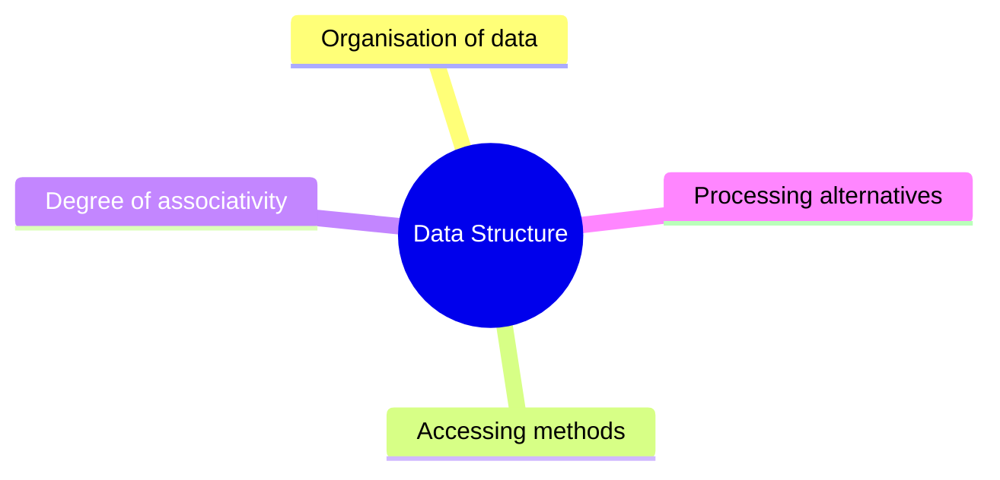
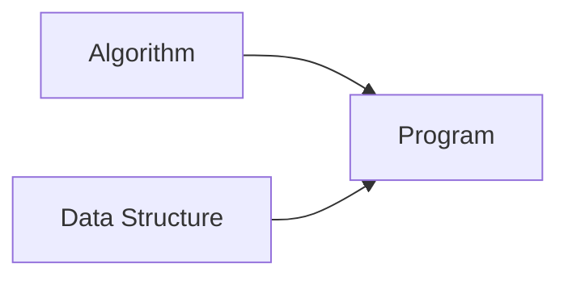

# 01 - Data and Data Structures

[← Unit Index](README.md) | [Next: Classification →](02-classification-of-data-structures.md)

## Learning Goals

After completing this topic, you should be able to:

- define data and its types,
- explain data representation,
- define a data structure,
- identify what a data structure specifies, and
- distinguish storage structure from file structure.

---

## 1. What is Data?

**Data** is a basic fact or entity used in calculation or manipulation.

| Type | Meaning | Examples |
|---|---|---|
| **Numeric data** | Data represented using numbers | `18`, `72.5`, `-4` |
| **Alphanumeric data** | Data containing letters, numbers, or both | `"Kapil"`, `"CSE3"`, `"A101"` |

## 2. Data Representation

When a programmer collects data for processing, it must be stored in the
computer's main memory.

> [!IMPORTANT]
> The process of storing data items in a computer's main memory is called
> **representation**.

Data must also be organised in a suitable fashion before it can be processed
efficiently.

This need for systematic organisation leads to the study of data structures.

---

## 3. What is a Data Structure?

A **data structure** represents the logical relationship between individual
elements of data.

In other words, it is a way of organising data that considers both:

- the elements being stored, and
- the relationships among those elements.

A data structure may also be described as a mathematical or logical model of a
particular organisation of data items.

## 4. What Does a Data Structure Specify?

| Aspect | Question answered |
|---|---|
| **Organisation of data** | How are the data items arranged? |
| **Accessing methods** | How can a particular item be reached? |
| **Degree of associativity** | How are items related to one another? |
| **Processing alternatives** | Which operations can be performed? |

---

## 5. Storage Structure vs File Structure

| Term | Meaning | Location |
|---|---|---|
| **Storage structure** | Representation of a particular data structure in computer memory | Main memory |
| **File structure** | Representation of a storage structure in auxiliary memory | Secondary storage |

## 6. The Program-Building Equation

An algorithm supplies the steps. A data structure organises the information on
which those steps operate. A useful program requires both.

---

## Quick Recall

| Term | One-line meaning |
|---|---|
| Data | A fact or entity used for calculation or manipulation |
| Representation | Storing data items in main memory |
| Data structure | Logical organisation and relationship of data elements |
| Storage structure | Data-structure representation in main memory |
| File structure | Storage-structure representation in auxiliary memory |

<strong>Quick Check</strong>

1. What are the two data types introduced in this unit?
2. Why must data be organised before processing?
3. Which four aspects does a data structure specify?
4. Where are storage structures and file structures represented?

[← Unit Index](README.md) | [Next: Classification →](02-classification-of-data-structures.md)

