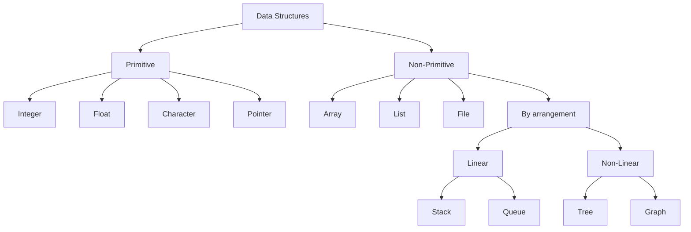
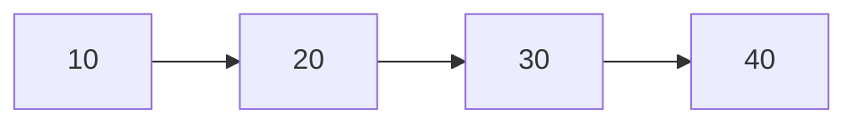
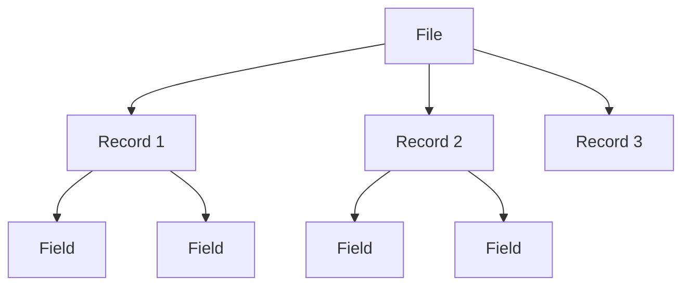
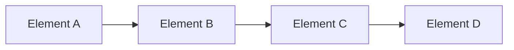
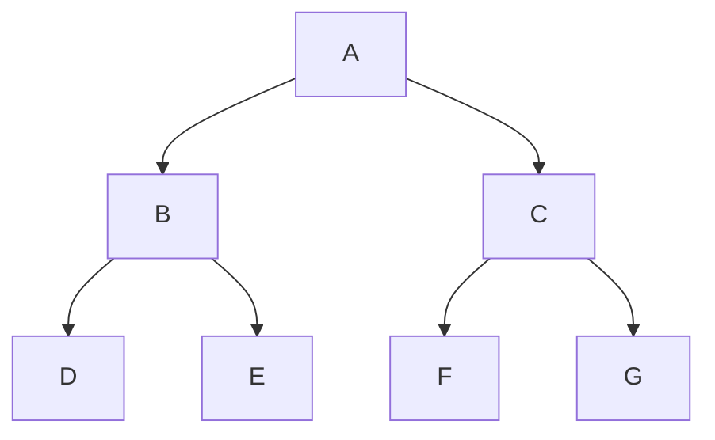

# 02 - Classification of Data Structures

[← Data and Data Structures](01-data-and-data-structures.md) | [Next: Operations →](03-operations-on-data-structures.md)

## Learning Goals

- Distinguish primitive and non-primitive data structures.
- Define array, list, and file.
- Distinguish linear and non-linear data structures.
- Identify examples from each category.

---

## 1. Classification Map

---

## 2. Primitive Data Structures

Primitive data structures are basic structures that can be operated upon
directly by machine instructions.

Examples:

- Integer
- Float
- Character
- Pointer

## 3. Non-Primitive Data Structures

Non-primitive data structures are derived from primitive data structures. They
emphasise the organisation of a group of homogeneous or heterogeneous data
items.

Examples introduced in the material:

- Array
- List
- File

## 4. Array

An **array** is a fixed-size, sequenced collection of elements of the same data
type.

| Index | 0 | 1 | 2 | 3 | 4 |
|---:|---:|---:|---:|---:|---:|
| Value | 10 | 20 | 30 | 40 | 50 |

Key features:

- fixed size,
- elements follow a sequence, and
- every element has the same data type.

## 5. List

A **list** is an ordered set containing a variable number of elements.

## 6. File

A **file** is a collection of logically related information. It can be viewed
as a large list of records, with each record consisting of different fields.

---

## 7. Linear Data Structures

A data structure is **linear** when its elements are connected in a linear
fashion, either logically or through sequential memory locations.

Examples:

- Stack
- Queue

## 8. Non-Linear Data Structures

A data structure is **non-linear** when its data items are not arranged in one
simple sequence.

Examples:

- Tree
- Graph

## 9. Linear vs Non-Linear

| Basis | Linear | Non-linear |
|---|---|---|
| Arrangement | Elements follow a sequence | Elements do not follow one simple sequence |
| Relationship | Sequential | Hierarchical or network-like |
| Traversal | Usually follows one logical path | Multiple traversal paths may exist |
| Examples | Stack, Queue | Tree, Graph |

## 10. Primitive vs Non-Primitive

| Basis | Primitive | Non-primitive |
|---|---|---|
| Nature | Basic structure | Derived structure |
| Machine support | Directly operated upon by machine instructions | Built using primitive structures |
| Data organisation | Represents a basic value | Organises groups of values |
| Examples | Integer, Float, Character, Pointer | Array, List, File |

> [!NOTE]
> Primitive/non-primitive describes the nature of a structure. Linear/
> non-linear describes the arrangement of elements. They are not the same
> classification rule.

---

## Quick Recall

| Category | Examples |
|---|---|
| Primitive | Integer, Float, Character, Pointer |
| Non-primitive | Array, List, File |
| Linear | Stack, Queue |
| Non-linear | Tree, Graph |

[← Data and Data Structures](01-data-and-data-structures.md) | [Next: Operations →](03-operations-on-data-structures.md)

