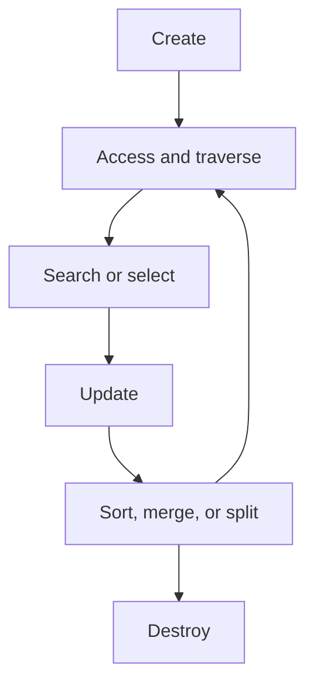
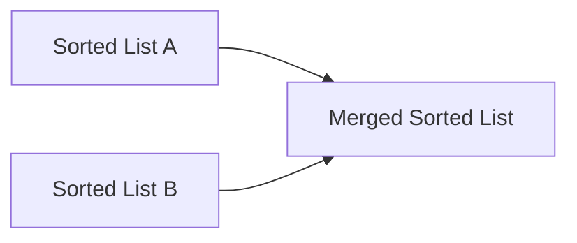
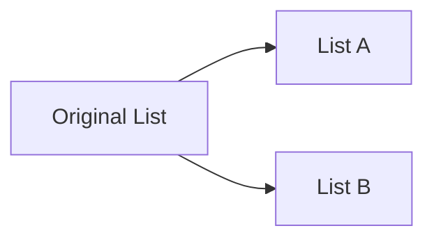

# 03 - Operations on Data Structures

[← Classification](02-classification-of-data-structures.md) | [Next: Algorithm Analysis →](04-algorithm-analysis.md)

Data structures support a set of common operations for creating, accessing,
modifying, processing, and removing data.

## Operation Lifecycle

---

## 1. Create

The **create** operation reserves memory for program elements.

## 2. Destroy

The **destroy** operation releases the memory allocated to a specified data
structure.

## 3. Selection

The **selection** operation accesses particular data within a data structure.

## 4. Updation

The **updation** operation updates or modifies existing data in the structure.

## 5. Searching

The **searching** operation checks for the presence of a desired data item in a
collection.

## 6. Sorting

The **sorting** operation arranges all data items in a particular order.

## 7. Merging

The **merging** operation combines the data items of two different sorted lists
into one sorted list.

## 8. Splitting

The **splitting** operation partitions a single list into multiple lists.

## 9. Traversal

The **traversal** operation visits every node or element of a structure in a
systematic manner.

---

## Operations at a Glance

| Operation | Purpose | Playlist analogy |
|---|---|---|
| Create | Reserve memory | Create a playlist |
| Destroy | Release allocated memory | Delete the playlist |
| Selection | Access particular data | Select one song |
| Updation | Modify existing data | Edit song information |
| Searching | Find a desired item | Find a song |
| Sorting | Arrange items in order | Sort by title |
| Merging | Combine two sorted lists | Combine sorted playlists |
| Splitting | Partition one list | Divide by mood |
| Traversal | Visit every element | Play every song once |

> [!TIP]
> In an exam answer, define each operation and include one short example. For
> merging, explicitly mention that the two source lists are sorted.

<strong>Quick Check</strong>

1. Which operation reserves memory?
2. How does selection differ from searching?
3. What condition is stated for the lists used in merging?
4. Which operation systematically visits every node?

[← Classification](02-classification-of-data-structures.md) | [Next: Algorithm Analysis →](04-algorithm-analysis.md)

