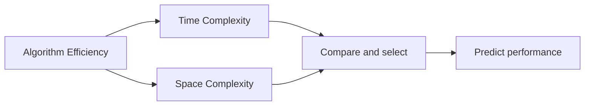
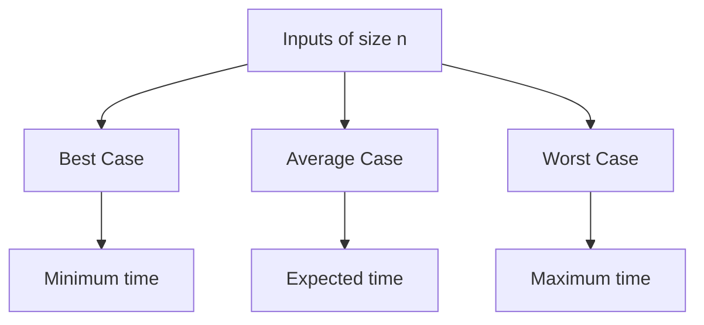
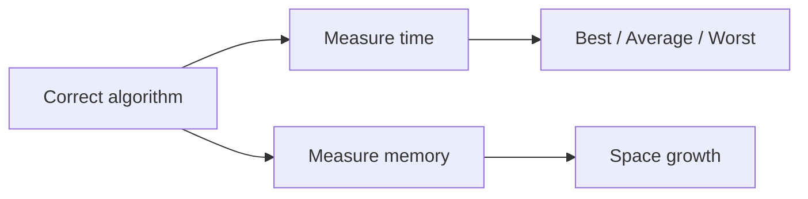

# 04 - Algorithm and Performance Analysis

[← Operations](03-operations-on-data-structures.md) | [Next: Asymptotic Notations →](05-asymptotic-notations.md)

## 1. What is Algorithm Analysis?

An algorithm that produces the correct answer may still be unsuitable if it is
too slow or consumes too much memory.

**Algorithm analysis** is the process of evaluating the efficiency of an
algorithm in terms of:

1. execution time, called **time complexity**, and
2. memory usage, called **space complexity**.



## 2. Purpose of Algorithm Analysis

Algorithm analysis helps us:

- compare algorithms,
- select the most efficient solution, and
- predict performance for large inputs.

---

## 3. Time Complexity

**Time complexity** describes how the number of elementary operations performed
by an algorithm grows with input size.

It does not normally mean the exact number of seconds measured on one computer.
Instead, it expresses growth using an input-size variable such as `n`.

```c
for (int i = 0; i < n; i++)
{
    printf("%d\n", i);
}
```

The loop body executes `n` times. Therefore, the running time grows linearly
with `n`.

$$
T(n) = n \Rightarrow O(n)
$$

## 4. Space Complexity

**Space complexity** describes how the memory required by an algorithm grows
with input size.

Memory may be required for:

- input data,
- variables,
- dynamically allocated memory,
- temporary structures, and
- function-call or recursion state.

| Measure | Focus | Main question |
|---|---|---|
| Time complexity | Number of operations | How does execution work grow as `n` grows? |
| Space complexity | Amount of memory | How does memory use grow as `n` grows? |

---

## 5. Cases in Algorithm Analysis

The same algorithm can require different amounts of work for different inputs
of the same size.



### Best Case

The **best case** is the minimum time required by an algorithm.

### Average Case

The **average case** is the expected time required over all possible inputs,
under stated assumptions about those inputs.

### Worst Case

The **worst case** is the maximum time required by an algorithm.

| Case | Meaning | Behaviour described |
|---|---|---|
| Best | Minimum time | Most favourable input |
| Average | Expected time | Expected input behaviour |
| Worst | Maximum time | Least favourable input |

> [!IMPORTANT]
> Worst-case time complexity is commonly reported because it states the maximum
> time an algorithm may require for an input of a given size.

---

## Quick Recall



<details>
<summary><strong>Quick Check</strong></summary>

1. What two resources are measured in algorithm analysis?
2. Why is exact execution time not normally used as the main complexity measure?
3. What does each performance case represent?
4. Why is worst-case complexity commonly considered?

</details>

[← Operations](03-operations-on-data-structures.md) | [Next: Asymptotic Notations →](05-asymptotic-notations.md)

