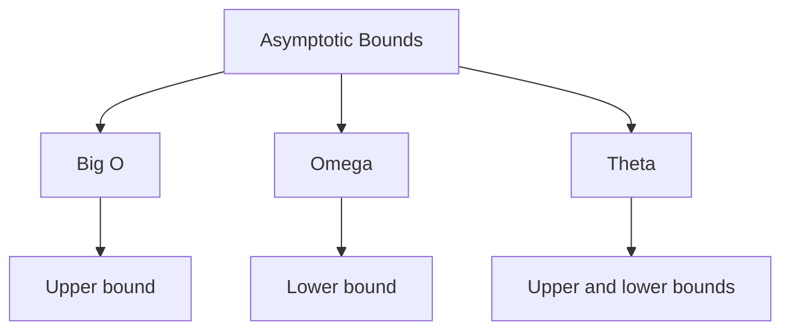
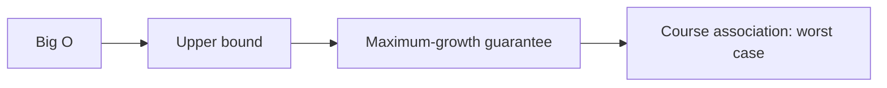
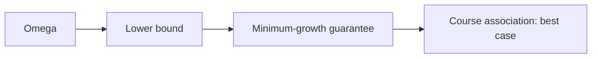
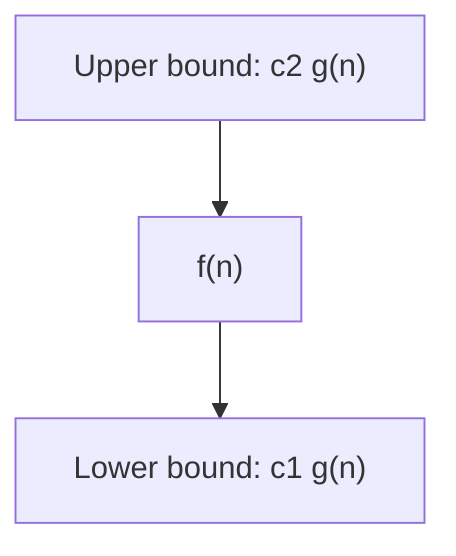

# 05 - Asymptotic Notations

[← Algorithm Analysis](04-algorithm-analysis.md) | [Next: Complexity Examples →](06-complexity-examples.md)

## 1. What is Asymptotic Analysis?

Asymptotic notations are mathematical tools used to analyse algorithm
performance by examining how efficiency changes as input size grows.

They provide a concise way to express the behaviour of an algorithm's time or
space complexity as input size approaches very large values.

Asymptotic analysis focuses on **relative growth rates** rather than exact
execution times. It abstracts away:

- machine-specific constants,
- hardware differences,
- programming-language speed, and
- minor implementation details.

This allows algorithms to be compared by their fundamental performance trends
as input size varies.

## 2. Main Asymptotic Notations

The three notations introduced in this unit are:

- Big O notation: `O`
- Omega notation: `Ω`
- Theta notation: `Θ`

---

## 3. Big O Notation - `O`

Big O represents an **asymptotic upper bound** on a function. The course
material uses it to describe the worst-case complexity of an algorithm.

It is the most widely used notation in introductory asymptotic analysis.

### Mathematical Definition

`f(n)` is `O(g(n))` if there are positive constants `c` and `n0` such that:

$$
0 \leq f(n) \leq c\,g(n) \quad \text{for every } n \geq n_0
$$

Set notation:

$$
O(g(n)) = \{f(n) : \exists\,c>0, n_0>0 \text{ such that }
0 \leq f(n) \leq c\,g(n) \text{ for all } n \geq n_0\}
$$

For sufficiently large `n`, the constant multiple `c g(n)` stays on or above
`f(n)`. Therefore, `g(n)` provides an upper bound on the growth of `f(n)`.

---

## 4. Omega Notation - `Ω`

Omega represents an **asymptotic lower bound** on a function. The course
material uses it to describe best-case complexity.

### Mathematical Definition

`f(n)` is `Ω(g(n))` if there are positive constants `c` and `n0` such that:

$$
0 \leq c\,g(n) \leq f(n) \quad \text{for every } n \geq n_0
$$

Set notation:

$$
\Omega(g(n)) = \{f(n) : \exists\,c>0, n_0>0 \text{ such that }
0 \leq c\,g(n) \leq f(n) \text{ for all } n \geq n_0\}
$$

For sufficiently large `n`, the constant multiple `c g(n)` stays on or below
`f(n)`. Therefore, `g(n)` provides a lower bound on the growth of `f(n)`.

---

## 5. Theta Notation - `Θ`

Theta bounds a function from both above and below. It represents a **tight
asymptotic bound**.

### Mathematical Definition

`f(n)` is `Θ(g(n))` if there are positive constants `c1`, `c2`, and `n0` such
that:

$$
0 \leq c_1g(n) \leq f(n) \leq c_2g(n)
\quad \text{for every } n \geq n_0
$$

Set notation:

$$
\Theta(g(n)) = \{f(n) : \exists\,c_1,c_2,n_0>0 \text{ such that }
0 \leq c_1g(n) \leq f(n) \leq c_2g(n)
\text{ for all } n \geq n_0\}
$$

For sufficiently large `n`, `f(n)` remains between the lower bound `c1 g(n)`
and the upper bound `c2 g(n)`. Thus, `g(n)` describes the growth of `f(n)`
tightly.

The course material associates Theta with average-case analysis and states that
average running time is obtained by considering possible inputs and taking an
average under the selected input model.

---

## 6. Comparison Table

| Notation | Formal meaning | Course-material association |
|---|---|---|
| `O(g(n))` | Asymptotic upper bound | Worst-case analysis |
| `Ω(g(n))` | Asymptotic lower bound | Best-case analysis |
| `Θ(g(n))` | Tight upper and lower bound | Average-case analysis |

> [!CAUTION]
> Do not memorise only `O = worst`, `Ω = best`, and `Θ = average`.
> Formally, the symbols describe mathematical bounds. The input case being
> analysed and the bound used to express its growth should be stated separately.

## 7. Growth-Rate Intuition

| Growth | Common notation | Behaviour as `n` increases |
|---|---:|---|
| Constant | `O(1)` | Work remains approximately unchanged |
| Linear | `O(n)` | Work grows in direct proportion to `n` |
| Quadratic | `O(n²)` | Work grows roughly with the square of `n` |

## 8. Memory Aid

| Symbol | Think of | Bound |
|---|---|---|
| `O` | Ceiling | Upper |
| `Ω` | Floor | Lower |
| `Θ` | Sandwiched between floor and ceiling | Tight |

<strong>Quick Check</strong>

1. Why are machine-specific constants ignored?
2. Which notation gives an upper bound?
3. Which notation gives a lower bound?
4. What conditions make a bound tight?
5. Why is the shorthand linking notations directly to cases incomplete?

[← Algorithm Analysis](04-algorithm-analysis.md) | [Next: Complexity Examples →](06-complexity-examples.md)

