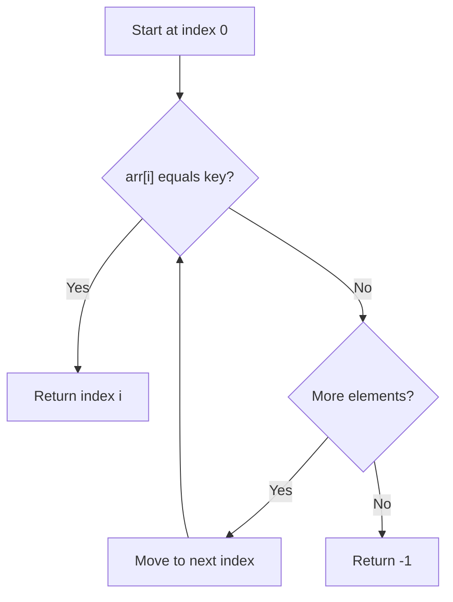
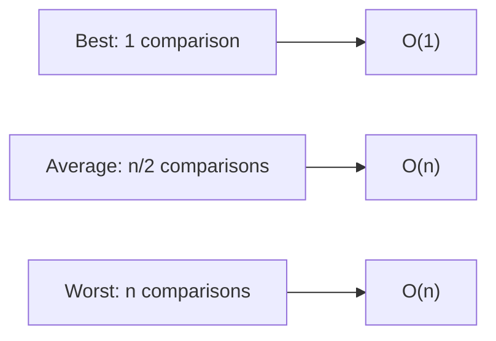
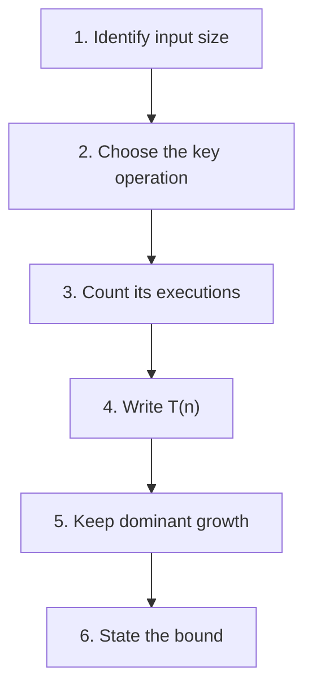

# 06 - Complexity Examples

[← Asymptotic Notations](05-asymptotic-notations.md) | [Unit Index →](README.md)

This topic applies algorithm analysis to the linear-search example from the
course material and explains how elementary operations are counted.

---

## 1. Linear Search

Linear search examines elements sequentially until the key is found or the
array ends.

```c
int linearSearch(const int arr[], int n, int key)
{
    for (int i = 0; i < n; i++)
    {
        if (arr[i] == key)
        {
            return i;
        }
    }

    return -1;
}
```

## 2. Search Flow



---

## 3. Best-Case Analysis

The key is found at the first position.

```text
Array = [10, 20, 30, 40]
Key   = 10
```

Search trace:

```text
10 == 10  ->  found
```

- Number of comparisons: `1`
- Time complexity: `O(1)`

The work does not increase with the size of the remaining array because the
search stops after the first comparison.

---

## 4. Average-Case Analysis

The key is found somewhere around the middle.

```text
Array = [10, 20, 30, 40, 50]
Key   = 30
```

Search trace:

```text
10 != 30
20 != 30
30 == 30  ->  found
```

- Average comparisons: approximately `n/2`
- Time complexity: `O(n)`

Although the simplified average is `n/2`, asymptotic notation ignores constant
factors. Therefore, `O(n/2)` becomes `O(n)`.

---

## 5. Worst-Case Analysis

The key is at the last position or is not present.

```text
Array = [10, 20, 30, 40, 50]
Key   = 60
```

Search trace:

```text
10 != 60
20 != 60
30 != 60
40 != 60
50 != 60  ->  not found
```

- Number of comparisons: `n`
- Time complexity: `O(n)`

Every element must be checked before the algorithm can conclude that the key is
absent.

## 6. Linear Search Comparison

| Case | Key position | Comparisons | Complexity |
|---|---|---:|---:|
| **Best** | First position | `1` | `O(1)` |
| **Average** | Around the middle | approximately `n/2` | `O(n)` |
| **Worst** | Last position or absent | `n` | `O(n)` |



---

## 7. How to Calculate Time Complexity

Time complexity is commonly estimated by counting the number of elementary
operations performed by an algorithm.



### Example A: Constant Work

```c
printf("%d", arr[0]);
```

The statement executes once, independently of `n`.

$$
T(n) = 1 \Rightarrow O(1)
$$

### Example B: One Loop

```c
for (int i = 0; i < n; i++)
{
    printf("%d", arr[i]);
}
```

The important statement executes `n` times.

$$
T(n) = n \Rightarrow O(n)
$$

### Example C: Ignore Constant Factors

If an algorithm performs about `n/2` comparisons:

$$
T(n) = \frac{n}{2} \Rightarrow O(n)
$$

The constant factor `1/2` is ignored because the growth remains linear.

> [!IMPORTANT]
> An algorithm may behave differently for different inputs. Worst-case time
> complexity is commonly used because it represents the maximum time taken for
> any input of a given size.

---

## Quick Recall

| Pattern | Complexity |
|---|---:|
| One operation independent of `n` | `O(1)` |
| One operation repeated `n` times | `O(n)` |
| About `n/2` repeated operations | `O(n)` |

<details>
<summary><strong>Quick Check</strong></summary>

1. When does linear search have constant complexity?
2. Why do both `n/2` and `n` comparisons produce linear complexity?
3. What elementary operation is counted in the search example?
4. What are the six steps for estimating time complexity?

</details>

[← Asymptotic Notations](05-asymptotic-notations.md) | [Unit Index →](README.md)

