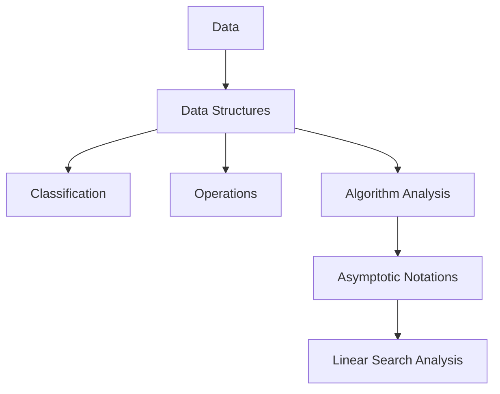

# Unit 1 - Introduction to Data Structures

> **CEM2003C | Data Structures | Semester 3**

This unit builds the foundation required for arrays, stacks, queues, linked
lists, trees, graphs, hashing, and file structures.

## Unit Roadmap

## Topic-wise Notes

| No. | Topic | Main visual | Open notes |
|---:|---|---|---|
| 1 | Data and Data Structures | Data-to-program flow | [Start](01-data-and-data-structures.md) |
| 2 | Classification of Data Structures | Classification tree | [Start](02-classification-of-data-structures.md) |
| 3 | Operations on Data Structures | Operation lifecycle | [Start](03-operations-on-data-structures.md) |
| 4 | Algorithm and Performance Analysis | Analysis framework | [Start](04-algorithm-analysis.md) |
| 5 | Asymptotic Notations | Bound comparison | [Start](05-asymptotic-notations.md) |
| 6 | Complexity Examples | Linear-search flow | [Start](06-complexity-examples.md) |

## Exam Support

- [Important Questions](important-questions.md)
- [Viva Questions](viva-questions.md)

## Learning Checklist

- [ ] Define data, representation, and data structure.
- [ ] Classify primitive, non-primitive, linear, and non-linear structures.
- [ ] Explain all common data-structure operations.
- [ ] Distinguish time complexity from space complexity.
- [ ] Explain best, average, and worst cases.
- [ ] Define `O`, `Ω`, and `Θ` mathematically.
- [ ] Analyse linear search for all three input cases.

> [!TIP]
> Follow the numbered files in order. Use the question files after completing
> the six topics.

**Next unit:** [Unit 2 - Array and Stack](../Unit-2-Array-and-Stack/)

