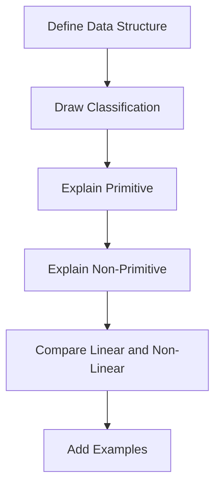
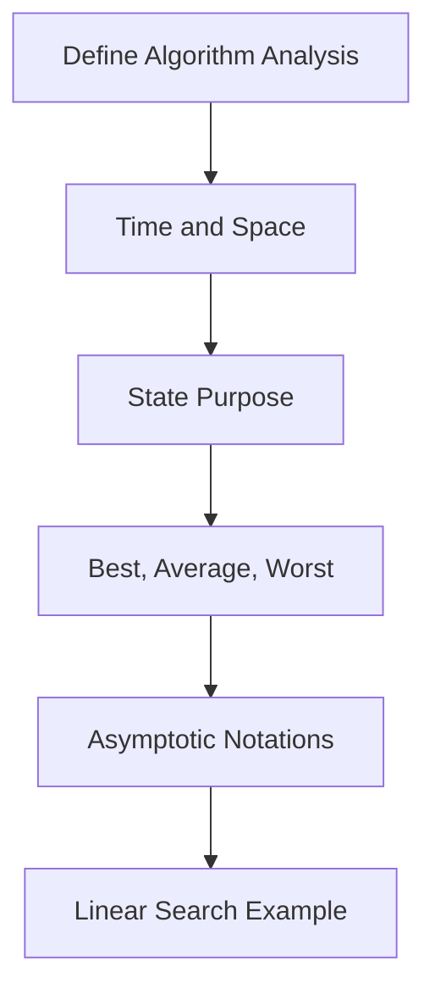

# Unit 1 - Important Questions

[← Unit Index](README.md) | [Viva Questions →](viva-questions.md)

Use the linked topic beside each question for focused revision.

## Short-Answer Questions

1. Define data. ([Topic 1](01-data-and-data-structures.md))
2. State the types of data introduced in this unit.
3. What is data representation?
4. Define a data structure.
5. List the four aspects specified by a data structure.
6. Define storage structure and file structure.
7. What is a primitive data structure? Give examples.
8. What is a non-primitive data structure? Give examples.
9. Define array, list, and file.
10. Define linear and non-linear data structures.
11. List the common operations on data structures.
12. Define create, selection, updation, and traversal.
13. What is algorithm analysis?
14. State the purpose of algorithm analysis.
15. Define time complexity and space complexity.
16. Define best, average, and worst cases.
17. What is asymptotic analysis?
18. What do Big O, Omega, and Theta represent?
19. State the best-case complexity of linear search.
20. State the average and worst-case complexity of linear search.

## Descriptive Questions

1. Explain data and data representation.
2. Explain the meaning of a data structure and the four aspects it specifies.
3. Explain the classification of data structures with a diagram.
4. Differentiate primitive and non-primitive data structures.
5. Differentiate linear and non-linear data structures.
6. Explain the nine operations performed on data structures.
7. Explain algorithm analysis and its purpose.
8. Explain time complexity and space complexity.
9. Explain best-case, average-case, and worst-case analysis.
10. Explain the need for asymptotic analysis.
11. Explain Big O notation with its mathematical definition.
12. Explain Omega notation with its mathematical definition.
13. Explain Theta notation with its mathematical definition.
14. Compare Big O, Omega, and Theta notations.
15. Analyse the best, average, and worst cases of linear search.
16. Explain how the time complexity of an algorithm is calculated.

## Answer Blueprint: Classification of Data Structures

## Answer Blueprint: Algorithm Analysis

## Last-Minute Checklist

- [ ] I can draw the classification diagram.
- [ ] I can list all nine operations without looking.
- [ ] I can write the three mathematical definitions.
- [ ] I can reproduce the linear-search comparison table.
- [ ] I can explain why `O(n/2)` simplifies to `O(n)`.

[← Unit Index](README.md) | [Viva Questions →](viva-questions.md)

