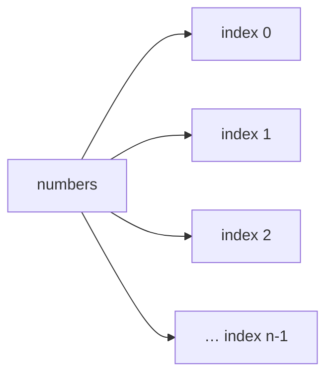
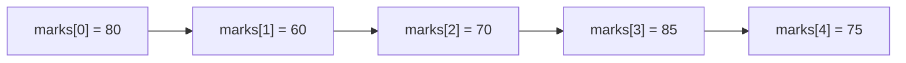
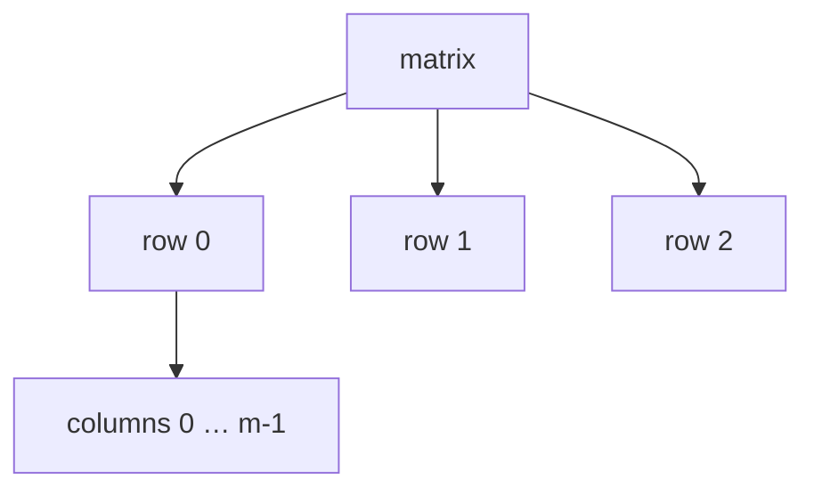

# 01 — Array Fundamentals and Representation

**Unit 2 · CEM2003C Data Structures** · [← Unit index](README.md) · [Next: Applications →](02-array-applications.md)

> **Source note:** The core definitions and examples in this file are adapted from the supplied Semester 1 *Unit-5 Array & String in C* notes. String topics are intentionally left out because this Unit 2 package focuses on arrays and stacks.

## Learning goals

- Define an array and explain its memory layout.
- Declare, initialise, traverse and access one-dimensional arrays.
- Represent two-dimensional data using rows and columns.
- Explain why contiguous storage enables constant-time indexed access.

## What is an array?

An **array** is a collection of elements of the **same data type**, referenced by one common name. It is an aggregate (derived) data type: many values are grouped into one logical object.



Each element is selected by an index. In C, indexing starts at `0`, so an array of size `n` has valid indices `0` through `n - 1`.

## Why do we need arrays?

Without an array, a fixed collection needs separate variables:

```c
int mark1, mark2, mark3, mark4, mark5;
```

With an array, one name represents the complete collection:

```c
int marks[5];
```

This makes loops, searching, sorting and bulk processing practical.

## Representation in memory

Array elements occupy **contiguous memory locations**. The first element has the lowest address and the last element has the highest address.

For a zero-based one-dimensional array:

\[
\operatorname{Address}(A[i]) = \operatorname{Base}(A) + i \times \operatorname{SizeOfElement}
\]

The exact byte address depends on the implementation, but the formula explains why `A[i]` can be reached directly without scanning earlier elements.


## Core properties

| Property | Meaning |
|---|---|
| Homogeneous | Every element has the same data type and size. |
| Common name | The complete collection is referred to by one identifier. |
| Contiguous | Elements are stored next to one another in memory. |
| Indexed | Each element is selected using an integer index. |
| Random access | Address calculation provides direct access to any valid index. |
| Fixed size (C array) | The declared number of elements does not grow automatically. |

## Advantages

1. **Code optimisation:** one loop can process many values.
2. **Easy traversal:** visit elements in order with a `for` loop.
3. **Easy sorting:** standard sorting algorithms can work on indexed data.
4. **Random access:** read or update `A[i]` directly.

## One-dimensional arrays

A one-dimensional array is a single sequence of elements.



### Declaration

```c
dataType arrayName[arraySize];
```

Examples from the notes:

```c
int marks[10];       // 10 integers
float height[50];    // 50 floating-point values
char name[10];       // 10 characters
```

### Initialisation

```c
int number[3] = {1, 2, 3};
```

The initialiser values are written in order: `number[0]` is `1`, `number[1]` is `2`, and `number[2]` is `3`. If fewer values are supplied, the remaining elements are initialised to zero for a static initialiser.

### Traversal example

```c
#include <stdio.h>

int main(void) {
    int marks[5] = {80, 60, 70, 85, 75};

    for (int i = 0; i < 5; i++) {
        printf("marks[%d] = %d\n", i, marks[i]);
    }
    return 0;
}
```

Output:

```text
marks[0] = 80
marks[1] = 60
marks[2] = 70
marks[3] = 85
marks[4] = 75
```

## Two-dimensional arrays

A two-dimensional array can be understood as an **array of arrays**. It organises values into rows and columns and is useful for tables and matrices.



### Declaration and initialisation

```c
int m[3][2];
int a[3][2] = {0, 0, 1, 1, 2, 2};
int b[3][2] = {{1, 2}, {2, 3}, {3, 4}};
```

The first dimension gives the number of rows; the second gives the number of columns. An element is accessed with two indices, such as `b[2][1]`.

### Nested traversal

```c
#include <stdio.h>

int main(void) {
    int matrix[3][2] = {{1, 2}, {2, 3}, {3, 4}};

    for (int row = 0; row < 3; row++) {
        for (int col = 0; col < 2; col++) {
            printf("%d ", matrix[row][col]);
        }
        printf("\n");
    }
    return 0;
}
```

Output:

```text
1 2
2 3
3 4
```

## 1D vs 2D at a glance

| 1D array | 2D array |
|---|---|
| One index: `a[i]` | Two indices: `a[row][col]` |
| Models a sequence | Models a table or matrix |
| One loop for traversal | Nested loops for traversal |

## Quick check

<details>
<summary>Can you answer these?</summary>

1. Why must all C array elements have the same type?
2. What are the valid indices of `int a[8]`?
3. Why does indexed access not require visiting every earlier element?
4. How many values are stored in `float table[4][3]`?

</details>

**Next:** [02 — Applications of Arrays](02-array-applications.md)
