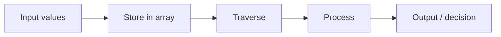
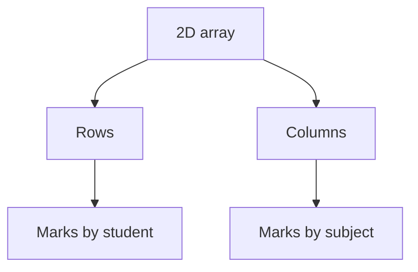
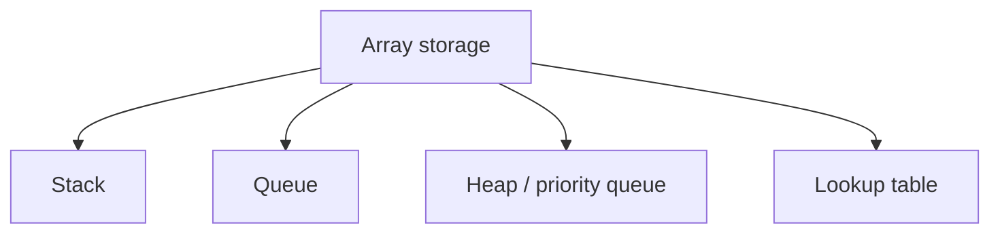

# 02 — Applications of Arrays

**Unit 2 · CEM2003C Data Structures** · [← Fundamentals](01-array-fundamentals.md) · [Next: Sparse Matrix →](03-sparse-matrix.md)

> **Source note:** The Semester 1 notes highlight optimisation, traversal, sorting and random access. This file turns those ideas into practical data-structure patterns and small C examples.

## The array workflow



An array is most useful when many values share one type and must be processed together.

## 1. Storing collections

Arrays model a fixed-size collection such as:

| Collection | Example declaration |
|---|---|
| Student marks | `int marks[60];` |
| Daily temperatures | `float temperature[7];` |
| Product prices | `double price[100];` |
| Roll numbers | `int rollNo[120];` |
| Sensor readings | `long reading[1000];` |

The common name allows one algorithm to work for every element.

## 2. Traversing and aggregating data

Traversal visits each element exactly once. The following program calculates a total and average:

```c
#include <stdio.h>

int main(void) {
    int marks[5] = {80, 60, 70, 85, 75};
    int total = 0;

    for (int i = 0; i < 5; i++) {
        total += marks[i];
    }

    printf("Total = %d\n", total);
    printf("Average = %.2f\n", total / 5.0);
    return 0;
}
```

**Complexity:** `O(n)` time and `O(1)` extra space.

## 3. Searching

Unsorted arrays can be searched sequentially. This is the linear-search pattern from Unit 1:

```c
int find_index(const int values[], int n, int key) {
    for (int i = 0; i < n; i++) {
        if (values[i] == key) {
            return i;
        }
    }
    return -1;
}
```

| Input condition | Comparisons | Growth |
|---|---:|---:|
| Key at first position | `1` | `O(1)` |
| Key near the middle | about `n/2` | `O(n)` |
| Key last or absent | `n` | `O(n)` |

If the array is sorted, binary search can reduce the growth to `O(log n)`; the trade-off is that maintaining sorted order may cost extra work.

## 4. Sorting

Sorting arranges values in ascending or descending order. A simple selection-sort pass demonstrates indexed updates:

```c
for (int i = 0; i < n - 1; i++) {
    int smallest = i;
    for (int j = i + 1; j < n; j++) {
        if (a[j] < a[smallest]) {
            smallest = j;
        }
    }

    int temp = a[i];
    a[i] = a[smallest];
    a[smallest] = temp;
}
```

This version takes `O(n²)` time and `O(1)` extra space. More efficient algorithms are introduced later in the course.

## 5. Tables and matrices

Two-dimensional arrays represent values identified by a row and a column:



```c
int marks[3][2] = {
    {80, 75},
    {60, 68},
    {90, 88}
};
```

Typical uses include mark sheets, pixel grids, adjacency matrices and multiplication tables.

## 6. Building other data structures

Arrays are the storage foundation for several structures studied in this course:



For example, an array-backed stack stores items in `stack[0…top]`; Unit 2's stack files implement that pattern.

## Strengths and limitations

| Strength | Limitation |
|---|---|
| Direct indexed access | C arrays have fixed capacity |
| Compact contiguous storage | Inserting in the middle shifts later values |
| Simple traversal and sorting | Removing in the middle also shifts values |
| Excellent cache locality | Resizing requires a new allocation and copy |

## Choosing an array

Use an array when:

- the element type is uniform;
- the maximum size is known or manageable;
- frequent indexed access matters;
- insertions and deletions are mostly at the end or are infrequent.

Consider a linked structure when the collection must grow frequently or when middle insertions dominate.

## Mini challenge

<details>
<summary>Predict before running</summary>

For `int a[4] = {3, 1, 4, 2};`, what are the values after an ascending sort? Which operation is responsible for moving `4` toward the end?

</details>

**Next:** [03 — Sparse Matrix and Representation](03-sparse-matrix.md)
