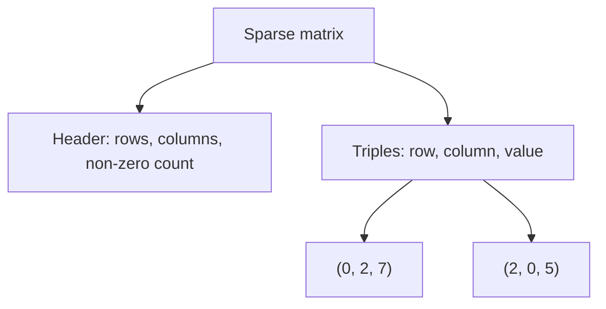
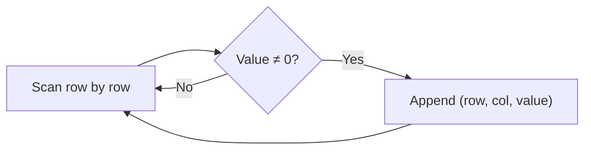

# 03 — Sparse Matrix and Representation

**Unit 2 · CEM2003C Data Structures** · [← Applications](02-array-applications.md) · [Unit index](README.md)

> [!NOTE]
> **Supplementary topic:** Sparse matrices were listed in the Unit 2 plan but were not present in the supplied Semester 1 array PDF. This concise section is included to make the repository syllabus-complete and is clearly separated from the source-derived array notes.

## What is a sparse matrix?

A matrix is **sparse** when most of its entries are zero. Storing every zero in a regular two-dimensional array wastes memory and increases the amount of data that algorithms must scan.

Example (`4 × 5`, only three non-zero values):

```text
0 0 7 0 0
0 0 0 0 0
5 0 0 0 9
0 0 0 0 0
```

Here, `17` of the `20` cells are zero.

## Triplet representation

Store only non-zero entries as triples `(row, column, value)`. A header records the original matrix dimensions and the number of non-zero values.



For the example above:

```text
Header: (4, 5, 3)
(0, 2, 7)
(2, 0, 5)
(2, 4, 9)
```

The row and column indices are zero-based, matching C array indexing.

## Dense vs sparse storage

| Representation | Stored items | Space idea |
|---|---:|---|
| Dense `r × c` array | `r × c` | Stores every value, including zeros |
| Triplet form | `3k + 3` fields | Stores `k` non-zero values plus the header |

Triplet form is beneficial when `k` is much smaller than `r × c`.

## Converting a matrix to triplets



### C implementation

```c
#include <stdio.h>

int main(void) {
    int matrix[4][5] = {
        {0, 0, 7, 0, 0},
        {0, 0, 0, 0, 0},
        {5, 0, 0, 0, 9},
        {0, 0, 0, 0, 0}
    };
    int triplet[20][3];
    int non_zero = 0;

    for (int row = 0; row < 4; row++) {
        for (int col = 0; col < 5; col++) {
            if (matrix[row][col] != 0) {
                triplet[non_zero][0] = row;
                triplet[non_zero][1] = col;
                triplet[non_zero][2] = matrix[row][col];
                non_zero++;
            }
        }
    }

    printf("Rows Columns Non-zero = 4 5 %d\n", non_zero);
    for (int i = 0; i < non_zero; i++) {
        printf("(%d, %d, %d)\n", triplet[i][0], triplet[i][1], triplet[i][2]);
    }
    return 0;
}
```

The scan takes `O(r × c)` time. The triplet list uses `O(k)` records, where `k` is the number of non-zero values.

## Quick check

<details>
<summary>Test your understanding</summary>

1. What makes a matrix sparse?
2. What does the header `(rows, columns, non-zero count)` describe?
3. Write the triplet for the value `9` in the example.
4. When is triplet storage smaller than dense storage?

</details>
