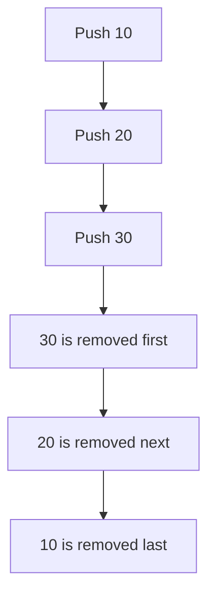
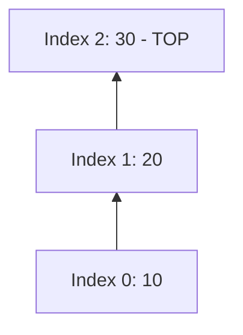
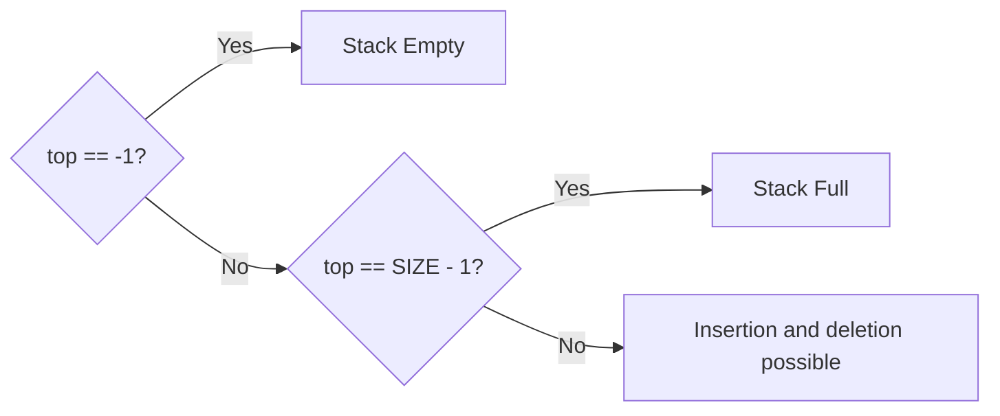

# 04 - Stack Fundamentals and Array Implementation

[← Unit Index](README.md) | [Next: Stack Operations →](05-stack-operations.md)

## 1. What is a Stack?

A **stack** is a linear data structure in which insertion and deletion are
performed at one end, called the **Top of Stack (TOS)**.

It follows the **Last In, First Out (LIFO)** principle.



### Everyday Examples

- Books placed one over another
- A stack of disks
- A stack of cards

> [!TIP]
> The element inserted last becomes the first element removed.

---

## 2. Important Stack Terms

| Term | Meaning |
|---|---|
| **Top** | Index of the current topmost element |
| **TOS** | Top of Stack |
| **LIFO** | Last In, First Out |
| **PUSH** | Insert an element at the top |
| **POP** | Remove the topmost element |
| **Overflow** | Attempt to insert into a full stack |
| **Underflow** | Attempt to delete from an empty stack |

---

## 3. Array Representation of a Stack

A stack can be stored in a one-dimensional array.

```c
#define SIZE 5

int stack[SIZE];
int top = -1;
```

The variable `top` records the index of the topmost element.

| Stack state | Value of `top` |
|---|---:|
| Empty | `-1` |
| One element at index `0` | `0` |
| Full stack of size `SIZE` | `SIZE - 1` |

### Example: Partially Filled Stack

| Index | 4 | 3 | 2 | 1 | 0 |
|---:|---:|---:|---:|---:|---:|
| Value | - | - | 30 | 20 | 10 |

Here, `top = 2` and the topmost element is `30`.



---

## 4. Empty Stack and Underflow

An array-based stack is empty when:

```c
top == -1
```

If POP or another deletion operation is attempted in this condition, no item
is available. This is called **stack underflow**.

```c
int isEmpty(void)
{
    return top == -1;
}
```

## 5. Full Stack and Overflow

An array-based stack is full when `top` reaches the last valid array index:

```c
top == SIZE - 1
```

Attempting to insert another item causes **stack overflow**.

```c
int isFull(void)
{
    return top == SIZE - 1;
}
```



---

## 6. Capacity vs Current Size

For an array stack:

$$
\text{Capacity} = \text{SIZE}
$$

$$
\text{Current number of elements} = \text{top} + 1
$$

Example: if `top = 3`, the stack contains `4` elements at indices `0` through
`3`.

## 7. Complexity Preview

| Operation | Time Complexity |
|---|---:|
| Check empty | `O(1)` |
| Check full | `O(1)` |
| Access top | `O(1)` |
| PUSH | `O(1)` |
| POP | `O(1)` |

<details>
<summary><strong>Quick Check</strong></summary>

1. Why is a stack called a LIFO structure?
2. What does `top = -1` represent?
3. What condition detects overflow in an array stack?
4. If `top = 4`, how many elements are present?

</details>

[← Unit Index](README.md) | [Next: Stack Operations →](05-stack-operations.md)

