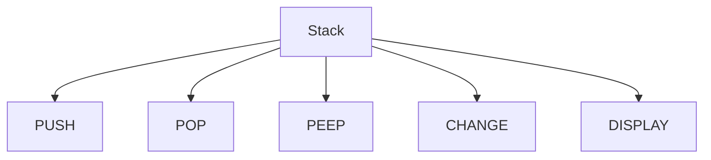
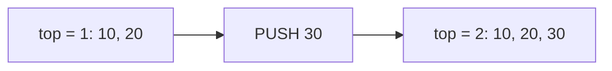
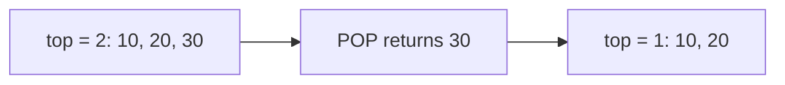

# 05 - Stack Operations

[← Stack Fundamentals](04-stack-fundamentals.md) | [Next: Expression Notations →](06-expression-notations.md)

The stack operations in the material are:

1. PUSH
2. POP
3. PEEP
4. UPDATE or CHANGE
5. TRAVERSAL or DISPLAY



---

## 1. PUSH Operation

**PUSH** inserts a new item at the top of the stack.

### Algorithm

```text
PUSH(Stack, Size, Top, Item)

1. If Top == Size - 1:
      Print "Stack Overflow"
      Stop
2. Top = Top + 1
3. Stack[Top] = Item
4. Stop
```

### State Change



### C Implementation

```c
int push(int stack[], int *top, int size, int item)
{
    if (*top == size - 1)
    {
        printf("Stack Overflow\n");
        return 0;
    }

    *top = *top + 1;
    stack[*top] = item;
    return 1;
}
```

Time complexity: `O(1)`

---

## 2. POP Operation

**POP** removes the topmost item from the stack.

### Algorithm

```text
POP(Stack, Top, DeletedItem)

1. If Top == -1:
      Print "Stack Underflow"
      Stop
2. DeletedItem = Stack[Top]
3. Top = Top - 1
4. Print or return DeletedItem
5. Stop
```

### State Change



### C Implementation

```c
int pop(int stack[], int *top, int *deletedItem)
{
    if (*top == -1)
    {
        printf("Stack Underflow\n");
        return 0;
    }

    *deletedItem = stack[*top];
    *top = *top - 1;
    return 1;
}
```

Time complexity: `O(1)`

---

## 3. PEEP Operation

**PEEP** retrieves an element from a specified position without removing it.

If positions are counted from the top:

- position `1` means the topmost element,
- position `2` means the element below the top, and
- the required array index is `top - position + 1`.

### Validity Condition

The position is invalid when:

```c
position <= 0 || top - position + 1 < 0
```

### Algorithm

```text
PEEP(Stack, Top, Position)

1. Index = Top - Position + 1
2. If Position <= 0 or Index < 0:
      Print "Invalid Position"
      Stop
3. Item = Stack[Index]
4. Print or return Item
```

### Example

For the stack `[10, 20, 30, 27]`, `top = 3`:

| Position from top | Index | Value |
|---:|---:|---:|
| 1 | 3 | 27 |
| 2 | 2 | 30 |
| 3 | 1 | 20 |
| 4 | 0 | 10 |

> [!NOTE]
> The slide formula validates a position using `top - pos + 1`. The access
> must use the same position-from-top interpretation, so the correct index is
> also `top - pos + 1`.

### C Implementation

```c
int peep(const int stack[], int top, int position, int *item)
{
    int index = top - position + 1;

    if (position <= 0 || index < 0)
    {
        printf("Invalid Position\n");
        return 0;
    }

    *item = stack[index];
    return 1;
}
```

Time complexity: `O(1)`

---

## 4. UPDATE or CHANGE Operation

The **CHANGE** operation replaces the item at a specified position from the top.

```text
CHANGE(Stack, Top, Position, Item)

1. Index = Top - Position + 1
2. If Position <= 0 or Index < 0:
      Print "Invalid Position"
      Stop
3. Stack[Index] = Item
4. Stop
```

```c
int change(int stack[], int top, int position, int item)
{
    int index = top - position + 1;

    if (position <= 0 || index < 0)
    {
        printf("Invalid Position\n");
        return 0;
    }

    stack[index] = item;
    return 1;
}
```

Time complexity: `O(1)`

---

## 5. TRAVERSAL or DISPLAY Operation

DISPLAY prints stack elements from the top to the bottom.

```text
DISPLAY(Stack, Top)

1. If Top == -1:
      Print "Stack is Empty"
      Stop
2. For i = Top down to 0:
      Print Stack[i]
```

```c
void display(const int stack[], int top)
{
    if (top == -1)
    {
        printf("Stack is Empty\n");
        return;
    }

    for (int i = top; i >= 0; i--)
    {
        printf("%d\n", stack[i]);
    }
}
```

Time complexity: `O(n)`

---

## Operation Comparison

| Operation | Changes stack? | Main condition | Complexity |
|---|---|---|---:|
| PUSH | Yes | Check overflow | `O(1)` |
| POP | Yes | Check underflow | `O(1)` |
| PEEP | No | Check position | `O(1)` |
| CHANGE | Yes | Check position | `O(1)` |
| DISPLAY | No | Check empty | `O(n)` |

[← Stack Fundamentals](04-stack-fundamentals.md) | [Next: Expression Notations →](06-expression-notations.md)

