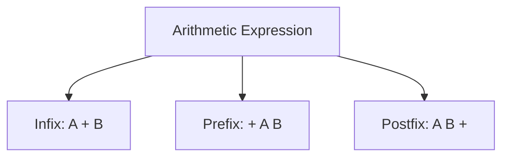
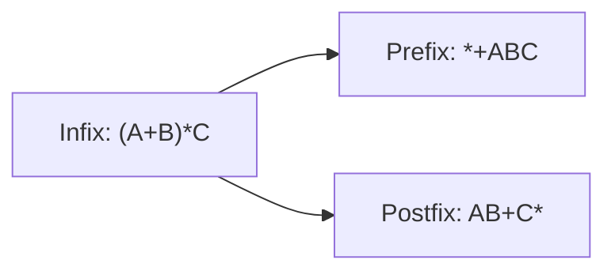

# 06 - Infix, Prefix and Postfix Notations

[← Stack Operations](05-stack-operations.md) | [Next: Postfix Evaluation →](07-postfix-evaluation.md)

Arithmetic expressions can be written in three common forms based on the
position of the operator.

## Expression Map



---

## 1. Infix Notation

In **infix notation**, the operator appears between its operands.

```text
<Operand> <Operator> <Operand>
```

Examples:

- `A + B`
- `C - D`
- `A * B`
- `G / H`

Infix is easy for humans to read, but precedence and parentheses must be
considered during evaluation.

## 2. Prefix or Polish Notation

In **prefix notation**, the operator appears before its operands.

```text
<Operator> <Operand> <Operand>
```

Examples:

- `+ A B`
- `- C D`
- `* A B`

Prefix notation is also called **Polish notation**.

## 3. Postfix or Reverse Polish Notation

In **postfix notation**, the operator appears after its operands.

```text
<Operand> <Operand> <Operator>
```

Examples:

- `A B +`
- `C D -`
- `A B *`

Postfix notation is also called **Reverse Polish notation**.

---

## 4. Comparison

| Form | Operator position | Addition example | Parentheses needed for evaluation? |
|---|---|---|---|
| Infix | Between operands | `A + B` | Sometimes |
| Prefix | Before operands | `+ A B` | No |
| Postfix | After operands | `A B +` | No |

## 5. One Expression in Three Forms

Consider:

```text
(A + B) * C
```

| Notation | Expression |
|---|---|
| Infix | `(A + B) * C` |
| Prefix | `* + A B C` |
| Postfix | `A B + C *` |



## 6. Stack Applications Covered

The stack is used for:

- postfix evaluation,
- infix-to-postfix conversion, and
- infix-to-prefix conversion.

<details>
<summary><strong>Quick Check</strong></summary>

1. Where is the operator placed in each notation?
2. What is another name for prefix notation?
3. What is another name for postfix notation?
4. Convert `A - B` into prefix and postfix.

</details>

[← Stack Operations](05-stack-operations.md) | [Next: Postfix Evaluation →](07-postfix-evaluation.md)

