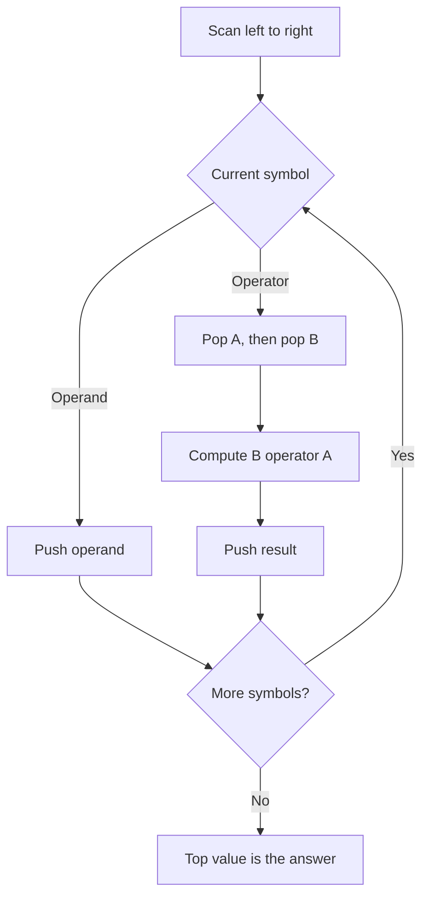
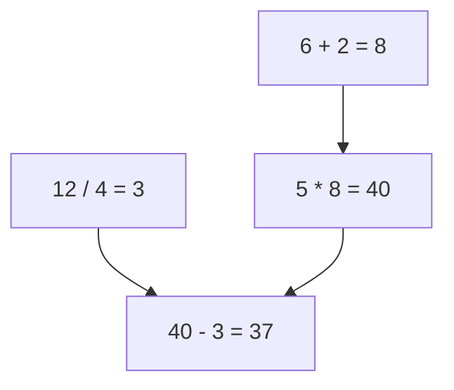

# 07 - Evaluation of Postfix Expressions

[← Expression Notations](06-expression-notations.md) | [Next: Infix to Postfix →](08-infix-to-postfix.md)

Postfix expressions can be evaluated directly using a stack that stores
operands and intermediate results.

## 1. Core Idea



> [!IMPORTANT]
> Operand order matters. If `A` is popped first and `B` second, calculate
> `B operator A`, not `A operator B`.

---

## 2. Algorithm

```text
EVALUATE_POSTFIX(P)

1. Scan P from left to right.
2. For each symbol:
   a. If it is an operand, push it onto the stack.
   b. If it is an operator:
      i.   A = POP()
      ii.  B = POP()
      iii. Result = B operator A
      iv.  PUSH(Result)
3. After all symbols are processed, the stack top is the final value.
4. Stop.
```

The slides express the termination step by appending `)` to the expression and
scanning until that symbol is reached. Token-count termination is an equivalent
implementation approach.

---

## 3. Worked Example

Evaluate:

```text
5 6 2 + * 12 4 / -
```

| Step | Symbol | Action | Stack after action |
|---:|---:|---|---|
| 1 | `5` | Push operand | `5` |
| 2 | `6` | Push operand | `5, 6` |
| 3 | `2` | Push operand | `5, 6, 2` |
| 4 | `+` | `6 + 2 = 8` | `5, 8` |
| 5 | `*` | `5 * 8 = 40` | `40` |
| 6 | `12` | Push operand | `40, 12` |
| 7 | `4` | Push operand | `40, 12, 4` |
| 8 | `/` | `12 / 4 = 3` | `40, 3` |
| 9 | `-` | `40 - 3 = 37` | `37` |

Final value:

$$
37
$$

## 4. Evaluation Tree



## 5. C Implementation for Single-Digit Operands

```c
#include <ctype.h>

int evaluatePostfix(const char expression[])
{
    int stack[100];
    int top = -1;

    for (int i = 0; expression[i] != '\0'; i++)
    {
        char symbol = expression[i];

        if (symbol == ' ')
        {
            continue;
        }

        if (isdigit((unsigned char)symbol))
        {
            stack[++top] = symbol - '0';
        }
        else
        {
            int right = stack[top--];
            int left = stack[top--];

            switch (symbol)
            {
                case '+': stack[++top] = left + right; break;
                case '-': stack[++top] = left - right; break;
                case '*': stack[++top] = left * right; break;
                case '/': stack[++top] = left / right; break;
            }
        }
    }

    return stack[top];
}
```

> [!NOTE]
> The code above demonstrates the stack logic for single-digit operands. A
> token-based parser is required for numbers such as `12`.

## 6. Complexity

For `n` tokens:

- Time complexity: `O(n)`
- Auxiliary stack space: `O(n)`

<details>
<summary><strong>Quick Check</strong></summary>

1. What happens when an operand is scanned?
2. In what order are operands applied after two POP operations?
3. What remains on the stack after a valid postfix expression is evaluated?
4. Why does evaluation require linear time?

</details>

[← Expression Notations](06-expression-notations.md) | [Next: Infix to Postfix →](08-infix-to-postfix.md)

