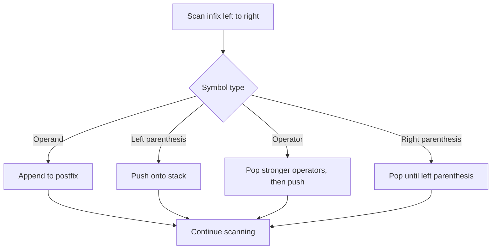
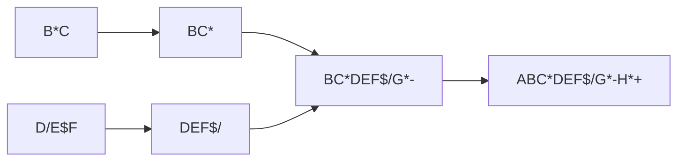

# 08 - Conversion of Infix to Postfix

[← Postfix Evaluation](07-postfix-evaluation.md) | [Next: Infix to Prefix →](09-infix-to-prefix.md)

An infix expression contains operands, operators and possibly parentheses. A
stack temporarily stores operators while the expression is scanned.

## 1. Conversion Rules



### Rules from the Material

- If an operand is found, add it to the postfix expression.
- If an operator is found, compare its precedence with the operator on the
  stack before pushing it.
- If `(` is found, push it onto the stack.
- If `)` is found, pop operators into the postfix expression until `(` is
  encountered. Remove `(` without adding it to the output.

---

## 2. Operator Precedence

The material uses `$` for exponentiation.

| Operator | Meaning | Precedence | Associativity |
|---|---|---:|---|
| `$` | Exponentiation | Highest | Right to left |
| `*`, `/` | Multiplication, division | Middle | Left to right |
| `+`, `-` | Addition, subtraction | Lowest | Left to right |

> [!NOTE]
> For a left-associative incoming operator, pop operators of greater or equal
> precedence. For right-associative exponentiation, do not pop another
> exponent operator merely because the precedence is equal.

---

## 3. Algorithm

Let:

- `Q` be the infix expression,
- `P` be the initially empty postfix expression,
- `Stack` store operators, and
- `top` represent the stack top.

```text
INFIX_TO_POSTFIX(Q, P, Stack, Top)

1. Push '(' onto Stack and append ')' to Q.
2. Scan Q from left to right until Stack becomes empty.
3. If the symbol is an operand, append it to P.
4. If the symbol is '(', push it.
5. If the symbol is an operator:
   a. Pop suitable higher-precedence operators from Stack into P.
   b. For left-associative operators, also pop equal precedence.
   c. Push the new operator.
6. If the symbol is ')':
   a. Pop operators from Stack into P until '(' appears.
   b. Remove '(' without appending it to P.
7. Print P.
8. Stop.
```

---

## 4. Worked Example

Convert:

```text
A+(B*C-(D/E$F)*G)*H
```

| Index | Symbol | Operator stack | Postfix output |
|---:|---:|---|---|
| 1 | `A` | `(` | `A` |
| 2 | `+` | `(+` | `A` |
| 3 | `(` | `(+(` | `A` |
| 4 | `B` | `(+(` | `AB` |
| 5 | `*` | `(+(*` | `AB` |
| 6 | `C` | `(+(*` | `ABC` |
| 7 | `-` | `(+(-` | `ABC*` |
| 8 | `(` | `(+(-(` | `ABC*` |
| 9 | `D` | `(+(-(` | `ABC*D` |
| 10 | `/` | `(+(-(/` | `ABC*D` |
| 11 | `E` | `(+(-(/` | `ABC*DE` |
| 12 | `$` | `(+(-(/$` | `ABC*DE` |
| 13 | `F` | `(+(-(/$` | `ABC*DEF` |
| 14 | `)` | `(+(-` | `ABC*DEF$/` |
| 15 | `*` | `(+(-*` | `ABC*DEF$/` |
| 16 | `G` | `(+(-*` | `ABC*DEF$/G` |
| 17 | `)` | `(+` | `ABC*DEF$/G*-` |
| 18 | `*` | `(+*` | `ABC*DEF$/G*-` |
| 19 | `H` | `(+*` | `ABC*DEF$/G*-H` |
| 20 | `)` | Empty | `ABC*DEF$/G*-H*+` |

Final postfix expression:

```text
ABC*DEF$/G*-H*+
```

## 5. Structural Check



## 6. Complexity

Each symbol is pushed and popped at most once.

- Time complexity: `O(n)`
- Auxiliary stack space: `O(n)`

<details>
<summary><strong>Quick Check</strong></summary>

1. What happens to an operand during conversion?
2. What happens when a closing parenthesis is scanned?
3. Why is exponentiation treated differently for equal precedence?
4. What is the final postfix form of the worked example?

</details>

[← Postfix Evaluation](07-postfix-evaluation.md) | [Next: Infix to Prefix →](09-infix-to-prefix.md)

