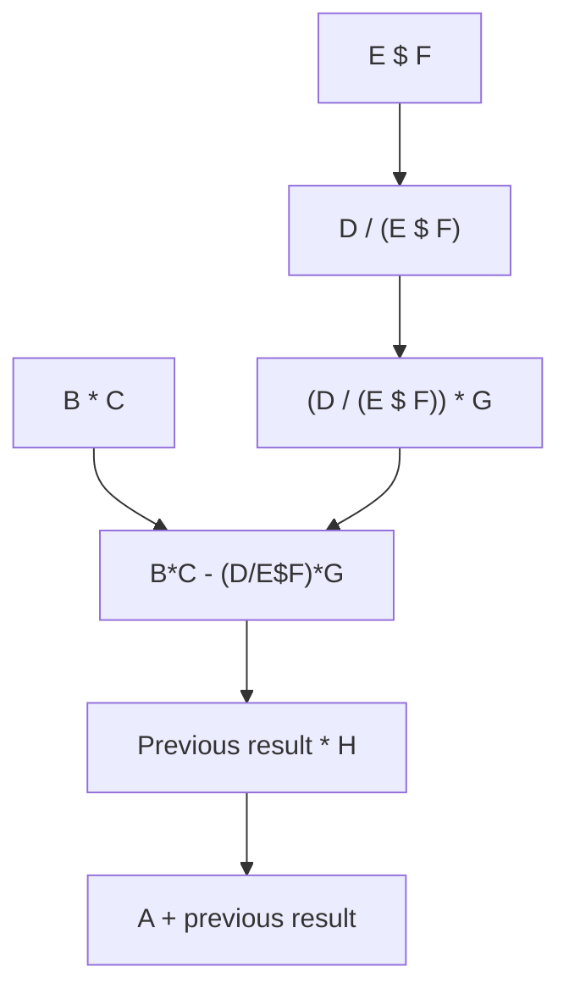

# 09 - Conversion of Infix to Prefix

[← Infix to Postfix](08-infix-to-postfix.md) | [Next: Recursion →](10-recursion.md)

Infix-to-prefix conversion follows the infix-to-postfix process with reversal
steps before and after conversion.

## 1. Conversion Strategy


---

## 2. Algorithm

Let:

- `Q` be the infix expression,
- `RQ` be the reversed and parenthesis-adjusted expression,
- `P` be the temporary postfix result, and
- `Stack` store operators.

```text
INFIX_TO_PREFIX(Q)

1. Reverse Q and store it in RQ.
2. Replace every '(' with ')' and every ')' with '(' in RQ.
3. Convert RQ to postfix using a stack.
4. Reverse the postfix result.
5. Print the reversed result as the prefix expression.
6. Stop.
```

When converting the reversed expression, associativity handling must also be
adjusted carefully so that the final prefix expression preserves the original
expression tree.

---

## 3. Worked Example

Original expression:

```text
A+(B*C-(D/E$F)*G)*H
```

### Step 1: Reverse the Expression

```text
H*)G*)F$E/D(-C*B(+A
```

### Step 2: Swap Parentheses

```text
H*(G*(F$E/D)-C*B)+A
```

### Step 3: Produce Temporary Postfix

```text
HGFE$D/*CB*-*A+
```

### Step 4: Reverse the Temporary Result

Final prefix expression:

```text
+A*-*BC*/D$EFGH
```

## 4. Expression Breakdown



Prefix places every operator before the complete representation of its left
and right operands.

## 5. Infix, Postfix and Prefix Result

| Form | Expression |
|---|---|
| Infix | `A+(B*C-(D/E$F)*G)*H` |
| Postfix | `ABC*DEF$/G*-H*+` |
| Prefix | `+A*-*BC*/D$EFGH` |

## 6. Complexity

Reversal and conversion each require linear time.

- Time complexity: `O(n)`
- Auxiliary stack space: `O(n)`

<details>
<summary><strong>Quick Check</strong></summary>

1. Why are parentheses swapped after reversing the expression?
2. Why is the temporary postfix result reversed?
3. What is the final prefix form of the worked example?
4. What is the time complexity of conversion?

</details>

[← Infix to Postfix](08-infix-to-postfix.md) | [Next: Recursion →](10-recursion.md)

