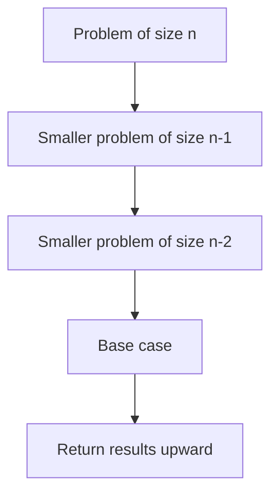
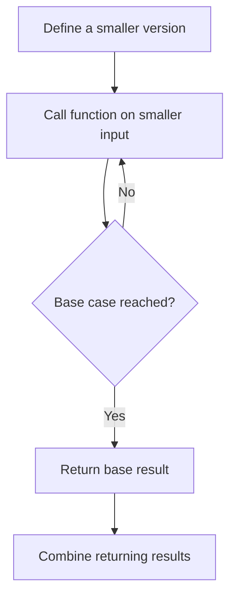
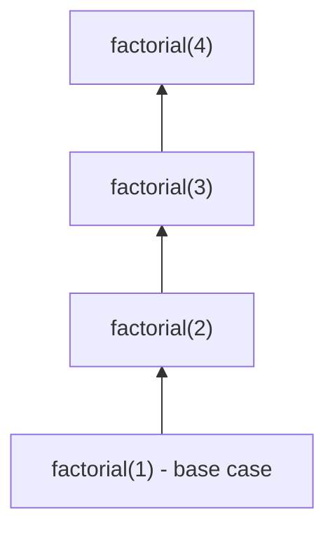
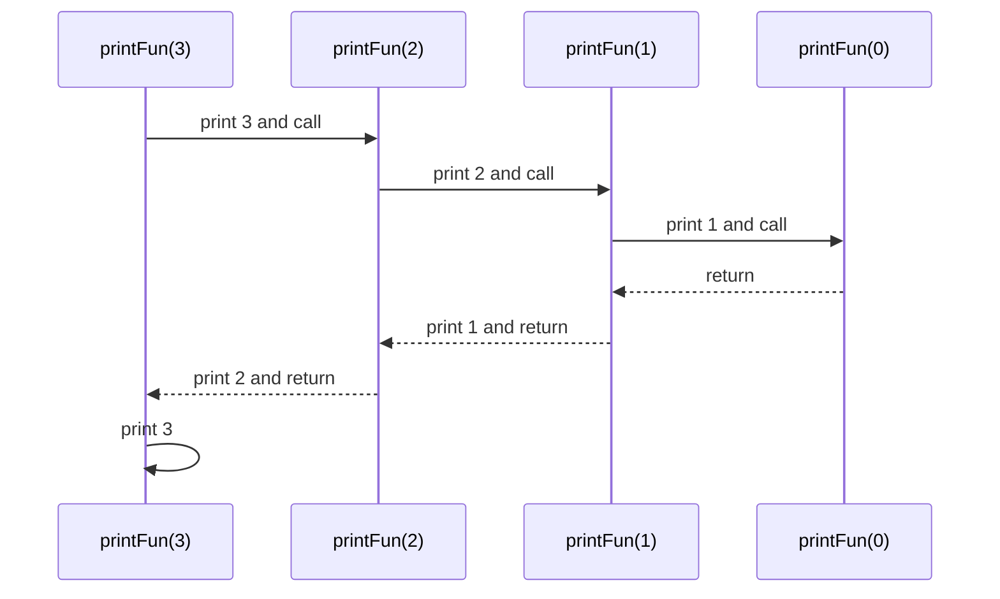

# 10 - Recursion and the Call Stack

[← Infix to Prefix](09-infix-to-prefix.md) | [Next: Tower of Hanoi →](11-tower-of-hanoi.md)

## 1. What is Recursion?

**Recursion** occurs when a function calls itself directly or indirectly.

A function that calls itself is called a **recursive function**.

Recursion is useful when a problem can be represented using smaller instances
of the same problem.

Examples from the material:

- Tower of Hanoi
- Tree traversal
- Depth First Search of a graph



---

## 2. Two Essential Parts

Every correct recursive solution requires:

1. a **base case** that stops recursion, and
2. a **recursive case** that moves the problem toward the base case.

### Factorial Example

```c
long long factorial(int n)
{
    if (n <= 1)
    {
        return 1;
    }

    return n * factorial(n - 1);
}
```

The base case is `n <= 1`. For larger values, the function reduces the problem
from `factorial(n)` to `factorial(n - 1)`.

$$
n! = n \times (n-1)!
$$

---

## 3. How Recursion Solves a Problem



For factorial:

```text
factorial(4)
= 4 * factorial(3)
= 4 * 3 * factorial(2)
= 4 * 3 * 2 * factorial(1)
= 4 * 3 * 2 * 1
= 24
```

---

## 4. How Memory is Allocated

When a function is called, memory for that call is allocated on the **call
stack**.

For a recursive function:

- each call receives a separate stack frame,
- each frame has its own local variables,
- a new frame is placed above the calling frame, and
- frames are removed in reverse order after the base case returns.



The most recent function call returns first, following LIFO behaviour.

---

## 5. Why Stack Overflow Occurs

If a base case is missing, unreachable or incorrect, recursive calls may
continue until the call stack runs out of memory. This causes **stack overflow**.

### Incorrect Example

```c
int fact(int n)
{
    if (n == 100)
    {
        return 1;
    }

    return n * fact(n - 1);
}
```

Calling `fact(10)` produces `fact(9)`, `fact(8)` and so on. The input moves away
from `100`, so the base case is never reached.

> [!CAUTION]
> A base case must be reachable from every valid recursive call path.

---

## 6. Recursion Trace Example

```cpp
#include <iostream>
using namespace std;

void printFun(int test)
{
    if (test < 1)
    {
        return;
    }

    cout << test << " ";
    printFun(test - 1);
    cout << test << " ";
}

int main()
{
    int test = 3;
    printFun(test);
    return 0;
}
```

Output:

```text
3 2 1 1 2 3
```

### Why?

| Phase | Printed values |
|---|---|
| Before recursive calls | `3 2 1` |
| While calls return | `1 2 3` |



## 7. Recursion Checklist

Before writing a recursive function, ask:

- What is the base case?
- Does every call move toward it?
- What smaller problem is being solved?
- What result is returned?
- How much call-stack memory may be used?

[← Infix to Prefix](09-infix-to-prefix.md) | [Next: Tower of Hanoi →](11-tower-of-hanoi.md)

