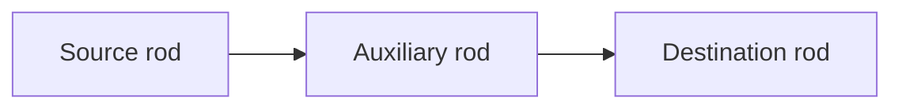
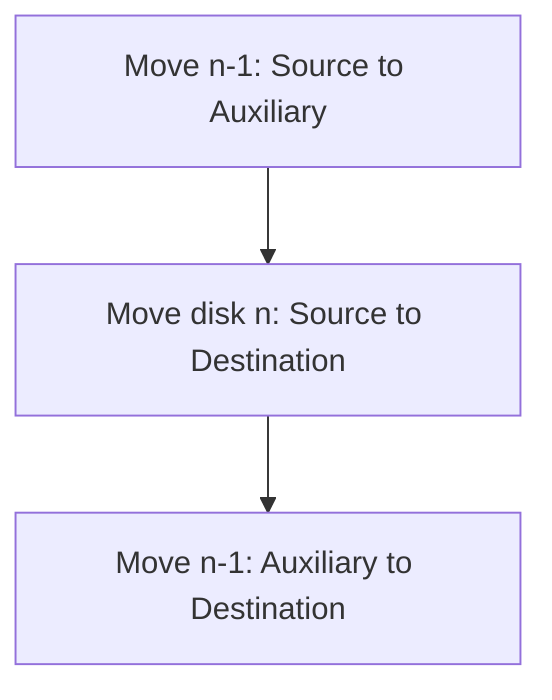

# 11 - Tower of Hanoi

[← Recursion](10-recursion.md) | [Unit Index →](README.md)

## 1. The Puzzle

Tower of Hanoi is a mathematical puzzle containing:

- three rods, and
- `n` disks of different sizes.

The objective is to move all disks from the source rod to the destination rod
using the auxiliary rod.



## 2. Rules

1. Only one disk may be moved at a time.
2. Only the uppermost disk of a rod may be moved.
3. A larger disk may never be placed on a smaller disk.

---

## 3. Minimum Number of Moves

For `n` disks, the minimum number of moves is:

$$
2^n - 1
$$

For three disks:

$$
2^3 - 1 = 7
$$

| Disks | Minimum moves |
|---:|---:|
| 1 | 1 |
| 2 | 3 |
| 3 | 7 |
| 4 | 15 |
| 5 | 31 |

---

## 4. Building the Recursive Idea

### One Disk

Move the disk directly from source to destination.

### Two Disks

1. Move the smaller disk from source to auxiliary.
2. Move the larger disk from source to destination.
3. Move the smaller disk from auxiliary to destination.

### More Than Two Disks

Treat the largest disk as one part and the remaining `n - 1` disks as another.



---

## 5. Recursive Algorithm

```text
HANOI(disks, source, destination, auxiliary)

1. If disks == 1:
      Move one disk from source to destination
      Return
2. HANOI(disks - 1, source, auxiliary, destination)
3. Move disk 'disks' from source to destination
4. HANOI(disks - 1, auxiliary, destination, source)
5. Return
```

## 6. C Implementation

```c
#include <stdio.h>

void hanoi(int disks, char source, char destination, char auxiliary)
{
    if (disks == 1)
    {
        printf("Move disk 1 from %c to %c\n", source, destination);
        return;
    }

    hanoi(disks - 1, source, auxiliary, destination);

    printf("Move disk %d from %c to %c\n",
           disks, source, destination);

    hanoi(disks - 1, auxiliary, destination, source);
}

int main(void)
{
    int disks;

    printf("Enter number of disks: ");
    scanf("%d", &disks);

    if (disks <= 0)
    {
        printf("Number of disks must be positive.\n");
        return 1;
    }

    hanoi(disks, 'A', 'C', 'B');
    return 0;
}
```

The number of disks is taken from the user; it is not hardcoded.

---

## 7. Dry Run for Three Disks

Let:

- `A` be the source,
- `B` be the auxiliary, and
- `C` be the destination.

| Move | Disk | From | To |
|---:|---:|---:|---:|
| 1 | 1 | A | C |
| 2 | 2 | A | B |
| 3 | 1 | C | B |
| 4 | 3 | A | C |
| 5 | 1 | B | A |
| 6 | 2 | B | C |
| 7 | 1 | A | C |

## 8. Recurrence and Complexity

The recursive running time follows:

$$
T(n) = 2T(n-1) + 1
$$

Therefore:

- Time complexity: `O(2^n)`
- Recursive stack space: `O(n)`
- Exact minimum moves: `2^n - 1`

<details>
<summary><strong>Quick Check</strong></summary>

1. What are the three Tower of Hanoi rules?
2. Why are `n - 1` disks moved twice?
3. How many moves are required for four disks?
4. What are the time and stack-space complexities?

</details>

[← Recursion](10-recursion.md) | [Unit Index →](README.md)

