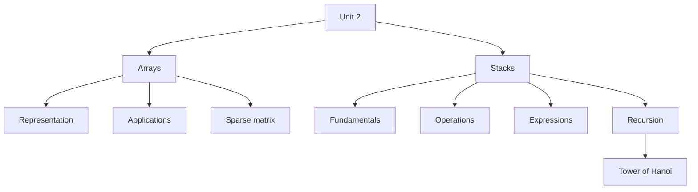

# Unit 2 - Array and Stack

> **CEM2003C | Data Structures | Semester 3**

Unit 2 covers two major linear data structures: **arrays** and **stacks**.

## Material Status

| Syllabus area | Source material | Status |
|---|---|---|
| Array representation | `Unit-5 Array & String in C.pdf` | Complete |
| Applications of arrays | Derived from supplied array fundamentals | Complete |
| Sparse matrix and representation | Syllabus-aligned supplement | Supplementary |
| Stack concepts and implementation | `Stack.pdf` | Complete |
| Stack operations | `Stack.pdf` | Complete |
| Expression notations and conversions | `Stack.pdf` | Complete |
| Recursion | `Stack.pdf` | Complete |
| Tower of Hanoi | `Stack.pdf` | Complete |

> [!NOTE]
> The first two array files are based on the supplied Semester 1 array notes.
> Sparse-matrix notes are a clearly labelled syllabus-aligned supplement because
> that topic was not included in the supplied PDF.

## Unit Roadmap

## Array Notes

| No. | Topic | Open notes |
|---:|---|---|
| 1 | Array Fundamentals and Representation | [Start](01-array-fundamentals.md) |
| 2 | Applications of Arrays | [Start](02-array-applications.md) |
| 3 | Sparse Matrix and Representation | [Start](03-sparse-matrix.md) |

## Stack Notes

| No. | Topic | Open notes |
|---:|---|---|
| 4 | Stack Fundamentals and Array Implementation | [Start](04-stack-fundamentals.md) |
| 5 | Stack Operations | [Start](05-stack-operations.md) |
| 6 | Infix, Prefix and Postfix Notations | [Start](06-expression-notations.md) |
| 7 | Postfix Evaluation | [Start](07-postfix-evaluation.md) |
| 8 | Infix to Postfix Conversion | [Start](08-infix-to-postfix.md) |
| 9 | Infix to Prefix Conversion | [Start](09-infix-to-prefix.md) |
| 10 | Recursion and the Call Stack | [Start](10-recursion.md) |
| 11 | Tower of Hanoi | [Start](11-tower-of-hanoi.md) |

## Exam Support

- [Important Questions](important-questions.md)
- [Viva Questions](viva-questions.md)

## Unit Learning Checklist

- [ ] Define an array and explain contiguous representation.
- [ ] Declare, initialise and traverse 1D and 2D arrays.
- [ ] Explain array applications, strengths and limitations.
- [ ] Describe triplet representation for a sparse matrix.
- [ ] Define a stack and explain LIFO.
- [ ] Represent a stack using an array and `top`.
- [ ] Identify overflow and underflow.
- [ ] Perform PUSH, POP, PEEP, CHANGE and DISPLAY.
- [ ] Distinguish infix, prefix and postfix notations.
- [ ] Evaluate a postfix expression using a stack.
- [ ] Convert infix expressions to postfix and prefix.
- [ ] Explain recursion, base cases and stack overflow.
- [ ] Solve Tower of Hanoi recursively.

**Previous:** [Unit 1 - Introduction](../Unit-1-Introduction/)  
**Next:** [Unit 3 - Queue and Linked List](../Unit-3-Queue-and-Linked-List/)
