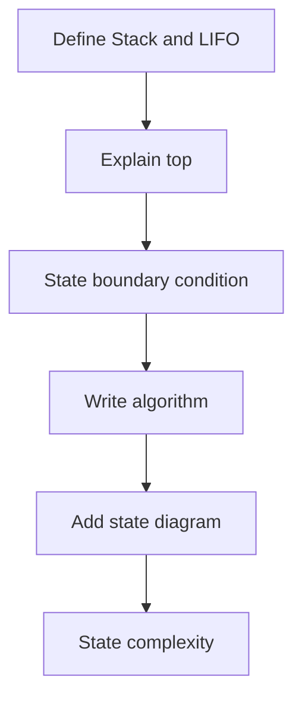
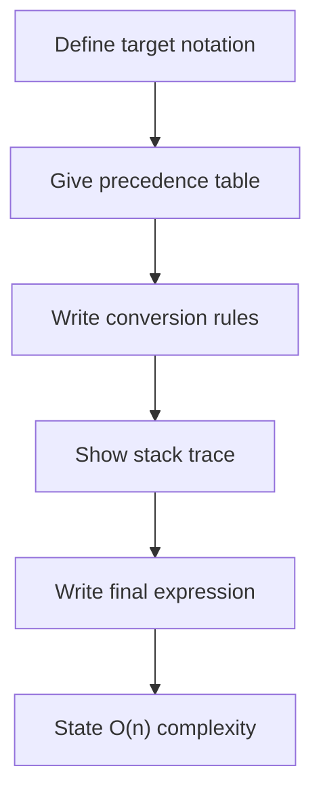

# Unit 2 - Array and Stack Important Questions

[← Unit Index](README.md) | [Viva Questions →](viva-questions.md)

> [!NOTE]
> Array questions are based on the supplied Semester 1 array notes. The sparse
> matrix questions are labelled supplementary because that topic was not in the
> supplied PDF; the remaining questions cover `Stack.pdf`.

## Array — Short-Answer Questions

1. Define an array.
2. Why are array elements stored contiguously?
3. What are the valid indices of `int a[10]`?
4. State four properties of an array.
5. State four advantages of using arrays.
6. Write the declaration syntax for a one-dimensional array.
7. Declare and initialise `int number[3]` with `1, 2, 3`.
8. What is a two-dimensional array?
9. Write the declaration syntax for a two-dimensional array.
10. Why are nested loops used to traverse a 2D array?

## Array — Descriptive Questions

1. Explain array representation and derive the indexed-address formula.
2. Explain one-dimensional array declaration, initialisation and traversal with a C program.
3. Explain two-dimensional arrays with row/column diagrams and a nested-traversal program.
4. Discuss array applications in searching, sorting, tables and other data structures.

## Sparse Matrix — Supplementary Questions

1. Define a sparse matrix and explain why dense storage wastes memory.
2. Explain triplet representation with a worked example.
3. Write an algorithm or C program to convert a matrix into triplet form.
4. Compare dense and sparse storage in terms of time and space.

## Short-Answer Questions

1. Define a stack.
2. Explain the LIFO principle with an example.
3. What is the Top of Stack?
4. How is an empty stack represented using `top`?
5. State the overflow condition for an array stack.
6. State the underflow condition for an array stack.
7. Define PUSH and POP.
8. Define PEEP and CHANGE.
9. What is stack traversal?
10. Define infix notation with an example.
11. Define prefix or Polish notation.
12. Define postfix or Reverse Polish notation.
13. What is the role of a stack in postfix evaluation?
14. State the main rules for infix-to-postfix conversion.
15. State the steps for infix-to-prefix conversion.
16. Define recursion and recursive function.
17. What is a base case?
18. Why can recursion cause stack overflow?
19. State the rules of Tower of Hanoi.
20. Write the minimum-move formula for Tower of Hanoi.

## Descriptive Questions

1. Explain stack representation using an array.
2. Explain stack overflow and underflow with conditions.
3. Write algorithms for PUSH and POP operations.
4. Explain PEEP, CHANGE and DISPLAY with algorithms.
5. Compare infix, prefix and postfix notations.
6. Explain postfix evaluation using a stack.
7. Evaluate `5 6 2 + * 12 4 / -` using a stack.
8. Explain the infix-to-postfix conversion algorithm.
9. Convert `A+(B*C-(D/E$F)*G)*H` to postfix.
10. Explain the infix-to-prefix conversion algorithm.
11. Convert `A+(B*C-(D/E$F)*G)*H` to prefix.
12. Explain recursion with a factorial example.
13. Explain memory allocation for recursive function calls.
14. Explain how an incorrect base case causes stack overflow.
15. Explain Tower of Hanoi and write its recursive algorithm.
16. Analyse the time and space complexity of Tower of Hanoi.

## Answer Blueprint: Stack Operations

## Answer Blueprint: Expression Conversion

## Last-Minute Checklist

- [ ] I can write all five stack operations.
- [ ] I can distinguish overflow from underflow.
- [ ] I can evaluate a postfix expression correctly.
- [ ] I remember operand order as `left operator right`.
- [ ] I can perform both expression conversions.
- [ ] I can explain recursion through the call stack.
- [ ] I can derive `2^n - 1` moves for Tower of Hanoi.

[← Unit Index](README.md) | [Viva Questions →](viva-questions.md)
