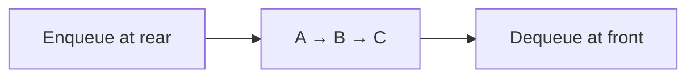
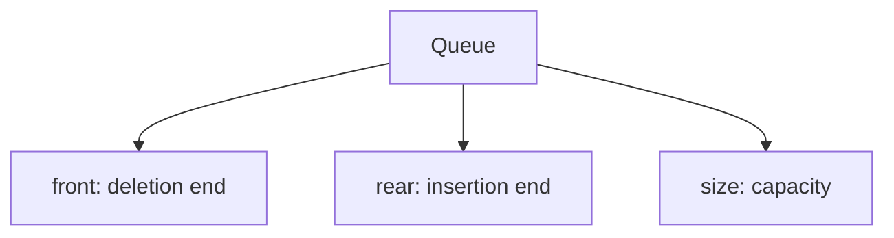

# 01 - Queue Fundamentals

**Unit 3 · CEM2003C Data Structures** · [← Unit index](README.md) · [Next: Operations →](02-queue-operations.md)

> **Source note:** Based on the supplied Chapter 3 notes. The queue portion covers linear queues, circular queues, deques, priority queues and applications.

## What is a queue?

A **queue** is a linear data structure in which insertion takes place at the **rear** and deletion takes place at the **front**. It follows **FIFO (First In, First Out)**.



Think of people waiting at a service counter: the person who arrives first is served first.

## Array representation

An array queue maintains two indices:

| Variable | Meaning |
|---|---|
| `front` | Index of the element to be deleted next |
| `rear` | Index of the last inserted element |
| `size` | Maximum number of elements |

Initial state:

```text
front = -1
rear  = -1
```



## Boundary conditions in a linear queue

- **Underflow:** the queue is empty. In the supplied notes this is represented by `front == -1`.
- **Overflow:** `rear == size - 1`.

> **Important:** A simple linear array queue can report overflow even when cells at the beginning became empty after deletions. Circular queues solve this wasted-space problem.

## Queue state example

```text
Initial       front = -1, rear = -1
Enqueue(10)   front = 0,  rear = 0       [10]
Enqueue(20)   front = 0,  rear = 1       [10, 20]
Dequeue()     removes 10; front = 1     [_, 20]
```

## Common operations

1. **Insertion / enqueue** - add an item at the rear.
2. **Deletion / dequeue** - remove an item from the front.
3. **Traversal / display** - visit items from front to rear.
4. **Update** - modify an existing item at a valid position.

**Next:** [02 - Queue Operations](02-queue-operations.md)
