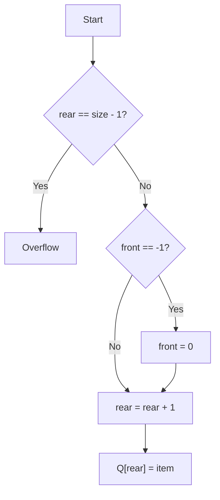

# 02 - Linear Queue Operations

**Unit 3 · CEM2003C Data Structures** · [← Fundamentals](01-queue-fundamentals.md) · [Next: Circular Queue →](03-circular-queue.md)

## Enqueue: insertion at the rear

```text
ENQUEUE(Q, item)
1. If rear == size - 1, report Overflow and stop.
2. If front == -1, set front = 0.
3. Increment rear.
4. Store item in Q[rear].
```



## Dequeue: deletion at the front

```text
DEQUEUE(Q)
1. If front == -1, report Underflow and stop.
2. Save Q[front] as item.
3. If front == rear, set front = rear = -1.
4. Otherwise increment front.
5. Return item.
```

Resetting both indices after removing the last item is essential; it restores the empty state.

## Complete C implementation

This program shows the four operations from the notes without hiding the
`front` and `rear` updates.

```c
#include <stdio.h>

#define SIZE 5

int queue[SIZE];
int front = -1;
int rear = -1;

void enqueue(int item) {
    if (rear == SIZE - 1) {
        printf("Queue Overflow\n");
        return;
    }
    if (front == -1) {
        front = 0;
    }
    queue[++rear] = item;
}

int dequeue(int *item) {
    if (front == -1) {
        printf("Queue Underflow\n");
        return 0;
    }

    *item = queue[front++];
    if (front > rear) {
        front = rear = -1;
    }
    return 1;
}

void display(void) {
    if (front == -1) {
        printf("Queue is empty\n");
        return;
    }
    for (int i = front; i <= rear; i++) {
        printf("%d ", queue[i]);
    }
    printf("\n");
}

void update(int position, int value) {
    if (front == -1 || position < front || position > rear) {
        printf("Invalid position\n");
        return;
    }
    queue[position] = value;
}
```

The position passed to `update` is the actual array index. A menu-driven
program can call these functions after reading values from the user.

## Display / traversal

```c
void display(const int queue[], int front, int rear) {
    if (front == -1) {
        printf("Queue is empty\n");
        return;
    }

    for (int i = front; i <= rear; i++) {
        printf("%d ", queue[i]);
    }
    printf("\n");
}
```

Display visits every active element from `front` through `rear`.

## Update

To update a valid queue position, locate the desired index and assign a new value. Updating an existing array cell is `O(1)` once its index is known; searching for a value or position may take `O(n)`.

## Complexity

| Operation | Time | Extra space |
|---|---:|---:|
| Enqueue | `O(1)` | `O(1)` |
| Dequeue | `O(1)` | `O(1)` |
| Display | `O(n)` | `O(1)` |
| Update by index | `O(1)` | `O(1)` |

**Next:** [03 - Circular Queue](03-circular-queue.md)
