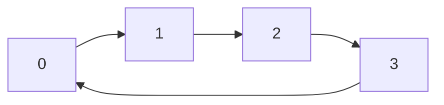

# 03 - Circular Queue

**Unit 3 · CEM2003C Data Structures** · [← Linear operations](02-queue-operations.md) · [Next: Deque →](04-deque.md)

## Idea

A **circular queue** connects the last array position back to the first. After reaching the last index, the next insertion can reuse an empty position at index `0`.



This avoids the unutilised-space problem of a linear queue.

## Wrap-around formula

```text
nextRear  = (rear + 1) % size
nextFront = (front + 1) % size
```

For the representation used in the supplied notes:

- **Underflow:** `front == -1`
- **Overflow:** `front == (rear + 1) % size`

## Enqueue algorithm

```text
CIRCULAR_ENQUEUE(Q, item)
1. If front == (rear + 1) % size, report Overflow.
2. If front == -1, set front = rear = 0.
3. Otherwise set rear = (rear + 1) % size.
4. Store Q[rear] = item.
```

## Dequeue algorithm

```text
CIRCULAR_DEQUEUE(Q)
1. If front == -1, report Underflow.
2. Save Q[front].
3. If front == rear, set front = rear = -1.
4. Otherwise set front = (front + 1) % size.
5. Return the saved item.
```

## Traversal

```c
void displayCircular(const int q[], int front, int rear, int size) {
    if (front == -1) {
        printf("Queue is empty\n");
        return;
    }

    int i = front;
    do {
        printf("%d ", q[i]);
        i = (i + 1) % size;
    } while (i != (rear + 1) % size);
    printf("\n");
}
```

The `do...while` loop handles a queue whose active range wraps from the last index to index `0`.

## Comparison

| Linear queue | Circular queue |
|---|---|
| Rear only moves forward | Front and rear wrap around |
| May waste freed cells | Reuses freed cells |
| Overflow at `rear == size - 1` | Overflow when next rear meets front |

**Next:** [04 - Double-Ended Queue](04-deque.md)
