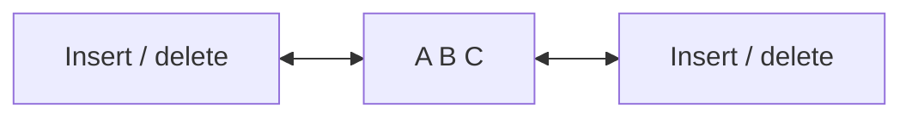

# 04 - Double-Ended Queue (Deque)

**Unit 3 · CEM2003C Data Structures** · [← Circular queue](03-circular-queue.md) · [Next: Priority Queue →](05-priority-queue.md)

## Definition

A **double-ended queue**, or **deque**, permits insertion and deletion at both the front and the rear.



## Types of deque

| Type | Insertion | Deletion |
|---|---|---|
| Input-restricted deque | Rear only | Front or rear |
| Output-restricted deque | Front or rear | Front only |

## Four possible operations

1. Insert at rear
2. Delete at front
3. Delete at rear
4. Insert at front

For an input-restricted deque, operations 1, 2 and 3 are valid. For an output-restricted deque, operations 1, 2 and 4 are valid.

## Insert at front: array algorithm

```text
INSERT_FRONT(DQ, item)
1. If (front == 0 and rear == size - 1) or front == rear + 1, report Overflow.
2. If front == -1, set front = rear = 0.
3. Else if front == 0, set front = size - 1.
4. Else decrement front.
5. Set DQ[front] = item.
```

The supplied notes use this non-circular boundary form. A circular-array deque can use modulo arithmetic for both ends.

## When is a deque useful?

Deques are useful when a system needs priority-like insertion at either end, sliding-window processing, undo/redo buffers, or task scheduling with front and rear policies.

**Next:** [05 - Priority Queue](05-priority-queue.md)
