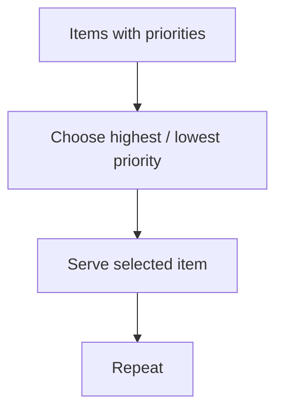

# 05 - Priority Queue

**Unit 3 · CEM2003C Data Structures** · [← Deque](04-deque.md) · [Next: Applications →](06-queue-applications.md)

## Definition

A **priority queue** assigns a priority to every element. The element with the highest or lowest priority is served first instead of blindly following FIFO. If priorities tie, equal-priority items are served in FIFO order.



## Types

| Type | First deletion |
|---|---|
| Ascending / min-priority queue | Smallest priority value |
| Descending / max-priority queue | Largest priority value |

The words *ascending* and *descending* describe the order in which priority values are processed; define the convention explicitly in an answer.

## Implementation choices

Priority queues can be implemented using:

- arrays;
- linked lists;
- heaps (covered as an efficient specialised structure later).

The implementation determines the cost of insertion and deletion. A simple unsorted array gives fast insertion but may scan all items to find the next priority.

## Example

```text
Patient A: priority 3
Patient B: priority 1
Patient C: priority 2

Min-priority service order: B → C → A
```

## Quick check

<details>
<summary>What happens when two priorities are equal?</summary>

The tied elements retain FIFO order.

</details>

**Next:** [06 - Queue Applications](06-queue-applications.md)
