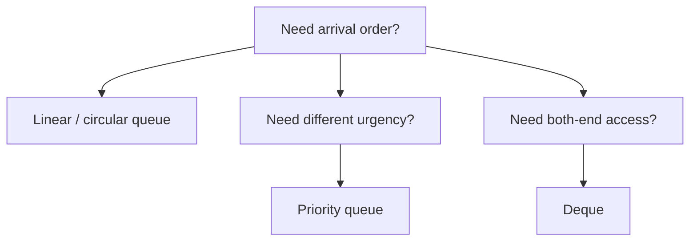

# 06 - Applications of Queues

**Unit 3 · CEM2003C Data Structures** · [← Priority queue](05-priority-queue.md) · [Next: Linked-list fundamentals →](07-linked-list-fundamentals.md)

## Why queues fit these systems

Queues preserve arrival order while separating producers from consumers. A producer can add work even when the consumer is temporarily busy.

## Applications from the notes

### Round-robin processor scheduling

Processes receive a time slice. After its slice, a process that is not finished goes to the rear, while the next process at the front runs.

### Customer service systems

Requests or customers wait in arrival order until a service agent becomes available.

### Shared-network printer

Print jobs from several computers are queued so the shared printer processes one job at a time.

## Other common uses

| Use case | Queue behaviour |
|---|---|
| Keyboard or network buffers | Absorb bursts before processing |
| Breadth-first search | Visit vertices level by level |
| Message brokers | Hold events until a worker consumes them |
| I/O scheduling | Order requests for a device |

## Choosing the queue type

**Next:** [07 - Linked-List Fundamentals](07-linked-list-fundamentals.md)
