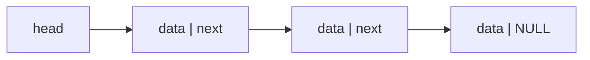

# 07 - Linked-List Fundamentals

**Unit 3 · CEM2003C Data Structures** · [← Queue applications](06-queue-applications.md) · [Next: Singly linked list →](08-singly-linked-list.md)

## What is a linked list?

A **linked list** is a dynamic data structure made of nodes. Each node stores data plus a pointer to another node. The list can grow or shrink during program execution.



## Key characteristics

- A header or `head` pointer identifies the first node.
- Successive nodes are connected through pointers.
- The last node points to `NULL` in a linear list.
- Nodes need not occupy adjacent memory locations.
- Insertion and deletion can occur at the beginning, end or a specified position.
- Random access is not available; nodes are reached by following links.
- Memory is allocated as needed, so unused capacity is avoided.

## Self-referential node

```c
struct node {
    int data;
    struct node *next;
};
```

A structure containing a pointer to the same structure type is called a **self-referential structure**.

## Array vs linked list

| Array | Linked list |
|---|---|
| Contiguous memory | Nodes may be scattered in memory |
| Direct indexed access | Sequential pointer traversal |
| Fixed capacity in a C array | Grows and shrinks dynamically |
| Middle insertion requires shifting | Middle insertion changes links |
| No link field overhead | Extra pointer memory per node |

**Next:** [08 - Singly Linked List](08-singly-linked-list.md)
