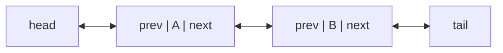

# 09 - Doubly Linked List

**Unit 3 · CEM2003C Data Structures** · [← Singly linked list](08-singly-linked-list.md) · [Next: Circular linked list →](10-circular-linked-list.md)

## Definition

A doubly linked list (DLL) stores links in both directions. Each node contains data, a pointer to the next node and a pointer to the previous node.



The first node has `prev = NULL`; the last node has `next = NULL`. Maintaining both `head` and `tail` permits forward and backward traversal.

## Node definition

```c
struct node {
    int data;
    struct node *next;
    struct node *prev;
};
```

## Insertion at the beginning

```text
1. Allocate newNode and set its data.
2. Set newNode->prev = NULL and newNode->next = head.
3. If head exists, set head->prev = newNode.
4. Otherwise set tail = newNode.
5. Set head = newNode.
```

## Insertion at the end

With a tail pointer, connect `tail->next` to the new node, set `newNode->prev = tail`, set `newNode->next = NULL`, then move `tail` to the new node.

## Deletion

When deleting a node, reconnect both neighbouring links:

```text
previous->next = target->next
next->prev = target->prev
```

Handle separately when the target is the first or last node, then free it.

## Advantages and cost

| Advantage | Cost |
|---|---|
| Forward and backward traversal | Two link fields per node |
| Easier deletion when a node is known | More pointer updates |
| Efficient insertion before a known node | More memory than a singly list |

## Complete operation set in C

This implementation maintains both `head` and `tail`. Positions are 1-based.

```c
#include <stdio.h>
#include <stdlib.h>

typedef struct DNode {
    int data;
    struct DNode *prev;
    struct DNode *next;
} DNode;

DNode *head = NULL;
DNode *tail = NULL;

void insertFront(int data) {
    DNode *node = malloc(sizeof *node);
    if (node == NULL) return;
    node->data = data;
    node->prev = NULL;
    node->next = head;
    if (head != NULL) head->prev = node;
    else tail = node;
    head = node;
}

void insertEnd(int data) {
    DNode *node = malloc(sizeof *node);
    if (node == NULL) return;
    node->data = data;
    node->next = NULL;
    node->prev = tail;
    if (tail != NULL) tail->next = node;
    else head = node;
    tail = node;
}

void insertAtPosition(int data, int position) {
    if (position <= 1) {
        insertFront(data);
        return;
    }

    DNode *current = head;
    for (int i = 1; current != NULL && i < position; i++) {
        current = current->next;
    }
    if (current == NULL) {
        insertEnd(data);
        return;
    }

    DNode *node = malloc(sizeof *node);
    if (node == NULL) return;
    node->data = data;
    node->prev = current->prev;
    node->next = current;
    current->prev->next = node;
    current->prev = node;
}

void deleteFront(void) {
    if (head == NULL) return;
    DNode *node = head;
    head = head->next;
    if (head != NULL) head->prev = NULL;
    else tail = NULL;
    free(node);
}

void deleteEnd(void) {
    if (tail == NULL) return;
    DNode *node = tail;
    tail = tail->prev;
    if (tail != NULL) tail->next = NULL;
    else head = NULL;
    free(node);
}

void deleteAtPosition(int position) {
    if (position < 1 || head == NULL) return;
    DNode *node = head;
    for (int i = 1; node != NULL && i < position; i++) {
        node = node->next;
    }
    if (node == NULL) return;
    if (node == head) { deleteFront(); return; }
    if (node == tail) { deleteEnd(); return; }

    node->prev->next = node->next;
    node->next->prev = node->prev;
    free(node);
}

void displayForward(void) {
    for (DNode *node = head; node != NULL; node = node->next) {
        printf("%d ", node->data);
    }
    printf("\n");
}

void displayBackward(void) {
    for (DNode *node = tail; node != NULL; node = node->prev) {
        printf("%d ", node->data);
    }
    printf("\n");
}
```

Every insertion or deletion updates both directions. The first and last node
are special cases because one of their neighbours is `NULL`.

**Next:** [10 - Circular Linked List](10-circular-linked-list.md)
