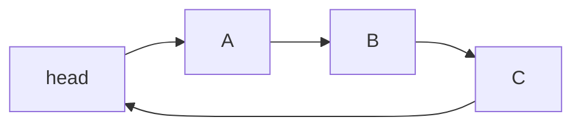

# 10 - Circular Linked List

**Unit 3 · CEM2003C Data Structures** · [← Doubly linked list](09-doubly-linked-list.md) · [Next: Linked implementations →](11-linked-implementations.md)

## Definition

In a circular linked list, the last node points back to the first node. There is no terminating `NULL` link.



A circular list may be singly or doubly linked. Since there is no natural end, traversal must stop when the starting node is reached again.

## Traversal

```c
void traverseCircular(struct node *head) {
    if (head == NULL) return;

    struct node *temp = head;
    do {
        printf("%d ", temp->data);
        temp = temp->next;
    } while (temp != head);
    printf("\n");
}
```

## Operations

The supplied notes cover insertion and deletion at the beginning and end. With a tail pointer:

- insert at beginning: link the new node before `head`, update `head`, and keep `tail->next = head`;
- insert at end: link the new node after `tail`, move `tail`, and restore `tail->next = head`;
- delete at beginning: move `head` to `head->next`, update the tail link, then free the old head;
- delete at end: find the predecessor of `tail`, make it the new tail, link it to `head`, then free the old tail.

## When to use it

Circular lists suit repeated cycles such as round-robin scheduling, circular buffers implemented with nodes, and playlists that loop continuously.

**Next:** [11 - Linked Implementations](11-linked-implementations.md)
