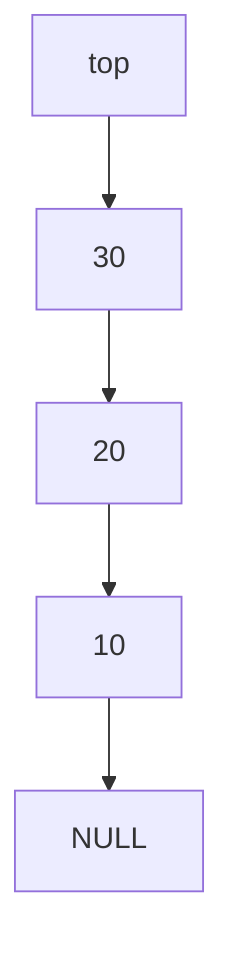

# 11 - Linked Implementations of Stack and Queue

**Unit 3 · CEM2003C Data Structures** · [← Circular linked list](10-circular-linked-list.md) · [Next: Applications →](12-linked-list-applications.md)

## Stack using a linked list

The list head acts as `top`. Push and pop happen at the head, so both are `O(1)`.



### Push

```c
void push(struct node **top, int value) {
    struct node *newNode = malloc(sizeof *newNode);
    if (newNode == NULL) {
        printf("Stack Overflow\n");
        return;
    }
    newNode->data = value;
    newNode->next = *top;
    *top = newNode;
}
```

### Pop

```c
int pop(struct node **top, int *ok) {
    if (*top == NULL) {
        *ok = 0;
        return 0;
    }
    struct node *temp = *top;
    int value = temp->data;
    *top = temp->next;
    free(temp);
    *ok = 1;
    return value;
}
```

An allocation failure is treated as overflow; removing from an empty linked stack is underflow.

## Queue using a linked list

Maintain `front` and `rear` pointers. Enqueue at the rear and dequeue at the front.


### Enqueue

```c
void enqueue(struct node **front, struct node **rear, int value) {
    struct node *newNode = malloc(sizeof *newNode);
    if (newNode == NULL) {
        printf("Queue Overflow\n");
        return;
    }
    newNode->data = value;
    newNode->next = NULL;

    if (*rear == NULL) {
        *front = *rear = newNode;
    } else {
        (*rear)->next = newNode;
        *rear = newNode;
    }
}
```

### Dequeue

```text
1. If front == NULL, report Underflow.
2. Save front in temp.
3. Move front to front->next.
4. If front becomes NULL, also set rear = NULL.
5. Free temp.
```

## Complexity

| Structure | Insert | Delete | Extra memory |
|---|---:|---:|---:|
| Linked stack at head | `O(1)` | `O(1)` | One node per item |
| Linked queue with front/rear | `O(1)` | `O(1)` | One node per item |

**Next:** [12 - Linked-List Applications](12-linked-list-applications.md)
