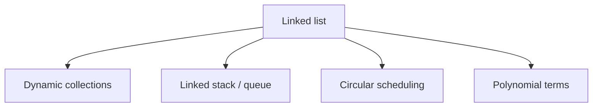

# 12 - Applications of Linked Lists

**Unit 3 · CEM2003C Data Structures** · [← Linked implementations](11-linked-implementations.md) · [Unit index](README.md)

## Why use a linked list?

Linked lists are useful when the collection changes size often or when insertion and deletion are more important than indexed access.

## Typical applications

- **Dynamic collections:** store records when the final count is unknown.
- **Stacks and queues:** use links instead of a fixed-capacity array.
- **Round-robin systems:** circulate through a circular list of tasks.
- **Polynomial representation:** store each coefficient and exponent as a node.
- **Sparse data:** store only present/non-zero entries as nodes.
- **Undo/redo or navigation:** use doubly linked links to move in both directions.

## Selection guide

| Need | Suitable list |
|---|---|
| Minimal memory per node and forward traversal | Singly linked list |
| Backward traversal | Doubly linked list |
| Continuous repetition without `NULL` | Circular linked list |
| LIFO behaviour | Linked stack |
| FIFO behaviour | Linked queue |

## Trade-off reminder

Linked lists avoid shifting during insertion/deletion, but they pay pointer-storage overhead and cannot provide `O(1)` indexed access. Choose the representation based on the dominant operation.

**Next:** [13 - Student Record Linked List](13-student-record-linked-list.md)
