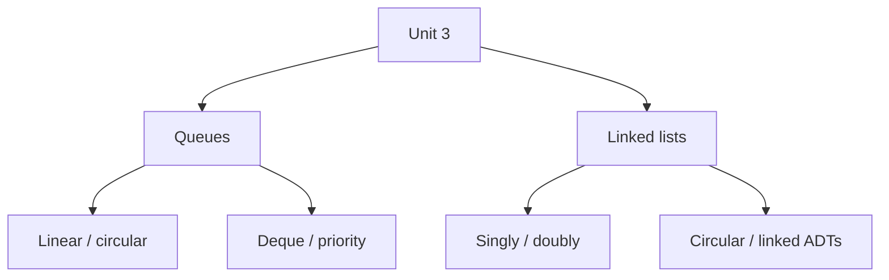

# Unit 3 - Queue and Linked List

> **CEM2003C | Data Structures | Semester 3**

Unit 3 moves from array-backed structures to dynamic linear structures: queues,
deques, priority queues, singly linked lists, doubly linked lists, circular
lists, plus linked implementations of stacks and queues.

> **Source note:** Prepared from the supplied `Chapter_3_DS_CE_.pdf`. Examples
> are rewritten for clarity while preserving the definitions, algorithms and
> applications in the faculty material.

## Unit roadmap

## Topic-wise notes

| No. | Topic | Open notes |
|---:|---|---|
| 1 | Queue Fundamentals | [Start](01-queue-fundamentals.md) |
| 2 | Linear Queue Operations | [Start](02-queue-operations.md) |
| 3 | Circular Queue | [Start](03-circular-queue.md) |
| 4 | Double-Ended Queue (Deque) | [Start](04-deque.md) |
| 5 | Priority Queue | [Start](05-priority-queue.md) |
| 6 | Applications of Queues | [Start](06-queue-applications.md) |
| 7 | Linked-List Fundamentals | [Start](07-linked-list-fundamentals.md) |
| 8 | Singly Linked List | [Start](08-singly-linked-list.md) |
| 9 | Doubly Linked List | [Start](09-doubly-linked-list.md) |
| 10 | Circular Linked List | [Start](10-circular-linked-list.md) |
| 11 | Linked Stack and Queue | [Start](11-linked-implementations.md) |
| 12 | Applications of Linked Lists | [Start](12-linked-list-applications.md) |
| 13 | Student Record Linked List | [Start](13-student-record-linked-list.md) |

## Exam support

- [Important Questions](important-questions.md)
- [Viva Questions](viva-questions.md)

## Learning checklist

- [ ] Explain FIFO, `front`, `rear`, overflow and underflow.
- [ ] Write enqueue, dequeue, display and update algorithms.
- [ ] Explain circular wrap-around and modulo conditions.
- [ ] Differentiate deque types and priority-queue types.
- [ ] Explain queue applications such as round robin and printer scheduling.
- [ ] Define a node and self-referential structure.
- [ ] Traverse, insert and delete in a singly linked list.
- [ ] Explain bidirectional links in a doubly linked list.
- [ ] Traverse and update a circular linked list safely.
- [ ] Implement a linked stack and linked queue.
- [ ] Build and traverse a linked list of student records.

**Previous:** [Unit 2 - Array and Stack](../Unit-2-Array-and-Stack/)  
**Next:** [Unit 4 - Trees](../Unit-4-Trees/)
