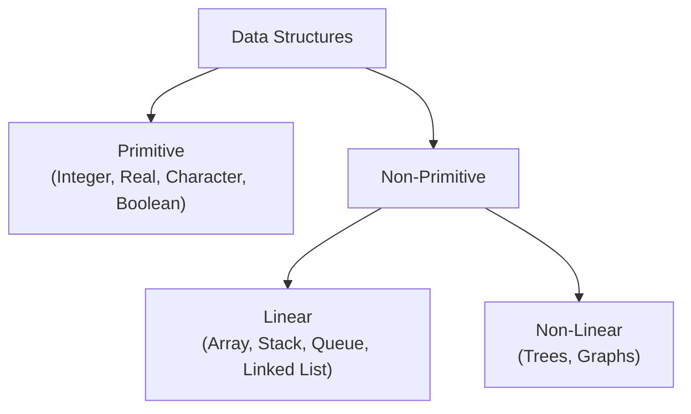
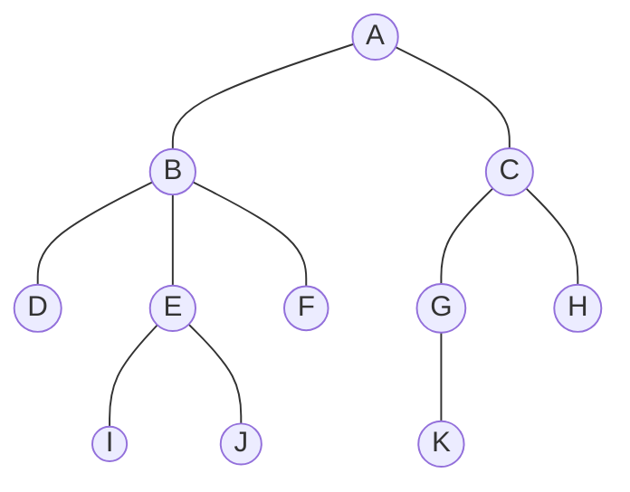

# 01 - Tree Definitions and Concepts

**Unit 4 · CEM2003C Data Structures** · [← Unit index](README.md) · [Next: Tree Representations →](02-tree-representations.md)

> **Source note:** Based on Chapter 4 (`Non-Linear Data Structures - Tree`) of the faculty study material. All definitions, terms, and properties preserve the source curriculum.

## What is a Tree?

A **tree** is a non-linear, hierarchical data structure. Unlike arrays, stacks, queues, and linked lists (which store data sequentially), a tree stores data elements hierarchically in a parent-child relationship.

- **Definition 1:** A tree is a non-linear data structure which organizes data in a hierarchical structure.
- **Definition 2:** A tree data structure is a collection of data items called **Nodes** organized in a hierarchical relationship.



---

## Fundamental Tree Terminology

Consider the standard reference tree from the course material containing **11 nodes** and **10 edges**:

```text
               A (Root)
             /   \
            B     C
          / | \   | \
         D  E  F  G  H
           / \    |
          I   J   K
```



### 1. Node
Every individual data element stored in a tree is called a **Node**.  
*Example:* In the reference tree, `A, B, C, D, E, F, G, H, I, J, K` are all nodes (Total = 11 nodes).

### 2. Edge
An **Edge** is a connecting link or line between two nodes.
> **Key Property:** In any connected tree with **$N$ nodes**, there are exactly **$N - 1$ edges**.  
> *Example:* For $N = 11$ nodes, the tree has $11 - 1 = 10$ edges.

### 3. Root Node
The first or top-most node of a tree from which all hierarchical relationships originate. It is the only node without a parent.  
*Example:* `A` is the root node.

### 4. Parent Node
In any tree, the node which has one or more children is called a **Parent**. It is the direct predecessor of a node.  
*Example:* `A` is the parent of `B` and `C`. `B` is the parent of `D`, `E`, and `F`. `E` is the parent of `I` and `J`. `C` is the parent of `G` and `H`. `G` is the parent of `K`.

### 5. Child Node
The descendant or direct successor of any node is called a **Child**.  
*Example:* `B` and `C` are children of `A`; `G` and `H` are children of `C`; `K` is the child of `G`.

### 6. Siblings
Nodes that share the same parent are called **Siblings**.  
*Example:*
- `B` and `C` are siblings (parent is `A`).
- `D`, `E`, and `F` are siblings (parent is `B`).
- `G` and `H` are siblings (parent is `C`).
- `I` and `J` are siblings (parent is `E`).

### 7. Leaf / Terminal Node
A node that does not have any children (has no successors) is called a **Leaf Node** or **Terminal Node**.  
*Example:* `D, I, J, F, K, H` are leaf nodes.

### 8. Internal Node (Non-Terminal Node)
Any node that has at least one child is called an **Internal Node** (every non-leaf node).  
*Example:* `A, B, C, E, G` are internal nodes.

### 9. Degree
- **Degree of a Node:** The total number of children a node has.
  - $\text{Degree}(B) = 3$ (children: `D, E, F`)
  - $\text{Degree}(A) = 2$ (children: `B, C`)
  - $\text{Degree}(E) = 2$ (children: `I, J`)
  - $\text{Degree}(G) = 1$ (child: `K`)
  - $\text{Degree}(F) = 0$ (leaf node)
- **Degree of a Tree:** The maximum degree among all nodes in the tree ($\text{Degree of reference tree} = 3$).

### 10. Level
The distance of a node from the root, measured in generational steps. By standard convention used in the source material:
- **Level 0:** Root node `A`
- **Level 1:** `B, C`
- **Level 2:** `D, E, F, G, H`
- **Level 3:** `I, J, K`

### 11. Height
- **Height of a Node:** The total number of edges on the longest downward path from that node to a leaf node.
  - $\text{Height}(A) = 3$ (path: $A \to B \to E \to I$)
  - $\text{Height}(B) = 2$ (path: $B \to E \to I$)
  - $\text{Height}(E) = 1$ (path: $E \to I$)
  - $\text{Height}(K) = 0$ (leaf node)
- **Height of a Tree:** The height of the root node ($\text{Height of tree} = 3$).

### 12. Depth
- **Depth of a Node:** The total number of edges from the root node to that specific node.
  - $\text{Depth}(A) = 0$ (root)
  - $\text{Depth}(B) = 1$
  - $\text{Depth}(E) = 2$
  - $\text{Depth}(K) = 3$ (path: $A \to C \to G \to K$)
- **Depth of a Tree:** The total number of edges from the root to the deepest leaf ($\text{Depth of tree} = 3$).

### 13. Path
A **Path** is a sequence of consecutive nodes and edges between two nodes.
- Path between `A` and `J`: `A - B - E - J` (length = 3 edges)
- Path between `C` and `K`: `C - G - K` (length = 2 edges)

### 14. Subtree
Any node of a tree together with all its descendants forms a **Subtree**.
- Subtree rooted at `B`: `{B, D, E, F, I, J}`
- Subtree rooted at `E`: `{E, I, J}`
- Subtree rooted at `C`: `{C, G, H, K}`

---

## Summary Table of Reference Tree

| Node | Parent | Children | Degree | Level | Height | Depth | Type |
|:---:|:---:|:---:|:---:|:---:|:---:|:---:|:---:|
| `A` | *None* (Root) | `B, C` | 2 | 0 | 3 | 0 | Root / Internal |
| `B` | `A` | `D, E, F` | 3 | 1 | 2 | 1 | Internal |
| `C` | `A` | `G, H` | 2 | 1 | 2 | 1 | Internal |
| `D` | `B` | *None* | 0 | 2 | 0 | 2 | Leaf / Terminal |
| `E` | `B` | `I, J` | 2 | 2 | 1 | 2 | Internal |
| `F` | `B` | *None* | 0 | 2 | 0 | 2 | Leaf / Terminal |
| `G` | `C` | `K` | 1 | 2 | 1 | 2 | Internal |
| `H` | `C` | *None* | 0 | 2 | 0 | 2 | Leaf / Terminal |
| `I` | `E` | *None* | 0 | 3 | 0 | 3 | Leaf / Terminal |
| `J` | `E` | *None* | 0 | 3 | 0 | 3 | Leaf / Terminal |
| `K` | `G` | *None* | 0 | 3 | 0 | 3 | Leaf / Terminal |

---

## Exam Tips

- In a tree with $N$ nodes, there are always **$N - 1$ edges**.
- **Height of leaf** $= 0$. **Depth of root** $= 0$.
- **Height of tree** equals the **Depth of tree**.
- A leaf node is also called a **terminal node** (degree = 0). Non-leaf nodes are called **internal nodes** (degree $\ge 1$).

**Next:** [02 - Tree Representations](02-tree-representations.md)
