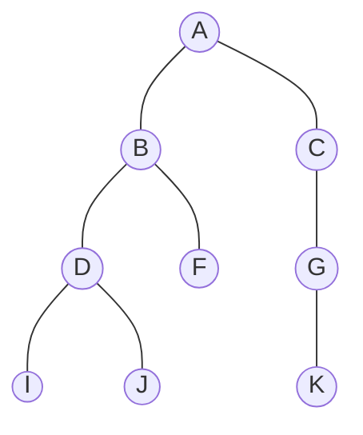
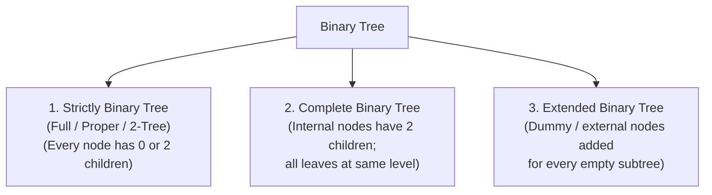

# 03 - Binary Tree

**Unit 4 · CEM2003C Data Structures** · [← Tree Representations](02-tree-representations.md) · [Next: Binary Tree Representations →](04-binary-tree-representations.md)

> **Source note:** Based on Chapter 4, slides 15–17. Covers the formal definition of a binary tree and the specific classifications in the syllabus: **Strictly Binary Tree (Full/Proper/2-Tree)**, **Complete Binary Tree**, and **Extended Binary Tree**.

## Definition of a Binary Tree

A **Binary Tree** is a hierarchical data structure in which every node has at most **two children**, referred to as the **left child** and the **right child**.

- **Key Rule:** Every node in a binary tree can have either **0 children**, **1 child**, or **2 children** (degree $\le 2$).
- No node can have more than two children.

```text
               A
             /   \
            B     C
          /   \     \
         D     F     G
        / \           \
       I   J           K
```



---

## Types of Binary Trees

The course curriculum defines three primary classifications of binary trees:



---

### 1. Strictly Binary Tree (Full / Proper / 2-Tree)

- **Definition:** A binary tree in which every node has **either two or zero children** is called a **Strictly Binary Tree**.
- **Alternative Names:** 
  - **Full Binary Tree**
  - **Proper Binary Tree**
  - **2-Tree**
- **Property:** No node in a strictly binary tree has exactly 1 child.

#### Example (Slide 16):
```text
               A
             /   \
            B     C
          /   \  /  \
         D     F G   H
        / \
       I   J
```
- Node `A`: 2 children (`B, C`)
- Node `B`: 2 children (`D, F`)
- Node `C`: 2 children (`G, H`)
- Node `D`: 2 children (`I, J`)
- Nodes `I, J, F, G, H`: 0 children (leaves)
- Since every node has either 2 or 0 children, this is a **Strictly Binary Tree**.

---

### 2. Complete Binary Tree

- **Definition:** A binary tree in which **every internal node has exactly two children** and **all leaf nodes are at the same level** is called a **Complete Binary Tree**.

#### Example (Slide 16):
```text
               1              (Level 0)
             /   \
            2     3           (Level 1)
          /  \   /  \
         4    5 6    7        (Level 2: All leaves)
```
- Total nodes at level $L = 2^L$.
- Total nodes in tree of height $h$: $N = 2^{h+1} - 1 = 2^3 - 1 = 7$.
- All leaves (`4, 5, 6, 7`) are at Level 2.

---

### 3. Extended Binary Tree

- **Definition:** The binary tree obtained by adding **dummy (external) nodes** to all empty subtree pointers of an existing binary tree is called an **Extended Binary Tree** (or 2-Tree).
- **Internal vs External Nodes:**
  - **Original Nodes (Internal Nodes):** Represented by **circles** (contain actual data).
  - **Dummy Nodes (External Nodes):** Represented by **squares** (represent empty subtrees / `NULL` pointers).

#### Property:
If an original binary tree has **$N$ internal nodes**, the extended binary tree will have exactly **$N + 1$ external (dummy) leaf nodes**.

```text
Original Binary Tree:                 Extended Binary Tree:
        ( )                                    ( )
       /   \                                  /   \
     ( )   ( )                              ( )   ( )
    /        \                             /   \  /  \
  ( )        ( )                         ( )  [ ] [ ] ( )
    \                                   /   \        /   \
    ( )                               [ ]   ( )    [ ]   [ ]
                                           /   \
                                         [ ]   [ ]
```

---

## Comparison Table

| Property | Strictly Binary Tree | Complete Binary Tree | Extended Binary Tree |
|---|---|---|---|
| **Child constraint** | Every node has 0 or 2 children | Every non-leaf has 2 children | Dummy nodes make all internal nodes have 2 children |
| **Leaf position** | Leaves can appear at different levels | All leaves must be at the exact same lowest level | All leaves are dummy (external) nodes |
| **Alternative name** | Full / Proper / 2-Tree | — | 2-Tree with external nodes |
| **Leaves vs Nodes** | $\text{Leaves} = \text{Internal Nodes} + 1$ | $N = 2^{h+1} - 1$ | $\text{External} = \text{Internal} + 1$ |

---

## Binary Tree vs Binary Search Tree

| Characteristic | Binary Tree (BT) | Binary Search Tree (BST) |
|---|---|---|
| **Definition** | General tree where each node has $\le 2$ children | Binary tree where left subtree $\le \text{root} < \text{right subtree}$ |
| **Node Ordering** | No ordering restriction between parent and children | Strict ordering condition on all keys |
| **Inorder Traversal** | Produces arbitrary sequence | Always produces **strictly sorted (ascending)** sequence |
| **Search Time** | $O(n)$ in worst case | $O(h)$ where $h$ is tree height ($O(\log n)$ balanced, $O(n)$ skewed) |

> **Key Takeaway (from course material):** *"Every Binary Search Tree is a binary tree, but all Binary Trees need not be binary search trees."*

**Next:** [04 - Binary Tree Representations](04-binary-tree-representations.md)
