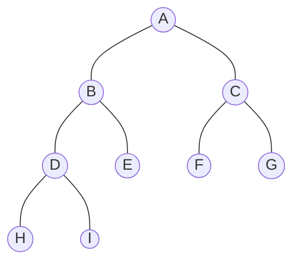

# 04 - Binary Tree Representations

**Unit 4 · CEM2003C Data Structures** · [← Binary Tree](03-binary-tree.md) · [Next: Binary Tree Traversals →](05-binary-tree-traversals.md)

> **Source note:** Based on Chapter 4, slide 18. Binary trees are implemented in memory using two primary methods: **Array Representation (Sequential Representation)** and **Linked List Representation**.

---

## 1. Array (Sequential) Representation

In an **Array Representation**, binary tree nodes are stored in a one-dimensional contiguous array based on level-order indexing.

### Indexing Formulas

#### 1-Based Indexing (Standard Faculty Reference from Slide 18):
When the root is placed at index `1`:
- **Root node:** index `1`
- **Left child:** index $= 2i$
- **Right child:** index $= 2i + 1$
- **Parent node:** index $= \lfloor i / 2 \rfloor$ (for $i > 1$)

#### 0-Based Indexing (Standard in C Arrays):
When the root is placed at index `0`:
- **Root node:** index `0`
- **Left child:** index $= 2i + 1$
- **Right child:** index $= 2i + 2$
- **Parent node:** index $= \lfloor (i - 1) / 2 \rfloor$ (for $i > 0$)

---

### Example from Course Material (Slide 18)

Consider the binary tree presented in Slide 18:

```text
               A
             /   \
            B     C
          /   \  /  \
         D     E F   G
        / \
       H   I
```



#### Array Layout (1-Based Indexing):

```text
Index: [ 1 | 2 | 3 | 4 | 5 | 6 | 7 | 8 | 9 ]
Data:  [ A | B | C | D | E | F | G | H | I ]
```

- **Index 1:** `A` (Root)
- **Children of `A` (index 1):** Left at $2(1) = 2$ (`B`), Right at $2(1)+1 = 3$ (`C`)
- **Children of `B` (index 2):** Left at $2(2) = 4$ (`D`), Right at $2(2)+1 = 5$ (`E`)
- **Children of `C` (index 3):** Left at $2(3) = 6$ (`F`), Right at $2(3)+1 = 7$ (`G`)
- **Children of `D` (index 4):** Left at $2(4) = 8$ (`H`), Right at $2(4)+1 = 9$ (`I`)
- **Leaves `E, F, G, H, I`:** Have no children (their calculated child positions exceed array bounds or hold `NULL`).

#### Equivalent 0-Based Array Layout:

```text
Index: [ 0 | 1 | 2 | 3 | 4 | 5 | 6 | 7 | 8 ]
Data:  [ A | B | C | D | E | F | G | H | I ]
```

- **Index 0:** `A` (Root)
- **Children of `A` (index 0):** Left at $2(0)+1 = 1$ (`B`), Right at $2(0)+2 = 2$ (`C`)
- **Children of `B` (index 1):** Left at $2(1)+1 = 3$ (`D`), Right at $2(1)+2 = 4$ (`E`)
- **Children of `C` (index 2):** Left at $2(2)+1 = 5$ (`F`), Right at $2(2)+2 = 6$ (`G`)
- **Children of `D` (index 3):** Left at $2(3)+1 = 7$ (`H`), Right at $2(3)+2 = 8$ (`I`)

> **Source note on Slide 18:** In the faculty slide, the left box presents an array illustration with omitted child entries (`[A, B, C, D, -, F, G, H, I, J, -, -, -, K, -]`), while the right box provides the complete tree structure with nodes `A` through `I`. The representation above unifies these views into an internally consistent model matching the slide's linked structure.

---

## 2. Linked List Representation

In the **Linked List Representation**, each node is dynamically allocated in heap memory and maintains explicit pointer variables to its left child and right child.

### Node Structure

Each tree node contains **three fields**:
1. **`LPTR` (Left Pointer):** Stores the address of the left child node.
2. **`DATA`:** Stores the actual information/value.
3. **`RPTR` (Right Pointer):** Stores the address of the right child node.

```text
+----------+----------+----------+
|   LPTR   |   DATA   |   RPTR   |
+----------+----------+----------+
```

```c
struct TreeNode {
    int data;
    struct TreeNode *lptr;  // Pointer to left child
    struct TreeNode *rptr;  // Pointer to right child
};
```

---

### Linked Node Diagram (Slide 18)

For leaf nodes or missing children, `LPTR` and `RPTR` hold `NULL` (marked as `X` in diagrams):

```text
                         +-------+-------+-------+
                         |   •   |   A   |   •   |  <--- root
                         +---|---+-------+---|---+
                             |               |
           +-----------------+               +-----------------+
           |                                                   |
           ▼                                                   ▼
+-------+-------+-------+                             +-------+-------+-------+
|   •   |   B   |   •   |                             |   •   |   C   |   •   |
+---|---+-------+---|---+                             +---|---+-------+---|---+
    |               |                                     |               |
    ▼               ▼                                     ▼               ▼
+-------+-------+-------+ +-------+-------+-------+ +-------+-------+-------+ +-------+-------+-------+
|   •   |   D   |   •   | |   X   |   E   |   X   | |   X   |   F   |   X   | |   X   |   G   |   X   |
+---|---+-------+---|---+ +-------+-------+-------+ +-------+-------+-------+ +-------+-------+-------+
    |               |
    ▼               ▼
+-------+-------+-------+ +-------+-------+-------+
|   X   |   H   |   X   | |   X   |   I   |   X   |
+-------+-------+-------+ +-------+-------+-------+
```

---

## Comparison: Array vs Linked Representation

| Parameter | Array Representation | Linked List Representation |
|---|---|---|
| **Memory Allocation** | Static / Contiguous | Dynamic / Heap allocation |
| **Space Efficiency** | High waste ($O(2^h)$) for skewed or sparse trees | Optimal ($O(n)$) — allocates memory only for existing nodes |
| **Best Suited For** | Complete / Full Binary Trees (e.g., Heaps) | General, dynamic, or unbalanced binary trees |
| **Parent/Child Access** | $O(1)$ direct arithmetic calculation | $O(1)$ by following direct pointer links |
| **Pointer Overhead** | Zero extra pointer memory | 2 pointer addresses stored per node |
| **Tree Growth / Resize** | Fixed size array limit | Dynamically grows or shrinks at runtime |

**Next:** [05 - Binary Tree Traversals](05-binary-tree-traversals.md)
