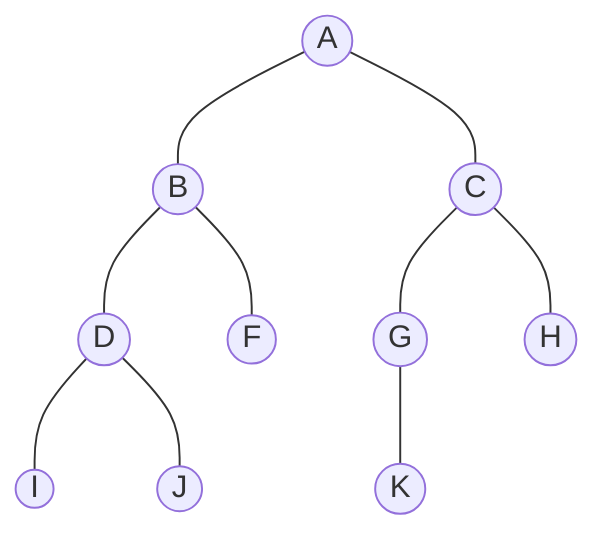

# 05 - Binary Tree Traversals

**Unit 4 · CEM2003C Data Structures** · [← Binary Tree Representations](04-binary-tree-representations.md) · [Next: Tree Construction →](06-tree-construction.md)

> **Source note:** Based on Chapter 4, slides 19–23. Binary tree traversal refers to systematically visiting every node in a tree exactly once.

## What is Tree Traversal?

- **Definition:** Displaying (or) visiting the order of nodes in a binary tree is called **Binary Tree Traversal**.
- In linear structures (arrays, linked lists), elements are naturally visited sequentially from start to finish. In a non-linear tree, there are multiple traversal paths depending on when the **root** node is processed relative to its **left** and **right** subtrees.

There are three primary depth-first traversal methods:
1. **In-Order Traversal** (`Left` → `Root` → `Right`)
2. **Pre-Order Traversal** (`Root` → `Left` → `Right`)
3. **Post-Order Traversal** (`Left` → `Right` → `Root`)

---

## 1. In-Order Traversal (L - Root - R)

### Concept:
1. Traverse the left subtree in Inorder.
2. Process (visit/print) the current root node.
3. Traverse the right subtree in Inorder.

### Faculty Algorithm: `Procedure RINORDER(T)`
```text
1. [Check for empty Tree]
   If T = NULL then
       write ('Empty Tree')
       return

2. [Process the Left Subtree]
   If LPTR(T) ≠ NULL then
       RINORDER(LPTR(T))

3. [Process the root node]
   write (DATA(T))

4. [Process the Right Subtree]
   If RPTR(T) ≠ NULL then
       RINORDER(RPTR(T))

5. [Finished]
   return
```

---

## 2. Pre-Order Traversal (Root - L - R)

### Concept:
1. Process (visit/print) the current root node first.
2. Traverse the left subtree in Preorder.
3. Traverse the right subtree in Preorder.

### Faculty Algorithm: `Procedure RPREORDER(T)`
```text
1. [Check for empty Tree and Process Root]
   If T = NULL then
       write ('Empty Tree')
       return
   else
       write (DATA(T))

2. [Process the Left Subtree]
   If LPTR(T) ≠ NULL then
       RPREORDER(LPTR(T))

3. [Process the Right Subtree]
   If RPTR(T) ≠ NULL then
       RPREORDER(RPTR(T))

4. [Finished]
   return
```

---

## 3. Post-Order Traversal (L - R - Root)

### Concept:
1. Traverse the left subtree in Postorder.
2. Traverse the right subtree in Postorder.
3. Process (visit/print) the current root node last.

### Faculty Algorithm: `Procedure RPOSTORDER(T)`
```text
1. [Check for empty Tree]
   If T = NULL then
       write ('Empty Tree')
       return

2. [Process the Left Subtree]
   If LPTR(T) ≠ NULL then
       RPOSTORDER(LPTR(T))

3. [Process the Right Subtree]
   If RPTR(T) ≠ NULL then
       RPOSTORDER(RPTR(T))

4. [Process the root node]
   write (DATA(T))

5. [Finished]
   return
```

---

## Step-by-Step Traversal on Primary Reference Tree

Consider the 10-node reference binary tree (slides 20–22):

```text
               A
             /   \
            B     C
          /   \  /  \
         D     F G   H
        / \       \
       I   J       K
```



### Resulting Sequences:

- **In-Order Traversal (L - Root - R):**
  $$\mathbf{I \to D \to J \to B \to F \to A \to G \to K \to C \to H}$$

- **Pre-Order Traversal (Root - L - R):**
  $$\mathbf{A \to B \to D \to I \to J \to F \to C \to G \to K \to H}$$

- **Post-Order Traversal (L - R - Root):**
  $$\mathbf{I \to J \to D \to F \to B \to K \to G \to H \to C \to A}$$

---

## Additional Course Examples (Slide 23)

### Example 1: 5-Node Tree
```text
        1
       / \
      2   3
         /
        4
         \
          5
```
- **In-order:** `2, 1, 4, 5, 3`
- **Pre-order:** `1, 2, 3, 4, 5`
- **Post-order:** `2, 5, 4, 3, 1`

---

### Example 2: 7-Node Complete Tree
```text
          1
        /   \
       2     3
      / \   / \
     4   5 6   7
```
- **In-order:** `4, 2, 5, 1, 6, 3, 7`
- **Pre-order:** `1, 2, 4, 5, 3, 6, 7`
- **Post-order:** `4, 5, 2, 6, 7, 3, 1`

---

### Example 3: 9-Node Tree
```text
          A
        /   \
       B     C
      /     / \
     D     E   F
            \   \
             G   H
                  \
                   I
```
- **In-order:** `D, B, A, E, G, C, H, F, I`
- **Pre-order:** `A, B, D, C, E, G, F, H, I`
- **Post-order:** `D, B, G, E, H, I, F, C, A`

---

## C Implementation

```c
#include <stdio.h>
#include <stdlib.h>

struct Node {
    char data;
    struct Node *lptr;
    struct Node *rptr;
};

// Inorder: Left -> Root -> Right
void inorder(struct Node *root) {
    if (root != NULL) {
        inorder(root->lptr);
        printf("%c ", root->data);
        inorder(root->rptr);
    }
}

// Preorder: Root -> Left -> Right
void preorder(struct Node *root) {
    if (root != NULL) {
        printf("%c ", root->data);
        preorder(root->lptr);
        preorder(root->rptr);
    }
}

// Postorder: Left -> Right -> Root
void postorder(struct Node *root) {
    if (root != NULL) {
        postorder(root->lptr);
        postorder(root->rptr);
        printf("%c ", root->data);
    }
}
```

---

## Complexity Analysis

| Traversal | Time Complexity | Auxiliary Space (Recursion Call Stack) |
|---|:---:|:---:|
| **In-Order** | $O(n)$ | $O(h)$ where $h$ is tree height ($O(\log n)$ balanced, $O(n)$ skewed) |
| **Pre-Order** | $O(n)$ | $O(h)$ |
| **Post-Order** | $O(n)$ | $O(h)$ |

---

## Quick Mnemonic Table

| Traversal | Position of Root | Order of Subtrees | Memory Trick |
|---|:---:|:---:|:---:|
| **Preorder** | **First** | Left before Right | **Pre** = Root is first |
| **Inorder** | **Middle** | Left before Right | **In** = Root is in between |
| **Postorder** | **Last** | Left before Right | **Post** = Root is last |

**Next:** [06 - Tree Construction](06-tree-construction.md)
