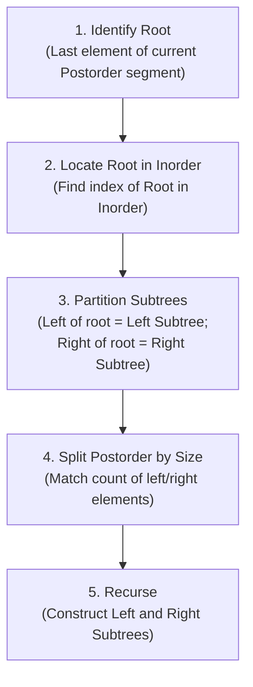
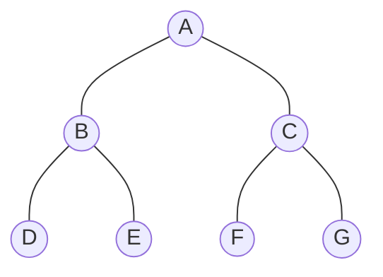

# 06 - Tree Construction from Traversal Sequences

**Unit 4 · CEM2003C Data Structures** · [← Binary Tree Traversals](05-binary-tree-traversals.md) · [Next: Binary Search Tree →](07-binary-search-tree.md)

> **Source note:** Based on Chapter 4, slides 24–34. Covers the exact algorithm and step-by-step construction of a binary tree from **Inorder** and **Postorder** traversals.

---

## Fundamental Uniqueness Rule

> **Important Theorem (Slide 24):**  
> - **Inorder + Postorder** determines a **unique** binary tree.  
> - **Inorder + Preorder** determines a **unique** binary tree.  
> - **Preorder + Postorder** alone do **NOT** determine a unique binary tree (unless the tree is strictly full).

### Why Inorder is Essential:
- **Preorder** tells us the root first (`Root - L - R`).
- **Postorder** tells us the root last (`L - R - Root`).
- **Inorder** (`L - Root - R`) is the only traversal that **separates** left-subtree nodes from right-subtree nodes once the root is identified.

---

## Construction Algorithm: Inorder + Postorder



---

## Detailed Step-by-Step Worked Example (Slides 24–34)

### Given Traversals:
- **INORDER:** $\quad\mathbf{D,\; B,\; E,\; A,\; F,\; C,\; G}$
- **POSTORDER:** $\quad\mathbf{D,\; E,\; B,\; F,\; G,\; C,\; A}$

---

### Step 1: Find the Root of the Whole Tree
The last element of the Postorder sequence is **`A`**.  
Therefore, **`A` is the root of the tree**.

```text
               ( A )
```

---

### Step 2: Partition Inorder and Postorder Sequences
Locate `A` in the Inorder sequence:
$$\underbrace{D,\; B,\; E}_{\text{Left Subtree (3 nodes)}}\;,\quad \mathbf{A}\;,\quad \underbrace{F,\; C,\; G}_{\text{Right Subtree (3 nodes)}}$$

Now, partition the Postorder sequence using matching group sizes (3 elements each):
- **Left Subtree Postorder:** `[D, E, B]`
- **Right Subtree Postorder:** `[F, G, C]`

---

### Step 3: Construct the Left Subtree
- **Inorder Segment:** `[D, B, E]`
- **Postorder Segment:** `[D, E, B]`
- Last element in Postorder segment is **`B`** $\implies$ **`B` is the left child of `A`**.
- Locate `B` in Inorder `[D, B, E]`:
  - Left of `B` is `[D]` $\implies$ **`D` is the left child of `B`**.
  - Right of `B` is `[E]` $\implies$ **`E` is the right child of `B`**.

```text
               ( A )
              /
            ( B )
           /     \
         ( D )   ( E )
```

---

### Step 4: Construct the Right Subtree
- **Inorder Segment:** `[F, C, G]`
- **Postorder Segment:** `[F, G, C]`
- Last element in Postorder segment is **`C`** $\implies$ **`C` is the right child of `A`**.
- Locate `C` in Inorder `[F, C, G]`:
  - Left of `C` is `[F]` $\implies$ **`F` is the left child of `C`**.
  - Right of `C` is `[G]` $\implies$ **`G` is the right child of `C`**.

```text
               ( A )
             /       \
          ( B )     ( C )
         /     \   /     \
       ( D )  ( E )( F ) ( G )
```

---

## Final Constructed Binary Tree



---

## Verification Check (Slide 34)

Let us verify all three traversals of our reconstructed tree:
- **Preorder:** `A, B, D, E, C, F, G`
- **Inorder:** `D, B, E, A, F, C, G` *(Matches given Inorder)*
- **Postorder:** `D, E, B, F, G, C, A` *(Matches given Postorder)*

---

## Summary of Rules for Exam Problems

| Given Pair | Root Selection Rule | Subtree Partitioning |
|---|---|---|
| **Inorder + Postorder** | Root is the **last** element of Postorder | Split Inorder around Root; split Postorder using left/right sizes |
| **Inorder + Preorder** | Root is the **first** element of Preorder | Split Inorder around Root; split Preorder using left/right sizes |
| **Preorder + Postorder** | Root is first in Pre / last in Post | **Ambiguous**: cannot determine left vs right child without Inorder |

**Next:** [07 - Binary Search Tree](07-binary-search-tree.md)
