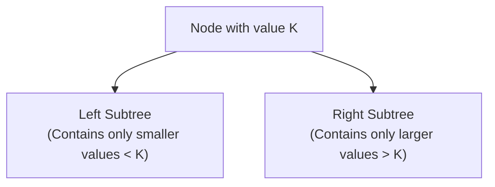

# 07 - Binary Search Tree (BST)

**Unit 4 · CEM2003C Data Structures** · [← Tree Construction](06-tree-construction.md) · [Next: General Tree Conversion →](08-tree-conversion-and-applications.md)

> **Source note:** Based on Chapter 4, slides 35–38. Covers the formal definition of a Binary Search Tree, the BST property, step-by-step insertion algorithm, and all course slide examples.

---

## What is a Binary Search Tree?

- **Definition:** A **Binary Search Tree (BST)** is a binary tree in which every node contains **only smaller values in its left subtree** and **only larger values in its right subtree**.
- **Formal BST Ordering Property:** For any node with key $K$:
  $$\text{All keys in Left Subtree} < K < \text{All keys in Right Subtree}$$
- **Golden Rule:** *"Every Binary Search Tree is a binary tree, but all Binary Trees need not be binary search trees."*

```text
               [ Node K ]
              /          \
    (Left Subtree)     (Right Subtree)
    All values < K     All values > K
```



---

## The Inorder Traversal Property

> **Critical Exam Fact:** The **In-Order Traversal** of any Binary Search Tree **always produces keys in strictly sorted (ascending) order**.

If you perform an inorder traversal on a BST and the numbers are not sorted, the tree is either not a BST or the traversal was performed incorrectly.

---

## BST Operations & Algorithms

### 1. Insertion Algorithm

```text
Algorithm BST_INSERT(ROOT, KEY):
1. If ROOT is NULL:
   Create a new node with DATA = KEY, LPTR = NULL, RPTR = NULL
   Return the new node as ROOT.
2. If KEY < DATA(ROOT):
   LPTR(ROOT) = BST_INSERT(LPTR(ROOT), KEY)
3. Else If KEY > DATA(ROOT):
   RPTR(ROOT) = BST_INSERT(RPTR(ROOT), KEY)
4. Return ROOT.
```

### 2. Search Algorithm

```text
Algorithm BST_SEARCH(ROOT, KEY):
1. If ROOT is NULL or DATA(ROOT) == KEY:
   Return ROOT.
2. If KEY < DATA(ROOT):
   Return BST_SEARCH(LPTR(ROOT), KEY)
3. Else:
   Return BST_SEARCH(RPTR(ROOT), KEY)
```

---

## Course Worked Examples

### Example 1: Step-by-Step Insertion (Slide 36)
**Sequence to insert:** `10, 12, 5, 4, 20, 8, 7, 15, 13`

1. **Insert 10:** Root is created: `[10]`
2. **Insert 12:** $12 > 10 \implies$ right child of `10`.
3. **Insert 5:** $5 < 10 \implies$ left child of `10`.
4. **Insert 4:** $4 < 10, 4 < 5 \implies$ left child of `5`.
5. **Insert 20:** $20 > 10, 20 > 12 \implies$ right child of `12`.
6. **Insert 8:** $8 < 10, 8 > 5 \implies$ right child of `5`.
7. **Insert 7:** $7 < 10, 7 > 5, 7 < 8 \implies$ left child of `8`.
8. **Insert 15:** $15 > 10, 15 > 12, 15 < 20 \implies$ left child of `20`.
9. **Insert 13:** $13 > 10, 13 > 12, 13 < 20, 13 < 15 \implies$ left child of `15`.

```text
                  10
                /    \
               5      12
              / \       \
             4   8       20
                /       /
               7       15
                      /
                     13
```

---

### Example 2: 10-Element BST (Slide 37)
**Data:** `50, 25, 75, 22, 40, 60, 80, 90, 15, 30`

```text
                  50
                /    \
               25     75
              /  \   /  \
             22  40 60  80
            /    /        \
           15   30         90
```

- **Inorder:** `15, 22, 25, 30, 40, 50, 60, 75, 80, 90` *(Sorted!)*

---

### Example 3: BST with Traversals (Slide 38)
**Data:** `10, 3, 15, 22, 6, 45, 65, 23, 78, 34, 5`

```text
                  10
                /    \
               3      15
                \       \
                 6       22
                /          \
               5            45
                           /  \
                          23   65
                            \    \
                            34    78
```

#### Traversal Results:
- **Preorder:** `10, 3, 6, 5, 15, 22, 45, 23, 34, 65, 78`
- **Inorder:** `3, 5, 6, 10, 15, 22, 23, 34, 45, 65, 78` *(Sorted!)*
- **Postorder:** `5, 6, 3, 34, 23, 78, 65, 45, 22, 15, 10`

---

## Complexity Analysis

| Operation | Balanced BST (Average Case) | Skewed BST (Worst Case) |
|---|:---:|:---:|
| **Search** | $O(\log n)$ | $O(n)$ |
| **Insertion** | $O(\log n)$ | $O(n)$ |
| **Deletion** | $O(\log n)$ | $O(n)$ |
| **Space Complexity** | $O(n)$ | $O(n)$ |

> **Why Balanced Trees (AVL) are needed:** If elements are inserted in strictly ascending or descending order, a standard BST degenerates into a linear linked list of height $n$, causing $O(n)$ operations. Balanced trees guarantee $O(\log n)$ height.

**Next:** [08 - Tree Conversion and Applications](08-tree-conversion-and-applications.md)
