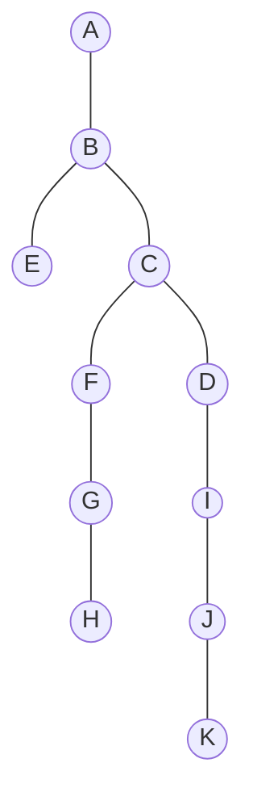

# 08 - General Tree Conversion and Applications

**Unit 4 · CEM2003C Data Structures** · [← Binary Search Tree](07-binary-search-tree.md) · [Next: Expression & Threaded Trees →](09-expression-and-threaded-trees.md)

> **Source note:** Based on Chapter 4, slides 39–40. Covers the transformation of an arbitrary general tree into a binary tree and the specific applications of trees listed in the course curriculum.

---

## Conversion of General Trees to Binary Trees

A **General Tree** ($N$-ary tree) where a node may have an arbitrary number of children can be transformed into a unique **Binary Tree** using the **Left-Child / Right-Sibling** mapping rules.

### Conversion Rules (Slide 39)

1. **Rule A (Root):** The root of the Binary Tree is the root of the Generic Tree.
2. **Rule B (Left Child):** The **leftmost child** of a node in the Generic Tree becomes the **Left Child** of that node in the Binary Tree.
3. **Rule C (Right Sibling):** The **immediate right sibling** of any node in the Generic Tree becomes the **Right Child** of that node in the Binary Tree.

```text
General Tree Linkage              Binary Tree Linkage
     Parent                            Parent
    /  |   \                            /
  C1─-C2-─-C3                         C1 (Left Child = First Child)
                                        \
                                         C2 (Right Child = Next Sibling)
                                           \
                                            C3 (Right Child = Next Sibling)
```

---

## Step-by-Step Conversion Example (Slide 39)

### Initial General Tree:
- Root: `A`
- Children of `A`: `B`, `C`, `D`
- Child of `B`: `E`
- Children of `C`: `F`, `G`, `H`
- Children of `D`: `I`, `J`
- Child of `J`: `K`

```text
               A
            /  |  \
           B   C   D
          /   /|\  | \
         E   F G H I  J
                      |
                      K
```

### Trace of Conversion Steps (Steps 1–8):

- **Step 1:** Root is `A`.
- **Step 2:** First child of `A` is `B` $\implies$ `B` is left child of `A`.
- **Step 3:** First child of `B` is `E` (left child of `B`); Sibling of `B` is `C` $\implies$ `C` is right child of `B`.
- **Step 4:** First child of `C` is `F` (left child of `C`); Sibling of `C` is `D` $\implies$ `D` is right child of `C`.
- **Step 5:** Sibling of `F` is `G` $\implies$ `G` is right child of `F`.
- **Step 6:** Sibling of `G` is `H` $\implies$ `H` is right child of `G`; First child of `D` is `I` $\implies$ `I` is left child of `D`.
- **Step 7:** Sibling of `I` is `J` $\implies$ `J` is right child of `I`.
- **Step 8:** First child of `J` is `K` $\implies$ `K` is left child of `J`.

### Resulting Binary Tree:

```text
              A
             /
            B
           / \
          E   C
             / \
            F   D
             \   \
              G   I
               \   \
                H   J
                   /
                  K
```



---

## Applications of Trees (Slide 40)

The course syllabus highlights five major real-world applications of tree data structures:

### 1. Manipulate Hierarchical Data
- File directory structures in operating systems (folders and sub-folders).
- Organizational hierarchy and management charts.
- HTML Document Object Model (DOM) and XML/JSON hierarchical document trees.

### 2. Make Information Easy to Search
- Binary Search Trees (BST) and balanced trees allow fast $O(\log n)$ search, insertion, and retrieval.
- Tree traversals enable systematic data processing.

### 3. Manipulate Sorted Lists of Data
- Inorder traversal of a BST provides an inherently sorted sequence of elements without explicit sorting algorithms.
- Dynamically inserting new keys while preserving sorted order in $O(\log n)$ time.

### 4. Router Algorithms
- Network routers use tree data structures (e.g., prefix trees / tries and spanning trees) to make rapid packet forwarding decisions and find loop-free shortest routing paths.

### 5. Expression Trees
- Used by compilers and calculators to parse, validate, and evaluate mathematical and logical expressions according to operator precedence.

**Next:** [09 - Expression and Threaded Trees](09-expression-and-threaded-trees.md)
