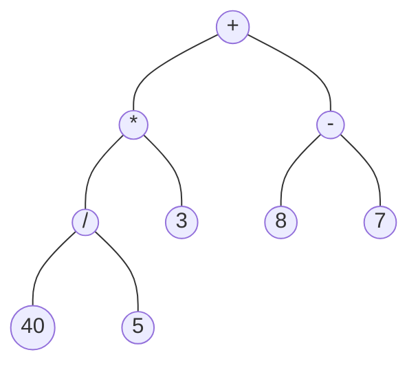
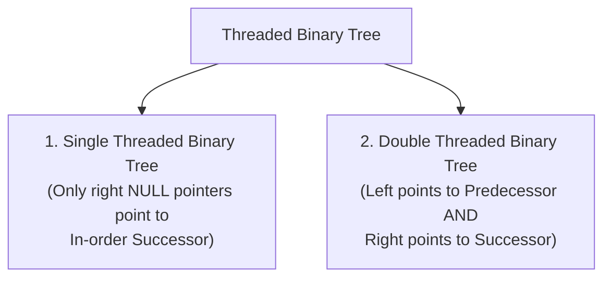

# 09 - Expression and Threaded Binary Trees

**Unit 4 · CEM2003C Data Structures** · [← General Tree Conversion](08-tree-conversion-and-applications.md) · [Next: AVL Tree →](10-avl-tree.md)

> **Source note:** Based on Chapter 4, slides 41–43. Covers **Expression Trees** (representation and evaluation of arithmetic expressions) and **Threaded Binary Trees** (utilizing `NULL` pointers for stackless traversals).

---

## 1. Expression Trees

### Definition (Slide 41)
An **Expression Tree** is a binary tree in which:
- Each **Internal Node** corresponds to an **Operator** (e.g., `+`, `-`, `*`, `/`).
- Each **Leaf Node** corresponds to an **Operand** (e.g., constants or variables like `40`, `5`, `a`, `b`).



---

### Expression Tree Properties & Traversals

Traversing an expression tree produces standard mathematical notations:

| Traversal | Produces | Example for $40 / 5 * 3 + (8 - 7)$ |
|---|---|---|
| **In-Order** (L - Root - R) | **Infix Expression** | `(40 / 5) * 3 + (8 - 7)` |
| **Pre-Order** (Root - L - R) | **Prefix (Polish) Expression** | `+ * / 40 5 3 - 8 7` |
| **Post-Order** (L - R - Root) | **Postfix (Reverse Polish) Expression** | `40 5 / 3 * 8 7 - +` |

---

### Evaluation Example 1 (Slide 41)
**Expression:** `40 / 5 * 3 + (8 - 7)`

- **Left subtree evaluation:**
  1. $40 / 5 = 8$
  2. $8 * 3 = 24$
- **Right subtree evaluation:**
  1. $8 - 7 = 1$
- **Root evaluation:**
  1. $24 + 1 = \mathbf{25}$

---

### Example 2 (Slide 42)
**Expression:** `(a + b * c) * e + f`

- **Infix:** `(a + b * c) * e + f`
- **Postfix:** `abc*+e*f+`
- **Prefix:** `+*+a*bcef`

```text
               +
             /   \
            *     f
          /   \
         +     e
       /   \
      a     *
          /   \
         b     c
```

---

## 2. Threaded Binary Trees

### Motivation:
In a binary tree with $N$ nodes implemented via linked representation, there are $2N$ pointer fields in total, out of which **$N + 1$ pointers are `NULL`**. A **Threaded Binary Tree** efficiently utilizes these wasted `NULL` pointers to store direct links (*threads*) to other nodes in the traversal order.

### Definition (Slide 43)
A **Threaded Binary Tree** is a binary tree in which:
- All **left child pointers** that are `NULL` point to the node's **In-Order Predecessor**.
- All **right child pointers** that are `NULL` point to the node's **In-Order Successor**.

---

### Types of Threaded Binary Trees



```text
       Double Threaded Binary Tree Example (Slide 43):
                          ( 6 )
                        /       \
                     ( 3 )     ( 8 )
                    /     \   /     \
                 ( 1 )   ( 5)( 7 )  ( 11 )
                                    /    \
                                 ( 9 )  ( 13 )

       Threads (Dashed lines):
       - Right of 1  --> points to 3 (successor)
       - Left of 5   --> points to 3 (predecessor)
       - Right of 5  --> points to 6 (successor)
       - Left of 7   --> points to 6 (predecessor)
       - Right of 7  --> points to 8 (successor)
       - Left of 9   --> points to 8 (predecessor)
       - Right of 9  --> points to 11 (successor)
       - Left of 13  --> points to 11 (predecessor)
```

---

### Advantages of Threading
1. **Stackless Traversal:** Inorder and preorder traversals can be executed iteratively without recursion or auxiliary stack memory.
2. **Fast Predecessor / Successor Lookup:** Moving to the next or previous in-order node is an $O(1)$ operation.
3. **Zero Extra Memory:** Reuses already allocated `NULL` pointer storage.

**Next:** [10 - AVL Tree](10-avl-tree.md)
