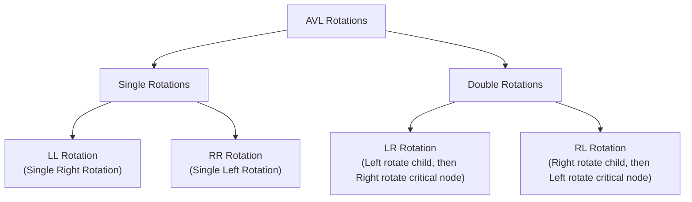
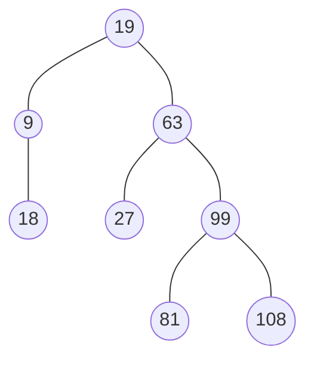

# 10 - AVL Tree

**Unit 4 · CEM2003C Data Structures** · [← Expression & Threaded Trees](09-expression-and-threaded-trees.md) · [Next: m-Way and B-Trees →](11-m-way-and-b-trees.md)

> **Source note:** Based on Chapter 4, slides 44–56. Named after Soviet mathematicians **G.M. Adelson-Velskii and E.M. Landis** (1962). An AVL Tree is a strictly self-balancing Binary Search Tree.

---

## What is an AVL Tree?

- **Definition (Slide 44):** An **AVL Tree** is a balanced binary search tree in which the **Balance Factor** of every node is either **$-1$, $0$, or $+1$**.
- **Balance Factor Formula:**
  $$\text{Balance Factor (BF)} = \text{Height of Left Subtree} - \text{Height of Right Subtree}$$
  $$\mathbf{\text{BF}(T) = h_{\text{left}} - h_{\text{right}} \in \{-1, 0, +1\}}$$
- **Property:** *"Every AVL Tree is a binary search tree, but all Binary Search Trees need not be AVL trees."*

```text
                 100 (BF: 3-2 = +1)
               /     \
    (BF: -1) 50       150 (BF: 0)
            /  \     /   \
  (BF: 0) 25   75  125   175 (BF: 0)
              /  \
    (BF: 0) 65    85 (BF: 0)
```

---

## Critical Node & Rotations

- **Critical Node:** When a new node is inserted or deleted, the balance factor of ancestors changes. The **lowest ancestor node** on the path whose balance factor becomes $\pm 2$ is called the **Critical Node**.
- **Rotation:** The process of restructuring nodes locally to restore the balance factor without violating the BST ordering property.



---

## The Four Insertion Rotations

### 1. LL Rotation (Single Right Rotation)
- **Condition:** Inserted into the **Left subtree of the Left child** of critical node $A$.
- **Correction:** Perform a **Single Right Rotation** around $A$.

```text
    Unbalanced (BF = +2)           LL Rotation              Balanced (BF = 0)
            ( 3 )                     ====>                      ( 2 )
           /                                                    /     \
        ( 2 ) (BF = +1)                                      ( 1 )   ( 3 )
       /
    ( 1 ) (BF = 0)
```

---

### 2. RR Rotation (Single Left Rotation)
- **Condition:** Inserted into the **Right subtree of the Right child** of critical node $A$.
- **Correction:** Perform a **Single Left Rotation** around $A$.

```text
    Unbalanced (BF = -2)           RR Rotation              Balanced (BF = 0)
        ( 1 )                         ====>                      ( 2 )
           \                                                    /     \
            ( 2 ) (BF = -1)                                  ( 1 )   ( 3 )
               \
                ( 3 ) (BF = 0)
```

---

### 3. LR Rotation (Double Left-Right Rotation)
- **Condition:** Inserted into the **Right subtree of the Left child** of critical node $C$.
- **Correction:** 
  1. Perform **Left Rotation** at left child $A$.
  2. Perform **Right Rotation** at critical node $C$.

```text
    Unbalanced (BF = +2)        Step 1: Left Rotate A       Step 2: Right Rotate C
            ( C )                       ( C )                         ( B )
           /                           /                             /     \
        ( A ) (BF = -1)     ===>    ( B )                 ===>    ( A )   ( C )
           \                       /
            ( B )               ( A )
```

---

### 4. RL Rotation (Double Right-Left Rotation)
- **Condition:** Inserted into the **Left subtree of the Right child** of critical node $A$.
- **Correction:**
  1. Perform **Right Rotation** at right child $C$.
  2. Perform **Left Rotation** at critical node $A$.

```text
    Unbalanced (BF = -2)        Step 1: Right Rotate C      Step 2: Left Rotate A
        ( A )                           ( A )                         ( B )
           \                               \                         /     \
            ( C ) (BF = +1)     ===>        ( B )         ===>    ( A )   ( C )
           /                                   \
        ( B )                                   ( C )
```

---

## Course Worked Example: Step-by-Step AVL Construction (Slides 50–52)

**Construct an AVL tree by inserting:** `63, 9, 19, 27, 18, 108, 99, 81`

1. **Insert 63:** $\text{BF}(63) = 0$.
2. **Insert 9:** $9 < 63 \implies$ Left child. $\text{BF}(63) = +1, \text{BF}(9) = 0$.
3. **Insert 19:** $19 < 63, 19 > 9 \implies$ Right child of 9.
   - $\text{BF}(9) = -1$, $\text{BF}(63) = +2$ (**Critical Node: 63**).
   - Pattern: **LR Condition** $\implies$ **LR Rotation**.
   - Left rotate at 9, Right rotate at 63 $\implies$ **`19` becomes root**, `9` left, `63` right.
4. **Insert 27:** $27 > 19, 27 < 63 \implies$ Left child of 63. $\text{BF}(63) = +1, \text{BF}(19) = -1$.
5. **Insert 18:** $18 < 19, 18 > 9 \implies$ Right child of 9. $\text{BF}(9) = -1, \text{BF}(19) = 0$.
6. **Insert 108:** $108 > 19, 108 > 63 \implies$ Right child of 63. $\text{BF}(63) = 0$.
7. **Insert 99:** $99 > 19, 99 > 63, 99 < 108 \implies$ Left child of 108.
8. **Insert 81:** $81 < 108, 81 < 99 \implies$ Left child of 99.
   - $\text{BF}(108) = +2$, $\text{BF}(99) = +1$ (**Critical Node: 108**).
   - Pattern: **LL Condition** $\implies$ **LL Rotation (Single Right Rotation at 108)**.
   - Subtree becomes: `99` with left `81` and right `108`.



---

## AVL Deletion & Deletion Cases (Slides 53–56)

> **Source note:** The supplied faculty slides contain some inconsistent textual descriptions/labels for certain AVL deletion cases when compared with the worked diagrams and examples. This section follows the worked examples and rotation diagrams shown in the faculty material and retains its case notation for alignment with the source.

When a node $X$ is deleted using standard BST deletion, the balance factor of ancestors can become $\pm 2$. If node $A$ becomes critical, the rotation depends on which subtree $X$ was deleted from and the Balance Factor of $A$'s other child $B$.

---

### Category 1: Node $X$ Deleted from LEFT Subtree of $A$ ($L$-Cases)

Here, $A$ becomes right-heavy ($\text{BF}(A) = -2$), and $B$ is the **Right Child** of $A$:

| Case | $\text{BF}(B)$ | Description | Required Action |
|:---:|:---:|---|---|
| **$L_1$** | $+1$ | Right child $B$ is left-heavy | **Double RL Rotation** (Right rotate $B$, then Left rotate $A$) |
| **$L_{-1}$** | $-1$ | Right child $B$ is right-heavy | **Single Left Rotation** at node $A$ |
| **$L_0$** | $0$ | Right child $B$ is balanced | **Single Left Rotation** at node $A$ |

---

### Category 2: Node $X$ Deleted from RIGHT Subtree of $A$ ($R$-Cases)

Here, $A$ becomes left-heavy ($\text{BF}(A) = +2$), and $B$ is the **Left Child** of $A$:

| Case | $\text{BF}(B)$ | Description | Required Action |
|:---:|:---:|---|---|
| **$R_0$** | $0$ | Left child $B$ is balanced | **Single Right Rotation** at node $A$ |
| **$R_1$** | $+1$ | Left child $B$ is left-heavy | **Single Right Rotation** at node $A$ |
| **$R_{-1}$** | $-1$ | Left child $B$ is right-heavy | **Double LR Rotation** (Left rotate $B$, then Right rotate $A$) |

---

### Course Deletion Examples

#### 1. $R_0$ Case Example (Slide 54):
- **Initial:** Root `20` ($\text{BF} = -1$), left child `10` with children `5` and `18` ($\text{BF} = 0$), right child `30`.
- **Action:** Delete `30` from right subtree of `20`.
- **Result:** Critical node `20` has $\text{BF} = +2$. Child `10` has $\text{BF} = 0 \implies \mathbf{R_0}$ **Case**.
- **Fix:** Single Right Rotation at `20`. `10` becomes root with left `5` and right `20` (which has left `18`).

#### 2. $R_1$ Case Example (Slide 55):
- **Initial:** Root `50`, left child `40` (with children `30` and `45`, `30` has left `10`), right child `60` with child `55`.
- **Action:** Delete `55` from right subtree of `50`.
- **Result:** Critical node `50` has $\text{BF} = +2$. Child `40` has $\text{BF} = +1 \implies \mathbf{R_1}$ **Case**.
- **Fix:** Single Right Rotation at `50`. `40` becomes root.

#### 3. $R_{-1}$ Case Example (Slide 56):
- **Initial:** Root `45`, left child `36` (with left `27` and right `39` having `37, 41`), right child `63` with `72`.
- **Action:** Delete `72` from right subtree of `45`.
- **Result:** Critical node `45` has $\text{BF} = +2$. Child `36` has $\text{BF} = -1 \implies \mathbf{R_{-1}}$ **Case**.
- **Fix:** Double LR Rotation (Left rotate at `36`, then Right rotate at `45`). `39` becomes new root.

---

## Complexity Comparison

| Operation | Standard BST (Worst Case) | AVL Tree (Guaranteed Worst Case) |
|---|:---:|:---:|
| **Search** | $O(n)$ | $\mathbf{O(\log n)}$ |
| **Insertion** | $O(n)$ | $\mathbf{O(\log n)}$ |
| **Deletion** | $O(n)$ | $\mathbf{O(\log n)}$ |
| **Height** | $O(n)$ | $\mathbf{\approx 1.44 \log_2 n}$ |

**Next:** [11 - m-Way and B-Trees](11-m-way-and-b-trees.md)
