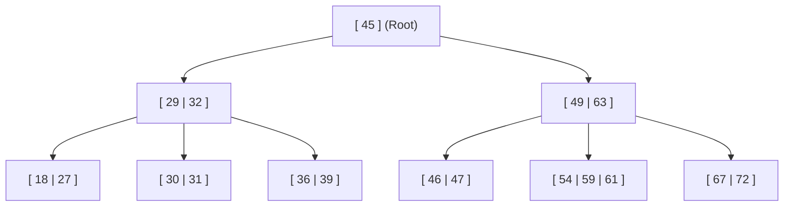
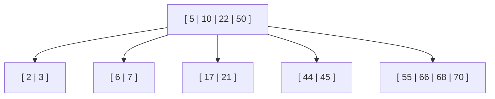

# 11 - m-Way Search Trees and B-Trees

**Unit 4 · CEM2003C Data Structures** · [← AVL Tree](10-avl-tree.md) · [Next: B+ Tree →](12-b-plus-tree.md)

> **Source note:** Based on Chapter 4, slides 57–65. Binary trees are limited to 2 children per node, leading to large tree heights when indexing massive datasets on secondary storage (disk). Multi-way trees and **B-Trees** increase node branching (*fan-out*) to minimize tree height and reduce disk I/O operations.

---

## 1. m-Way Search Tree

### Definition (Slide 57)
An **$m$-way search tree** (or multi-way search tree) is a specialized tree data structure where:
- Each node can have up to **$m$ children**.
- Each node can contain up to **$m - 1$ keys (data elements)**.

It is a direct generalization of a binary search tree (which is a 2-way search tree) designed to **minimize tree height** and **reduce disk access time** for massive datasets.

---

### Node Structure in an $m$-Way Tree

A node containing $k - 1$ sorted keys ($K_1 < K_2 < \dots < K_{k-1}$) has $k$ child pointers ($P_0, P_1, \dots, P_{k-1}$):

```text
+------+------+------+------+------+------+------+
|  P0  |  K1  |  P1  |  K2  |  P2  | ...  | Pk-1 |
+------+------+------+------+------+------+------+
```

- Subtree $P_0$: All keys $< K_1$
- Subtree $P_i$: All keys between $K_i$ and $K_{i+1}$
- Subtree $P_{k-1}$: All keys $> K_{k-1}$

```text
       Example of a 3-Way Search Tree (Slide 57):
                     [ • | 18 | • | 45 | • ]
                     /         |         \
         +----------+     +----+----+     +----------+
         |                |         |                |
   [ • | 9 | • | 11 | • ] [ • | 27 | • | 36 | • ] [ • | 54 | • | 63 | • ]
                               /         \
                              /           \
                 [ • | 29 | • | 30 | • ] [ • | 72 | • | 81 | • ]
```

---

## 2. B-Tree

### Definition & Properties (Slide 58)
A **B-Tree of order $m$** is a self-balanced $m$-way search tree that satisfies the following fundamental properties:

1. **Maximum Children:** Every node has at most $m$ children.
2. **Minimum Children:** Every node (except the root and leaf nodes) has at least $\lceil m/2 \rceil$ children.
3. **Root Property:** The root node has at least **two children** if it is not a leaf node.
4. **Leaf Level Property:** **All leaf nodes appear at the exact same level.**
5. **Key Count:** A non-leaf node with $k$ children contains exactly $k - 1$ keys.



---

## B-Tree Insertion Algorithm (Slides 59–62)

### Algorithm Steps:
1. **Search:** Search the B-tree to locate the appropriate leaf node where the new key belongs.
2. **Direct Insert (No Overflow):** If the leaf contains fewer than $m - 1$ keys, insert the new key into the node in sorted order.
3. **Split & Promote (Overflow):** If the leaf node is full ($m - 1$ keys already present):
   - Insert the key into the set in sorted order (temporarily creating $m$ keys).
   - **Split the node at its median** into two half-full nodes.
   - **Promote the median element** up into its parent node.
   - If the parent node also becomes full, repeat the splitting and promotion process upwards (propagating to root if necessary).

---

### Worked Insertion Trace (Order $m = 5$, Max Keys = 4)

#### Initial Tree State:
- **Root:** `[10 | 50]`
- **Leaves:** `[2, 3, 5, 7]`, `[22, 44, 45]`, `[55, 66, 68, 70]`

```text
                  [ 10 | 50 ]
                /      |      \
     [ 2 | 3 | 5 | 7 ] [ 22 | 44 | 45 ] [ 55 | 66 | 68 | 70 ]
```

#### Step 1: Insert 17 (Slide 59)
- Key 17 belongs in middle leaf `[22, 44, 45]`.
- Leaf has 3 keys (capacity = 4) $\implies$ Direct insert: `[17, 22, 44, 45]`.

#### Step 2: Insert 6 (Slide 60)
- Key 6 belongs in first leaf `[2, 3, 5, 7]`.
- Adding 6 produces overflow: `[2, 3, 5, 6, 7]`.
- **Median key 5 is promoted** to parent `[10 | 50]`.
- Leaf splits into `[2, 3]` and `[6, 7]`.
- **Root becomes:** `[5 | 10 | 50]`.

#### Step 3: Insert 21 (Slides 61–62)
- Key 21 belongs in leaf `[17, 22, 44, 45]`.
- Adding 21 produces overflow: `[17, 21, 22, 44, 45]`.
- **Median key 22 is promoted** to parent `[5 | 10 | 50]`.
- Leaf splits into `[17, 21]` and `[44, 45]`.
- **Root becomes:** `[5 | 10 | 22 | 50]`.



---

## B-Tree Deletion Algorithm (Slides 63–65)

### Algorithm Steps:
1. **Locate Key:** Find the node containing the key to delete.
2. **Internal Node Deletion:** If the key is in an internal node, replace it with its **in-order predecessor** or **in-order successor** (which resides in a leaf node), and delete that replacement key from the leaf.
3. **Leaf Node Deletion:**
   - **Case A (Sufficient Keys):** If the leaf contains more than the minimum required keys ($> \lceil m/2 \rceil - 1$), remove the key directly.
   - **Case B (Borrow / Rotation):** If the leaf has fewer than minimum keys:
     - *Left Sibling Borrow (Step 3.1):* If left sibling has $> \text{min}$ keys, promote its largest key to parent and pull the intervening parent key down into the current leaf.
     - *Right Sibling Borrow (Step 3.2):* If right sibling has $> \text{min}$ keys, promote its smallest key to parent and pull the intervening parent key down into the current leaf.
   - **Case C (Merge / Fusion - Step 4):** If both immediate siblings have only minimum keys:
     - Combine the current leaf, the sibling leaf, and the intervening parent key into a single node.
     - If pulling the parent key leaves the parent with fewer than minimum keys, propagate the rebalancing process upwards (which may reduce overall tree height by 1).

---

### Worked Deletion Example (Slide 65)

- **Starting Tree:** Root `[5 | 10 | 50]`, leaves `[2, 3]`, `[6, 7]`, `[17, 22, 44, 45]`, `[55, 66, 68, 70]`.
- **Action:** Delete `3` from leaf `[2, 3]`.
- **Result:** Leaf `[2]` now has underflow. Right sibling `[6, 7]` has only minimum keys $\implies$ **Merge**:
  - Merge `[2]`, right sibling `[6, 7]`, and parent separator key `5`.
  - Merged leaf becomes: `[2, 5, 6, 7]`.
  - Root loses key `5` and becomes: `[10 | 50]`.

```text
                  [ 10 | 50 ]
                /      |      \
     [ 2 | 5 | 6 | 7 ] [ 17 | 22 | 44 | 45 ] [ 55 | 66 | 68 | 70 ]
```

---

## Summary of B-Tree Bounds (Order $m$)

| Parameter | Root Node | Internal Node | Leaf Node |
|---|:---:|:---:|:---:|
| **Max Children** | $m$ | $m$ | 0 (No children) |
| **Min Children** | 2 | $\lceil m/2 \rceil$ | 0 |
| **Max Keys** | $m - 1$ | $m - 1$ | $m - 1$ |
| **Min Keys** | 1 | $\lceil m/2 \rceil - 1$ | $\lceil m/2 \rceil - 1$ |

**Next:** [12 - B+ Tree](12-b-plus-tree.md)
