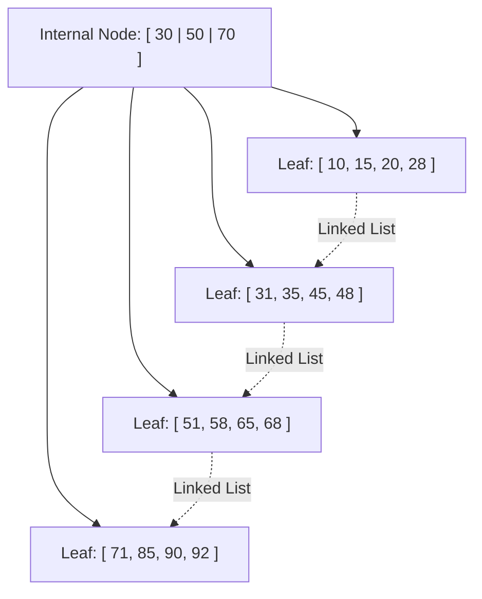

# 12 - B+ Tree and Comparison with B-Tree

**Unit 4 · CEM2003C Data Structures** · [← m-Way and B-Trees](11-m-way-and-b-trees.md) · [Next: Important Questions →](important-questions.md)

> **Source note:** Based on Chapter 4, slides 66–69. Covers the architecture, features, insertion/deletion principles of the **B+ Tree**, and the complete 8-point difference between B+ Trees and B-Trees.

---

## What is a B+ Tree?

- **Definition (Slide 66):** A **B+ Tree** is an advanced data structure used in database systems and file systems to maintain sorted data for fast retrieval, especially from disk. It is an extended version of the B-Tree, where **all actual data is stored only in the leaf nodes**, while **internal nodes contain only keys for navigation (indexing)**.

---

## Core Components of a B+ Tree (Slide 66)

1. **Leaf Nodes:** Store all the actual search key values along with pointers to the data records.
2. **Internal Nodes:** Store only router/guide keys and child pointers to direct searches down to the correct leaf node.
3. **Linked Leaves (Sequential Pointer Chain):** All leaf nodes are linked together as a singly (or doubly) linked list, enabling highly efficient sequential scanning and range queries (e.g., `WHERE age BETWEEN 20 AND 30`).

---

## Key Features of B+ Trees (Slide 66)

- **Balanced:** Automatically rebalances upon insertion and deletion, guaranteeing $O(\log n)$ search, insert, and delete times.
- **Multi-level Hierarchy:** Clearly separates routing logic (internal nodes) from storage (leaf nodes).
- **Ordered:** Maintains all keys in sorted order.
- **High Fan-Out:** Because internal nodes store only keys and child pointers (no bulky data records), a single disk block can store hundreds of router keys, keeping the tree extremely shallow (typically 3–4 levels for millions of records).
- **Cache-Friendly:** Compact internal nodes fit cleanly into CPU cache and RAM buffers.
- **Disk-Efficient:** Minimizes random disk head movements; sequential scans require reading only adjacent leaf blocks.

---

## Operations on B+ Trees

### Insertion (Slide 67)
1. **Navigate:** Traverse from root to the correct leaf node.
2. **Insert:** Place the new key in the leaf node in sorted order.
3. **Handle Overflow:** If the leaf exceeds maximum capacity:
   - Split the leaf into two halves.
   - **Copy (replicate) the middle key** up to the parent node (the key remains present in the leaf node as well to preserve complete data storage).
   - Propagate splits upwards towards the root if internal nodes overflow.

### Deletion (Slide 68)
1. **Locate & Remove:** Find and delete the key directly from the target leaf node.
2. **Rebalance (Underflow):** If the leaf node falls below minimum capacity:
   - **Borrow** an adjacent key from a neighboring sibling node.
   - Or **Merge** the node with its sibling and update/remove the separator key from the parent internal node.

---

## Comprehensive Difference Between B+ Tree and B-Tree (Slide 69)

| No. | Feature | B+ Tree | B-Tree |
|:---:|---|---|---|
| **1** | **Data Storage** | Separate leaf nodes for data storage; internal nodes store keys only for indexing. | Nodes store both search keys and data values at all levels. |
| **2** | **Leaf Linked List** | Leaf nodes form a continuous linked list for efficient range-based queries. | Leaf nodes do not form a linked list. |
| **3** | **Fan-out & Order** | Higher order (more keys per node) because internal nodes carry no data payload. | Lower order (fewer keys per node) due to data pointer overhead in every node. |
| **4** | **Key Duplication** | Keys in internal nodes are duplicated in the leaf nodes. | Usually does not allow key duplication across levels. |
| **5** | **Disk I/O Efficiency** | Better disk access due to sequential reads in linked leaf structure. | More disk I/O due to non-sequential reads across multiple tree levels. |
| **6** | **Primary Use Cases** | Database management systems and file systems where range queries are frequent. | In-memory data structures, search engines, general-purpose indexing. |
| **7** | **Query Performance** | Better performance for range queries and bulk data retrieval. | Balanced performance for single individual search, insert, and delete operations. |
| **8** | **Memory Usage** | Requires more memory for internal nodes (due to duplicated keys), but provides compact index blocks. | Requires less overall memory as keys and values are stored in the same node without duplication. |

**Next:** [Important Questions](important-questions.md)
