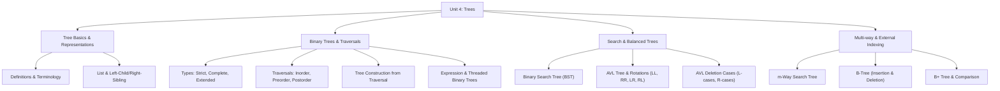

# Unit 4 - Trees

> **CEM2003C | Data Structures | Semester 3**

Unit 4 introduces non-linear, hierarchical data structures: tree definitions and terminology, general tree representations, binary trees, binary tree representations, recursive traversals, tree construction from traversals, binary search trees (BST), conversion of general trees to binary trees, expression trees, threaded binary trees, height-balanced AVL trees with rotations and deletion cases, multi-way search trees, B-trees, and B+ trees.

> **Source note:** Prepared from the faculty `Unit 4: Non-Linear Data Structures - Tree` study material (CEM2003C). All definitions, formulas, traversal algorithms, rotation cases, and worked examples strictly preserve the source syllabus.

## Unit roadmap

## Topic-wise notes

| No. | Topic | Open notes |
|---:|---|---|
| 1 | Tree Definitions and Concepts | [Start](01-tree-definitions-and-concepts.md) |
| 2 | Tree Representations (List & Left-Child / Right-Sibling) | [Start](02-tree-representations.md) |
| 3 | Binary Tree and Types | [Start](03-binary-tree.md) |
| 4 | Binary Tree Representations (Array & Linked) | [Start](04-binary-tree-representations.md) |
| 5 | Binary Tree Traversals (Inorder, Preorder, Postorder) | [Start](05-binary-tree-traversals.md) |
| 6 | Tree Construction from Traversal Sequences | [Start](06-tree-construction.md) |
| 7 | Binary Search Tree (BST) | [Start](07-binary-search-tree.md) |
| 8 | General Tree Conversion & Applications | [Start](08-tree-conversion-and-applications.md) |
| 9 | Expression Trees and Threaded Binary Trees | [Start](09-expression-and-threaded-trees.md) |
| 10 | AVL Tree (Balancing, Rotations & Deletion Cases) | [Start](10-avl-tree.md) |
| 11 | m-Way Search Trees and B-Trees | [Start](11-m-way-and-b-trees.md) |
| 12 | B+ Tree and B-Tree Comparison | [Start](12-b-plus-tree.md) |

## Exam support

- [Important Questions](important-questions.md)
- [Viva Questions](viva-questions.md)

## Learning checklist

- [ ] Define tree, root, edge, parent, child, sibling, leaf/terminal, internal node, degree, level, height, depth, and path.
- [ ] Represent a general tree using List Representation and Left-Child / Right-Sibling Representation.
- [ ] Differentiate strictly (full/proper) binary tree, complete binary tree, and extended binary tree.
- [ ] Represent binary trees in sequential (array) and linked-list memory structures.
- [ ] Trace and implement recursive algorithms for Inorder (`L-Root-R`), Preorder (`Root-L-R`), and Postorder (`L-R-Root`).
- [ ] Construct a unique binary tree given Inorder and Postorder (or Inorder and Preorder) sequences.
- [ ] Construct a Binary Search Tree (BST) step-by-step and perform search and sorted inorder traversal.
- [ ] Apply the rules to convert a general $N$-ary tree into a binary tree.
- [ ] Construct and evaluate an Expression Tree (prefix and postfix notations).
- [ ] Explain single and double Threaded Binary Trees (inorder predecessor/successor).
- [ ] Calculate AVL Balance Factor ($\text{BF} = h_L - h_R$) and perform LL, RR, LR, and RL rotations.
- [ ] Trace AVL deletion cases ($L_0, L_1, L_{-1}, R_0, R_1, R_{-1}$).
- [ ] Explain $m$-way search trees and B-tree properties of order $m$.
- [ ] Perform B-tree insertion (node splitting & median promotion) and deletion (borrowing & merging).
- [ ] Differentiate B-Tree and B+ Tree structures and explain why B+ trees are preferred for disk and database indexing.

**Previous:** [Unit 3 - Queue and Linked List](../Unit-3-Queue-and-Linked-List/)  
**Next:** [Unit 5 - Graphs](../Unit-5-Graphs/)
