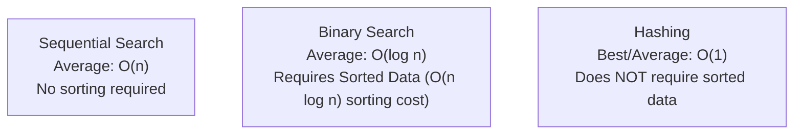
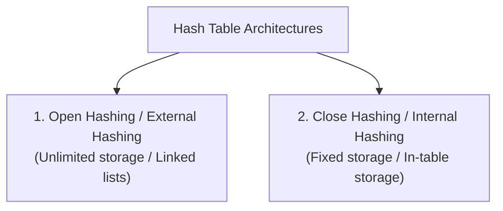

# 01 - Hashing and Hash Table Data Structures

**Unit 6 · CEM2003C Data Structures** · [← Unit Index](README.md) · [Next: Hashing Functions →](02-hashing-functions.md)

> **Source note:** Based on Chapter 6 (`Unit 6: Hashing & File Structure`), slides 3–7 of the faculty study material. All definitions, time complexities, forms of hashing, and structural descriptions strictly follow the course curriculum.

---

## What is Hashing?

Searching through large collections of data is a fundamental computing problem. Traditional searching techniques present trade-offs:

1. **Sequential Search (Linear Search):** Requires on average $\mathbf{O(n)}$ comparisons to locate an element. For large databases, performing $O(n)$ comparisons is computationally expensive and undesirable.
2. **Binary Search:** Requires much fewer comparisons on average ($\mathbf{O(\log n)}$), but imposes the strict prerequisite that the **data must be kept sorted**. Even with the most efficient sorting algorithms, sorting elements requires $O(n \log n)$ time.



### The Hashing Technique
**Hashing** is a widely used technique for storing and retrieving data that:
- Does away with the requirement of keeping data sorted (unlike binary search).
- Achieves a best-case and average-case timing complexity of **constant order $\mathbf{O(1)}$**.
- In its worst case (when multiple collisions occur and degenerate), the hashing algorithm starts behaving like linear search ($\mathbf{O(n)}$).

### Timing Behavior of Searching Using Hashing:
- **Best-case timing behavior:** $\mathbf{O(1)}$
- **Worst-case timing behavior:** $\mathbf{O(n)}$

---

## The Hashing Concept & Address Calculation

In hashing, the record for a key value `"key"` is directly referred to by **calculating the address from the key value itself**.

- The address or location of an element or record $x$ is obtained by computing an arithmetic function $f$.
- The function value $\mathbf{f(\text{key})}$ gives the physical or logical address of $x$ in the hash table.

```text
               +---------------+
  Record Key   |               |   Calculated Location
   [ "key" ] ──>|  Function f() | ─────────────────────────> Slot in Hash Table
               |               |
               +---------------+
```


### Mapping of Record in Hash Table (Slide 4)

```text
Record
+-----+-----+-----+-----+-----+
|     |     | key |     |     |
+-----+-----+-----+-----+-----+
         │
         │ f() ──> Address (e.g., Slot 6)
         ▼
     Hash Table
   +---+-----------+
 1 |   |           |
   +---+-----------+
 2 |   |           |
   +---+-----------+
 3 |   |           |
   +---+-----------+
 4 |   |           |
   +---+-----------+
 5 |   |           |
   +---+-----------+
 6 | • |  Record   | <── Stored at calculated location
   +---+-----------+
 7 |   |           |
   +---+-----------+
```

---

## Forms of Hash Table Data Structures (Slide 5)

The faculty material classifies hashing into two fundamental architectural forms based on storage constraints:



---

### 1. Open Hashing (External Hashing)

- **Definition:** Open (or external) hashing allows records to be stored in **unlimited space** (such as external storage or hard disks).
- **Table Size:** Places **no limitation** on the size of the table.
- **Organization (Slide 6):**
  - Records [elements] are partitioned into $B$ classes, numbered $0, 1, 2, \dots, B-1$.
  - A hashing function $f(x)$ maps a record with key $x$ to an integer value between $0$ and $B-1$.
  - Each bucket in the **bucket table** serves as the **head of a linked list** of all records that map to that bucket.

```text
Bucket Table                Linked List of Elements
   +-----+
 0 |  •──┼──────────> [ Record ] ───> [ Record ] ───> [ Record ]
   +-----+
 1 |  •──┼──────────> [ Record ] ───> [ Record ]
   +-----+
   |  :  |
   +-----+
B-1|  •──┼──────────> [ Record ] ───> [ Record ] ───> [ Record ]
   +-----+
```

---

### 2. Close Hashing (Internal Hashing)

- **Definition:** Closed (or internal) hashing uses a **fixed space** for storage and thus **limits the size of the hash table**.
- **Organization (Slide 7):**
  - A closed hash table keeps all elements directly **inside the bucket (table slot) itself**.
  - **Only one element** can be placed in any single bucket.
  - **Collision:** If an attempt is made to place an element in a bucket that already holds an element, a **collision** occurs.
  - **Rehashing:** In case of a collision, the element must be **rehashed** to an alternate empty location within the bucket table.
  - **Collision handling** is the central operational concern in closed hashing.

```text
Index   Stored Element
+-----+----------------+
|  0  |       A        |
+-----+----------------+
|  1  |    (Empty)     |
+-----+----------------+
|  2  |       C        |
+-----+----------------+
|  3  |    (Empty)     |
+-----+----------------+
|  4  |    (Empty)     |
+-----+----------------+
|  5  |       B        |
+-----+----------------+
```

---

## Comparison Summary: Open Hashing vs Close Hashing

| Parameter | Open Hashing (External Hashing) | Close Hashing (Internal Hashing) |
|---|---|---|
| **Storage Capacity** | Unlimited space (external storage / dynamic memory) | Fixed space (pre-allocated array / table size $m$) |
| **Element Storage** | Outside the table in linked chains/buckets | Inside the table slots directly |
| **Elements per Bucket** | Multiple elements per bucket (via linked list) | Exactly one element per bucket slot |
| **Collision Resolution** | Separate chaining (elements chained in lists) | Open addressing (rehashed to alternate empty slot) |
| **Table Overflow** | Never gets completely full | Can become full when all $m$ slots are occupied |

**Next:** [02 - Hashing Functions](02-hashing-functions.md)
