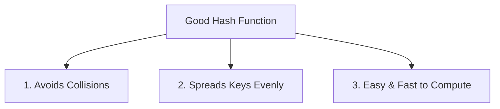
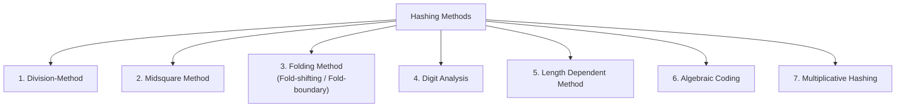
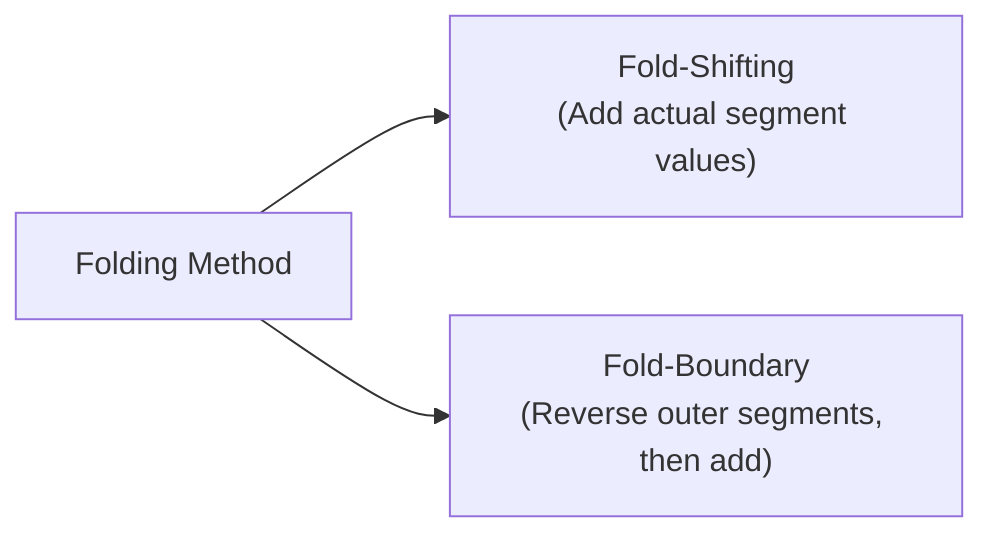

# 02 - Hashing Functions and Calculation Methods

**Unit 6 · CEM2003C Data Structures** · [← Hashing & Hash Tables](01-hashing-and-hash-table.md) · [Next: Collision Resolution →](03-collision-resolution.md)

> **Source note:** Based on Chapter 6 (`Unit 6: Hashing & File Structure`), slides 8–16 of the faculty study material. Covers the three characteristics of a good hash function and all 7 hashing functions with their exact formulas and course examples.

---

## Characteristics of a Good Hash Function (Slide 8)

A hash function $f(\text{key})$ transforms a search key into a table address. A well-designed hash function satisfies three fundamental criteria:

1. **Avoids collisions:** Minimizes the likelihood of two distinct keys mapping to the identical table slot.
2. **Even distribution:** Spreads keys uniformly across the range of array/table slots to prevent clustering.
3. **Easy to compute:** Computes the target address rapidly with minimal arithmetic overhead.

---

## The 7 Hashing Function Methods (Slide 8)

The course syllabus details seven specific hash function calculation methods:

---

### 1. Division-Method (Slide 9)

In the **Division Method**, modular arithmetic is used to divide the key value by an integer divisor $m$ (typically representing the table size or the number of slots in the file).

#### Formulas:
- **1-Based Indexing (Faculty Formula):**
  $$\mathbf{L = (K \bmod m) + 1}$$
- **0-Based Indexing (Standard Array Indexing):**
  $$\mathbf{L = K \bmod m}$$

Where:
- $L =$ location in table/file
- $K =$ key value
- $m =$ table size / number of slots in file

#### Course Example (Slide 9):
- **Given:** $k = 23$, $m = 10$
- **Calculation:**
  $$L = (23 \bmod 10) + 1 = 3 + 1 = \mathbf{4}$$
- **Result:** The key whose value is $23$ is placed in the **$4^{\text{th}}$ location**.

---

### 2. Midsquare Method (Slide 10)

In the **Midsquare Method**, we square the key value and extract the number of digits required for the address from the **middle position** of the squared value.

#### Procedure:
1. Compute $\text{Key}^2$.
2. Identify the middle digits corresponding to the required address width.
3. Use those extracted middle digits as the hash address.

#### Course Example (Slide 10):
- **Given:** Key value $= 16$, desired address width $= 2 \text{ digits}$
- **Step 1 (Square):** $16^2 = \mathbf{256}$
- **Step 2 (Extract middle 2 digits):** From $256$, select the two digits starting from the middle $\implies \mathbf{56}$.
- **Result:** Hash Address $= \mathbf{56}$.

---

### 3. Folding Method (Slides 11–12)

When keys are large and cannot easily fit into standard hardware data types, the **Folding Method** partitions the key into multiple segments so that all parts of the key influence the resulting address.

#### Procedure:
1. Partition the key into segments, each having the same length as the required address.
2. Add the values of each segment together.
3. **Ignore the final carry** (truncate overflow digits) to obtain the address.

The faculty notes define **two ways** of folding:

#### A. Fold-Shifting (Slide 12):
The actual values of each key part are added directly.
- **Example:** Key $= 12345678$, required address length $= 2 \text{ digits}$.
- **Break into 2-digit parts:** $12,\; 34,\; 56,\; 78$
- **Add:** $12 + 34 + 56 + 78 = 180$
- **Ignore carry:** Truncate the leading digit $1 \implies \mathbf{80}$ as the location.

#### B. Fold-Boundary (Slide 12):
The outer boundary parts of the key are **reversed** before addition, while middle parts remain unchanged.
- **Example:** Key $= 12345678$, required address length $= 2 \text{ digits}$.
- **Reverse outer parts:** Outer part $12 \to 21$, outer part $78 \to 87$. Middle parts remain $34, 56$.
- **Break into parts:** $21,\; 34,\; 56,\; 87$
- **Add:** $21 + 34 + 56 + 87 = 198$
- **Ignore carry:** Truncate the leading digit $1 \implies \mathbf{98}$ as the location.

---

### 4. Digit Analysis (Slide 13)

**Digit Analysis** is a **distribution-dependent** hashing function suitable when all keys are known in advance.

#### Procedure:
1. Perform a statistical analysis on all digit positions of the keys.
2. Select those digit positions that exhibit the most uniform distribution or occur frequently across the key set.
3. Reverse or shift the extracted digits to construct the final hash address.

#### Course Example (Slide 13):
- **Given:** Key $= 9861234$
- **Analysis:** Statistical analysis reveals that the **$3^{\text{rd}}$ and $5^{\text{th}}$ position digits** occur quite frequently.
- **Selection:**
  - $3^{\text{rd}}$ digit $= 6$
  - $5^{\text{th}}$ digit $= 2$
  - Extracted pair $= 62$
- **Reverse:** Reversing $62$ yields $\mathbf{26}$ as the address.

---

### 5. Length Dependent Method (Slide 14)

In the **Length Dependent Method**, the length of the key is combined with a portion of the key to determine the hash location:
- **Direct Method:** The key length along with a selected portion of the key directly produces the address.
- **Indirect Method:** The key length along with some portion of the key is used to generate an **intermediate value**, which is subsequently mapped to an address.

---

### 6. Algebraic Coding (Slide 15)

In **Algebraic Coding**, an $n$-bit binary key value is interpreted as the coefficients of a polynomial:

1. **Key Polynomial:** An $n$-bit key is represented as:
   $$\mathbf{f(x) = a_1 + a_2 x + a_3 x^2 + \dots + a_n x^{n-1}}$$
2. **Divisor Polynomial:** A fixed divisor polynomial $d(x)$ is constructed based on the required address range:
   $$\mathbf{d(x) = d_1 + d_2 x + d_3 x^2 + \dots + d_n x^{n-1}}$$
3. **Modular Division:** The key polynomial $f(x)$ is divided by $d(x)$ using polynomial modulo arithmetic:
   $$\mathbf{\text{Required Address Polynomial} = f(x) \bmod d(x)}$$

---

### 7. Multiplicative Hashing (Slide 16)

In **Multiplicative Hashing**, the address is computed by multiplying the key by a constant fraction:

#### Mathematical Formulation:
For a non-negative key $k$, table size $m$, and a constant $c$ such that $0 < c < 1$:

1. Compute $kc \bmod 1$, which represents the **fractional part of $kc$** ($kc - \lfloor kc \rfloor$).
2. Multiply this fractional part by $m$ and take the floor value:

$$\mathbf{h(k) = \lfloor m \cdot (kc \bmod 1) \rfloor}$$

Where the resulting hash address satisfies:
$$\mathbf{0 \le h(k) < m}$$

---

## Summary Comparison of Hashing Functions

| Method | Core Arithmetic Principle | Primary Input Required | Key Strength / Use Case |
|---|---|---|---|
| **Division** | Modulo division ($K \bmod m$) | Key value $K$, table size $m$ | Simple, fast, most widely implemented |
| **Midsquare** | Squaring and middle digit extraction | Key value $K$, address digit width | Uniform distribution across table |
| **Folding** | Partitioning and summation (Shift/Boundary) | Key value $K$, partition width | Long keys exceeding register size |
| **Digit Analysis** | Statistical selection and reversal | Known key distribution | Fixed static key collections |
| **Length Dependent** | Key length combined with key segment | Key length and key segment | Variable-length identifier keys |
| **Algebraic Coding** | Polynomial modulo division ($f(x) \bmod d(x)$) | Bitstring key, divisor polynomial | Error-detecting codes & hardware |
| **Multiplicative** | Fraction multiplication ($\lfloor m(kc \bmod 1)\rfloor$) | Key $k$, constant $c \in (0, 1)$, size $m$ | Independent of table size $m$ |

**Next:** [03 - Collision Resolution](03-collision-resolution.md)
