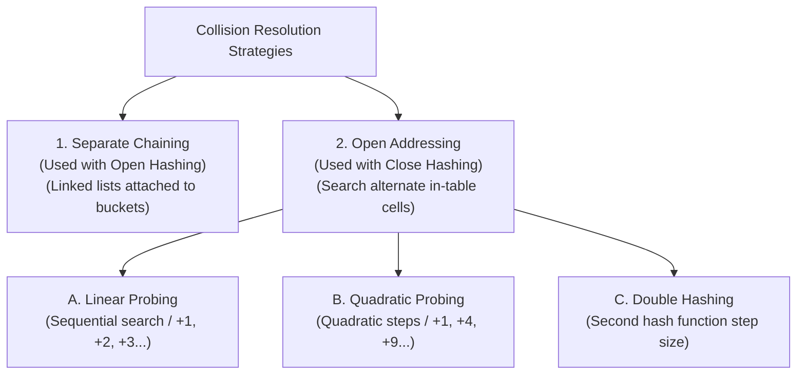

# 03 - Collision Resolution Strategies

**Unit 6 · CEM2003C Data Structures** · [← Hashing Functions](02-hashing-functions.md) · [Next: Blockchain & Hashing →](04-blockchain-and-hashing.md)

> **Source note:** Based on Chapter 6 (`Unit 6: Hashing & File Structure`), slides 17–26 of the faculty study material. Covers collision definition, **Separate Chaining** (open hashing), and **Open Addressing** (closed hashing) with **Linear Probing**, **Quadratic Probing**, and **Double Hashing**.

---

## What is a Collision? (Slide 17)

- **Definition:** Collision resolution is the primary challenge in hashing.
- When an element to be inserted maps to a table location where an element is already present, a **collision** occurs.
- Collisions are inevitable whenever the key space is larger than the number of table slots.



---

## 1. Separate Chaining (Slides 18–20)

### Concept:
In **Separate Chaining**, a separate linked list of all elements mapped to the same hash location is maintained outside the table.

- **Collision Avoidance:** Elements that collide are simply appended to the linked list of that bucket.
- **Memory Consideration:** If memory space is tight, separate chaining should be avoided due to the pointer overhead of linked list nodes.
- **Uniform Distribution:** The hash function must ensure an even distribution of elements among buckets; otherwise, linked chains become long and search performance deteriorates towards $O(n)$.

---

### Separate Chaining Structure (Slide 19)

Consider a hash table of size $10$ (slots $0$ to $9$) with inserted elements:

```text
Slot   Chained Linked List
+---+
| 0 | ──> [ 10 ] ──> [ 50 ]
+---+
| 1 | ──> NULL
+---+
| 2 | ──> [ 12 ] ──> [ 32 ] ──> [ 62 ]
+---+
| 3 | ──> NULL
+---+
| 4 | ──> [ 4 ] ──> [ 24 ]
+---+
| 5 | ──> NULL
+---+
| 6 | ──> NULL
+---+
| 7 | ──> [ 7 ]
+---+
| 8 | ──> NULL
+---+
| 9 | ──> [ 9 ] ──> [ 69 ]
+---+
```

---

### Course Worked Example: Separate Chaining (Slide 20)

**Problem Statement:**  
Insert the following integers into a hash table with **5 locations (indices 0, 1, 2, 3, 4)** using chaining to resolve collisions:  
$$\{1,\; 2,\; 3,\; 4,\; 5,\; 10,\; 21,\; 22,\; 33,\; 34,\; 15,\; 32,\; 31,\; 48,\; 49,\; 50\}$$

#### Hash Mapping and Location Groups:

| Hash Table Location | Mapped Elements |
|:---:|---|
| **0** | $5 \to 10 \to 50 \to 15$ |
| **1** | $1 \to 21 \to 31$ |
| **2** | $2 \to 22 \to 32$ |
| **3** | $3 \to 33 \to 48$ |
| **4** | $4 \to 34 \to 49$ |

```text
Location   Chained Linked List
  [ 0 ] ──> [ 5 ]  ──> [ 10 ] ──> [ 50 ] ──> [ 15 ]
  [ 1 ] ──> [ 1 ]  ──> [ 21 ] ──> [ 31 ]
  [ 2 ] ──> [ 2 ]  ──> [ 22 ] ──> [ 32 ]
  [ 3 ] ──> [ 3 ]  ──> [ 33 ] ──> [ 48 ]
  [ 4 ] ──> [ 4 ]  ──> [ 34 ] ──> [ 49 ]
```

---

## 2. Open Addressing (Slides 21–26)

In **Open Addressing (Closed Hashing)**, all elements are stored directly inside the hash table itself without external pointers:
- If a collision occurs at the home address, **alternate cells are probed sequentially or mathematically** until an empty cell is located.
- The three open addressing probing techniques are:
  1. **Linear Probing**
  2. **Quadratic Probing**
  3. **Double Hashing**

---

### A. Linear Probing (Slides 22–23)

In **Linear Probing**, whenever a collision occurs, adjacent cells are searched **sequentially (with wraparound)** for the next available empty cell:
$$\mathbf{h(k, i) = (f(\text{key}) + i) \bmod m \quad \text{for } i = 0, 1, 2, \dots}$$

---

#### Course Worked Example: Linear Probing (Slide 22)
- **Keys to Insert:** $\{5,\; 18,\; 55,\; 78,\; 35,\; 15\}$
- **Hash Function:** $f(\text{key}) = \text{key} \bmod 10$
- **Table Size:** $m = 10$ (Indices $0$ to $9$)

#### Step-by-Step Insertion Trace:

1. **Insert 5:** $5 \bmod 10 = 5 \implies$ Slot $5$ is empty $\to$ Place **5** at index $5$.
2. **Insert 18:** $18 \bmod 10 = 8 \implies$ Slot $8$ is empty $\to$ Place **18** at index $8$.
3. **Insert 55:** $55 \bmod 10 = 5 \implies$ Collision at $5$. Probe $(5+1) \bmod 10 = 6$ (empty) $\to$ Place **55** at index $6$.
4. **Insert 78:** $78 \bmod 10 = 8 \implies$ Collision at $8$. Probe $(8+1) \bmod 10 = 9$ (empty) $\to$ Place **78** at index $9$.
5. **Insert 35:** $35 \bmod 10 = 5 \implies$ Collision at $5, 6$. Probe $(5+2) \bmod 10 = 7$ (empty) $\to$ Place **35** at index $7$.
6. **Insert 15:** $15 \bmod 10 = 5 \implies$ Collision at $5, 6, 7, 8, 9$. Wraparound probe $(5+5) \bmod 10 = 0$ (empty) $\to$ Place **15** at index $0$.

#### Hash Table State After Each Insertion (Slide 22):

| Index | Initial | After 5 | After 18 | After 55 | After 78 | After 35 | After 15 (Final) |
|:---:|:---:|:---:|:---:|:---:|:---:|:---:|:---:|
| **0** | | | | | | | **15** |
| **1** | | | | | | | |
| **2** | | | | | | | |
| **3** | | | | | | | |
| **4** | | | | | | | |
| **5** | | **5** | **5** | **5** | **5** | **5** | **5** |
| **6** | | | | **55** | **55** | **55** | **55** |
| **7** | | | | | | **35** | **35** |
| **8** | | | **18** | **18** | **18** | **18** | **18** |
| **9** | | | | | **78** | **78** | **78** |

---

#### The Primary Clustering Problem (Slide 23):
- While linear probing is straightforward to implement, it suffers from **Primary Clustering**.
- When multiple keys map to the same location, linear probing places them in consecutive neighboring cells.
- This creates large contiguous blocks of occupied slots (*clusters*), increasing probe lengths and degrading average search time.

---

### B. Quadratic Probing (Slide 24)

**Quadratic Probing** is designed to reduce primary clustering by using quadratic step intervals instead of linear increments:

- If a key maps to location $j$ and cell $j$ is occupied, the sequence of probed locations is:
  $$\mathbf{j,\; (j + 1^2),\; (j + 2^2),\; (j + 3^2),\; \dots \implies j,\; (j+1),\; (j+4),\; (j+9), \dots \pmod m}$$

#### Characteristics:
- **Advantage:** Spreads colliding keys farther apart, significantly reducing primary clustering.
- **Limitation:** Does not guarantee that all cells in the hash table will be probed; it is possible that an insertion fails even if empty slots exist in the table.

---

### C. Double Hashing (Slides 25–26)

**Double Hashing** is an open addressing technique that uses two distinct hash functions to eliminate clustering:

1. **Primary Hash Function $f_1(\text{key})$:** Computes the initial home address.
2. **Secondary Hash Function $f_2(\text{key})$:** Computes the **increment step size** applied upon collision.

#### Probing Sequence:
$$\mathbf{f_1(\text{key}) + f_2(\text{key}),\; f_1(\text{key}) + 2 \cdot f_2(\text{key}),\; f_1(\text{key}) + 3 \cdot f_2(\text{key}),\; \dots}$$

#### Mathematical Formulas (Slide 26):
$$\mathbf{h_1(x) = x \bmod m}$$
$$\mathbf{h_2(x) = x \bmod m'}$$
$$\mathbf{h(x, i) = (h_1(x) + i \cdot h_2(x)) \bmod m \quad \text{for } i = 0, 1, 2, \dots}$$

Where:
- $m =$ size of the hash table
- $m' =$ integer slightly less than $m$ (often a prime number)
- $i =$ probe index ($i = 0$ is initial probe; $i \ge 1$ are collision probes)

---

## Comparison of Collision Resolution Techniques

| Strategy | Memory Overhead | Clustering Behavior | Table Full Capacity Limit |
|---|---|---|---|
| **Separate Chaining** | Requires pointer memory for linked list nodes | No clustering within table array | Unlimited (can hold more than $m$ elements) |
| **Linear Probing** | Zero extra pointer memory | Suffers from **Primary Clustering** | Exactly $m$ elements |
| **Quadratic Probing** | Zero extra pointer memory | Eliminates primary clustering; may suffer secondary clustering | May fail before table is 100% full |
| **Double Hashing** | Zero extra pointer memory | Minimizes all clustering through variable step sizes | Exactly $m$ elements |

**Next:** [04 - Blockchain and Hashing](04-blockchain-and-hashing.md)
