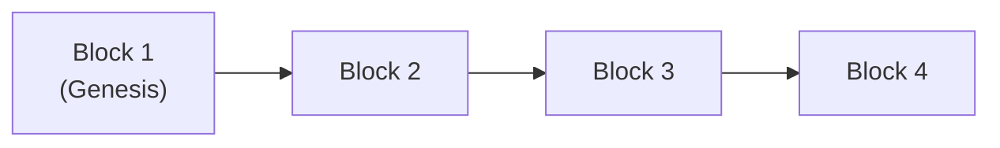

# 04 - Introduction to Blockchain and Hashing

**Unit 6 · CEM2003C Data Structures** · [← Collision Resolution](03-collision-resolution.md) · [Next: File Structure & Organization →](05-file-structure-and-organization.md)

> **Source note:** Based on Chapter 6 (`Unit 6: Hashing & File Structure`), slides 27–33 of the faculty study material. Covers the application of cryptographic hashing and linked list data structure concepts in blockchain architecture.

---

## Introduction to Blockchain (Slide 28)

A **Blockchain** is a **distributed, tamper-evident chain of records**:
- It is a **distributed ledger** shared across multiple independent computers (nodes) on a network.
- Transactions are grouped together into discrete **blocks** and connected in strict chronological order.
- **Cryptographic hashing** is used to guarantee data integrity and immediately detect any unauthorized modification to stored data.
- **Consensus mechanisms** enable participating nodes across the network to agree on the single valid version of the ledger.



---

## Basic Structure of a Block (Slide 29)

Every block in a blockchain consists of two primary sections: **Metadata** (the Block Header) and the **Transaction / Data Payload**.

```text
+-------------------------------------------------------------+
|                      BLOCK STRUCTURE                        |
+-------------------------------------------------------------+
|  METADATA (Block Header)                                    |
|  - Previous Block Hash  (Cryptographic link to parent block)|
|  - Timestamp            (Creation time of block)            |
|  - Nonce                (Consensus / proof-of-work data)    |
|  - Merkle Root          (Summary hash of all transactions)  |
+-------------------------------------------------------------+
|  DATA / TRANSACTION PAYLOAD                                 |
|  - Transaction 1: Alice -> Bob                              |
|  - Transaction 2: Bob -> Carol                              |
|  - ...more transactions...                                  |
+-------------------------------------------------------------+
|  BLOCK HASH = Digital Fingerprint (e.g., SHA-256)           |
+-------------------------------------------------------------+
```

- **Block Hash:** The digital fingerprint generated by hashing the block's header and contents.
- **Previous Block Hash:** Links the current block immutably to its predecessor.

---

## How Blocks Form a Chain (Slide 30)

The **`Previous Block Hash` field** creates the cryptographic link between consecutive blocks:

```mermaid
flowchart LR
    subgraph B1 ["Block 1"]
        D1["Data\nPrev Hash: 0\nTimestamp\nNonce"]
    end
    subgraph B2 ["Block 2"]
        D2["Data\nPrev Hash: H(B1)\nTimestamp\nNonce"]
    end
    subgraph B3 ["Block 3"]
        D3["Data\nPrev Hash: H(B2)\nTimestamp\nNonce"]
    end
    subgraph B4 ["Block 4"]
        D4["Data\nPrev Hash: H(B3)\nTimestamp\nNonce"]
    end
    
    B1 -->|Stores H(B1)| B2
    B2 -->|Stores H(B2)| B3
    B3 -->|Stores H(B3)| B4
```

> **Core Chain Invariant (Slide 30):**  
> If an attacker modifies any transaction data in **Block 2**, its cryptographic hash immediately changes. As a result, the `Previous Hash` stored in **Block 3 no longer matches**, breaking the chain and exposing the tampering.

---

## Role of Hashing in Blockchain (Slide 31)

Cryptographic hashing is the foundation of blockchain security:

1. **Fixed-Length Output:** A cryptographic hash function (e.g., **SHA-256**) converts input data of arbitrary size into a fixed-length string (digital fingerprint).
2. **Avalanche Effect:** Even a microscopic modification to the input data (such as altering a single character or digit) produces a dramatically different hash output.
3. **Dual Storage:** Each block stores both its **own hash** and the **previous block's hash**.
4. **Integrity & Linkage:** Hashing simultaneously enforces **data integrity**, **tamper detection**, and **inter-block linkage**.

```text
[ Block Data ] ──> [ Hash Function (e.g., SHA-256) ] ──> [ Fixed-Length Hash ]
                                                                   │
                                                   (Tamper ──> Completely Different Hash!)
```

---

## Role of Linked List in Blockchain (Slide 32)

### Conceptual Connection:
- A traditional **Linked List** connects nodes in memory using memory pointer addresses:
  $$\text{Node}_i \xrightarrow{\text{memory address pointer}} \text{Node}_{i+1}$$
- A **Blockchain** connects blocks conceptually like a linked list, but replaces memory pointers with **stored cryptographic hash references (hash pointers)**:
  $$\text{Block}_i \xrightarrow{\text{cryptographic hash reference}} \text{Block}_{i+1}$$

### Academic Note (Slide 32):
- In a real blockchain, the architecture incorporates additional distributed systems components beyond a simple linked list (including peer-to-peer networking, validation rules, and consensus protocols).
- The backward cryptographic link makes the entire ledger history **tamper-evident**.

---

## Worked Example: Detecting Tampering (Slide 33)

Consider a scenario where an attacker attempts to alter a transaction in Block 2:

```text
ORIGINAL STATE:
+------------------------+      +------------------------+      +------------------------+
|        BLOCK 1         |      |        BLOCK 2         |      |        BLOCK 3         |
| Hash: H1               |─────>| Amount: Rs. 100        |─────>| Prev Hash: H2          |
|                        |      | Hash: H2               |      | Hash: H3               |
+------------------------+      +------------------------+      +------------------------+

TAMPERED STATE:
+------------------------+      +------------------------+      +------------------------+
|        BLOCK 1         |      |    TAMPERED BLOCK 2    |      |        BLOCK 3         |
| Hash: H1               |─────>| Amount: Rs. 900        |──X──>| Stored Prev Hash: H2   |
|                        |      | NEW Hash: H2'          |      | (Mismatch: H2' != H2!) |
+------------------------+      +------------------------+      +------------------------+
```

### Detection Trace (Slide 33):
1. **Original Block 2:** Amount $= ₹100 \implies \text{Hash}(\text{Block 2}) = \mathbf{H_2}$. Block 3 stores $\text{Previous Hash} = \mathbf{H_2}$.
2. **Tampered Block 2:** Attacker modifies Amount to $₹900 \implies \text{New Hash}(\text{Block 2}) = \mathbf{H_2'}$.
3. **Verification:** Block 3 still contains the original stored reference $\text{Previous Hash} = \mathbf{H_2}$.
4. **Result:** Since $\mathbf{H_2' \ne H_2}$, the cryptographic link breaks instantly, and the network detects the tampering.

> **Key Takeaway (Slide 33):** *"Hashing provides the fingerprint; linked references connect the blocks."*

**Next:** [05 - File Structure and Organization](05-file-structure-and-organization.md)
