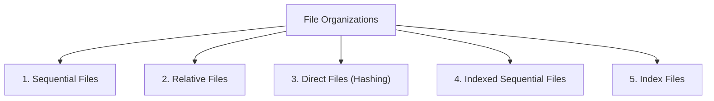

# 05 - File Structure and File Organizations

**Unit 6 · CEM2003C Data Structures** · [← Blockchain & Hashing](04-blockchain-and-hashing.md) · [Next: Indexing Techniques →](06-indexing.md)

> **Source note:** Based on Chapter 6 (`Unit 6: Hashing & File Structure`), slides 34–42 of the faculty study material. Covers file definitions, fields, records, primitive operations, **Sequential File Organization**, and **Direct / Hashing File Organization** with bucket directories.

---

## What is a File? (Slide 35)

- **Definition:** A **File** is a collection of logical **records**, where each record consists of one or more **fields**.
- **Field:** A basic data element describing a specific attribute (e.g., `Name`, `Roll No.`, `Year`, `Marks`). Each field is normally of **fixed length**.
- **Record Structure:** Every record in a file contains the same sequence of fields.
- **Key Field:** A field whose value uniquely identifies an individual record (e.g., `Roll No.`).
- **Database:** A collection of interrelated files.

### Sample File Structure (Slide 35)

| Name | Roll No. (Key Field) | Year | Marks |
|---|:---:|:---:|:---:|
| AMIT | 1000 | 1 | 82 |
| KALPESH | 1005 | 2 | 54 |
| JITENDRA | 1009 | 1 | 75 |
| RAVI | 1010 | 1 | 79 |

---

## Primitive Operations on a File (Slide 36)

The faculty material defines **six primitive operations** that can be performed on any file:

1. **Creation:** Initializing a new file structure and writing initial data records.
2. **Reading:** Retrieving and processing records from the file.
3. **Insertion:** Adding a new record to the file.
4. **Deletion:** Removing an existing record from the file.
5. **Updation:** Modifying one or more field values in an existing record.
6. **Searching:** Locating a specific record based on a search key value.

---

## Types of File Organizations (Slide 36)

File organization refers to the physical arrangement of records on secondary storage devices:



---

## 1. Sequential Files (Slides 37–39)

### Structure & Characteristics (Slide 37):
- **Most Common File Type:** Sequential file organization is the most widely used file format.
- **Fixed Format:** A fixed record format is used; all records have the same length, and the position and length of each field is fixed.
- **Physical Ordering:** Records are **physically ordered** on the storage medium based on the value of one designated field, termed the **Ordering Field**.

```text
BLOCK 1 (Ordered on Roll No)
+----------+----------+------+-------+
| Name     | Roll No. | Year | Marks |
+----------+----------+------+-------+
| AMIT     | 1000     | 1    | 82    |
| KALPESH  | 1005     | 2    | 54    |
| JITENDRA | 1009     | 1    | 75    |
| RAVI     | 1010     | 1    | 79    |
+----------+----------+------+-------+

BLOCK 2 (Ordered on Roll No)
+----------+----------+------+-------+
| Name     | Roll No. | Year | Marks |
+----------+----------+------+-------+
| RAMESH   | 1015     | 1    | 75    |
| ROHIT    | 1025     | 1    | 65    |
| JANAK    | 1026     | 1    | 75    |
| AMAR     | 1029     | 1    | 79    |
+----------+----------+------+-------+
```

---

### Advantages of Sequential Files (Slide 38):
1. **Efficient Sequential Access:** Reading all records in the order of the ordering key is extremely fast.
2. **Minimal Block Transfers:** Locating the next record in sequence rarely requires reading an additional disk block because consecutive records reside in the same block.
3. **Fast Binary Search:** Searching on the ordering key is very efficient. **Binary Search** can be applied, requiring only:
   $$\mathbf{\log_2 b \quad \text{block accesses}}$$
   *(where $b$ is the total number of blocks in the file)*.

---

### Disadvantages of Sequential Files (Slide 39):
1. **Inefficient Search on Non-Ordering Fields:** Provides no performance advantage when searching on any attribute other than the ordering key (requires linear scanning of all $b$ blocks).
2. **Expensive Insertions:** Inserting a new record requires finding its exact sorted physical location and **shifting all subsequent records ahead** to create space.
3. **Expensive Deletions:** Deleting a record requires shifting records back to reclaim empty space.
4. **Time-Consuming Key Updates:** Modifying an ordering key field value requires deleting the record and re-inserting it in its new physical sorted position.

---

## 2. Direct / Hashing File Organization (Slides 40–42)

In **Direct File Organization (Hashing)**, records are mapped directly to physical disk blocks using a hash function, eliminating sequential searching entirely.

### Core Architectural Concepts (Slide 41):
- **Buckets:** The records of the file are partitioned among $b$ buckets ($0, 1, 2, \dots, b-1$). A bucket consists of **one disk block** or a **cluster of contiguous disk blocks**.
- **Hash Function Mapping:** A hash function $f(x)$ maps a record with key $x$ into a bucket number between $0$ and $b-1$.
- **Chained Blocks:** If records assigned to a bucket exceed the capacity of a single block, additional blocks are allocated and **chained together in a linked list**.

---

### Hashing with Buckets of Chained Blocks (Slide 40)

```text
Bucket Directory         Bucket Chains of Data Blocks
   +-----+
 0 |  •──┼──────────> [ 230 | 460 ] ───> [ 480 | 790 ] ──> Ground
   +-----+
 1 |  •──┼──────────> [ 321 | 531 ] ──> Ground
   +-----+
 2 |  •──┼──────────> [ 232 | 242 ] ───> [ 270 | 470 ] ───> [ 930 | 420 ] ──> Ground
   +-----+
   |  :  |
   +-----+
b-1|  •  |
   +-----+
```

---

### Operations and Performance Formulas (Slide 42):

1. **Bucket Directory Translation:** Translating a bucket number to a physical disk address is performed via the **Bucket Directory**, which stores the address of the first block of the chained list.
2. **Average Block Access Formula:** The average number of block accesses to retrieve a record is:
   $$\mathbf{\text{Block Accesses} = 1 \text{ (bucket directory)} + \frac{\text{Number of Records}}{(\text{Number of Buckets } b) \times (\text{Number of Records per Block})}}$$
3. **Speedup:** Searching is approximately **$b$ times faster** (where $b$ is the number of buckets) than searching an unordered file.
4. **Insertion Procedure:** A new record with key $x$ is inserted into the **last block** in the chain for bucket $f(x)$. If the last block is full, a new block is dynamically allocated and appended to the chain.
5. **Standard Performance:** A well-designed hashed file structure requires **exactly 2 block accesses** for most search and retrieval operations (1 for directory + 1 for block).

**Next:** [06 - Indexing Techniques](06-indexing.md)
